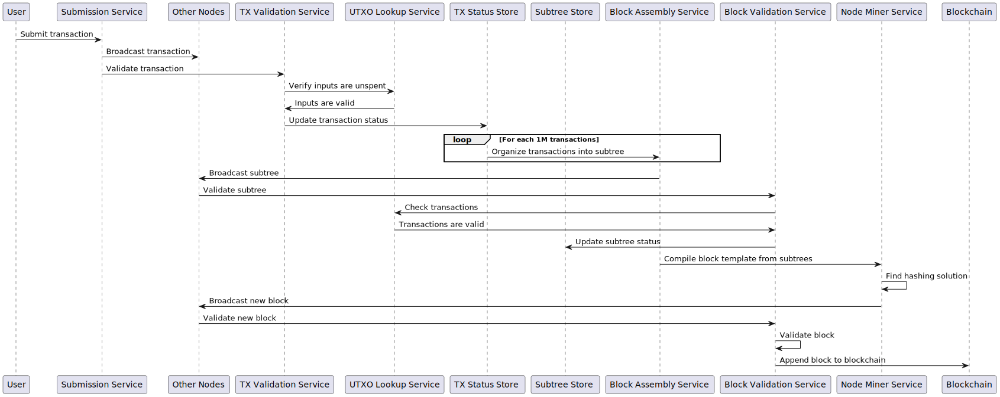

# Teranode Overall System Design

## Index

1. [Introduction](#1-introduction)
2. [Key Concepts and Innovations](#2-key-concepts-and-innovations)
- [2.1 Horizontal Scalability](#21-horizontal-scalability)
- [2.2 Subtrees](#22-subtrees)
- [2.3 Extended Transactions](#23-extended-transactions)
- [2.4 Unbounded Block Size](#24-unbounded-block-size)
- [2.5 Comparison with BTC](#25-comparison-with-btc)
3. [System Architecture Overview](#3-system-architecture-overview)
4. [Data Model and Propagation](#4-data-model-and-propagation)
- [4.1 Bitcoin Data Model](#41-bitcoin-data-model)
- [4.2 Teranode Data Model](#42-teranode-data-model)
- [4.3 Network Behavior](#43-network-behavior)
5. [Node Workflow](#5-node-workflow)
6. [Scalability and Performance](#6-scalability-and-performance)
7. [Impact on End-Users and Developers](#7-impact-on-end-users-and-developers)
8. [Glossary of Terms](#8-glossary-of-terms)
9. [Related Resources](#9-related-resources)

## 1. Introduction

In the early stages of Bitcoin's development, a block size limit of 1 megabyte per block was introduced as a temporary measure. This limit effectively restricts the network's capacity to approximately 3.3 to 7 transactions per second. As Bitcoin's adoption has expanded, this constraint has increasingly led to transaction processing bottlenecks, causing delays and higher transaction fees. These issues have highlighted the critical need for scalable solutions within the Bitcoin network.

Teranode, the next evolution of the BSV node software, and developed by the BSV Association, addresses the challenges of vertical scaling by instead spreading the workload across multiple machines. This horizontal scaling approach, coupled with an unbound block size, enables network capacity to grow with increasing demand through the addition of cluster nodes, allowing for Bitcoin scaling to be truly unbounded.

Teranode provides a robust node processing system for Bitcoin that can consistently handle over 1M transactions per second, while strictly adhering to the Bitcoin whitepaper.

Teranode is responsible for:

* Validating and accepting or rejecting received transactions.

* Building and assembling new subtrees and blocks.

* Validating and accepting or rejecting received or found subtrees and blocks.

* Adding found blocks to the Blockchain.

* Managing Coinbase transactions and their spendability.

## 2. Key Concepts and Innovations

### 2.1 Horizontal Scalability

While BTC relies on vertical scaling—increasing the power of individual nodes—Teranode embraces horizontal scalability through its microservices architecture. This fundamental difference allows Teranode to overcome BTC's inherent limitations:

1. **Scalability Approach**:
    - BTC: Increases processing power of single nodes (vertical scaling).
    - Teranode: Distributes workload across multiple machines (horizontal scaling).

2. **Transaction Processing**:
    - BTC: Limited to ~7 transactions per second due to 1MB block size and 10-minute block time.
    - Teranode: Capable of processing over 1 million transactions per second, with potential for further increase.

3. **Resource Utilization**:
    - BTC: Requires increasingly powerful (and expensive) hardware for each node.
    - Teranode: Can add multiple commodity machines to increase capacity cost-effectively.

4. **Flexibility**:
    - BTC: Monolithic architecture makes updates and improvements challenging.
    - Teranode: Microservices allow independent scaling and updating of specific functions (e.g., transaction validation, block assembly).

5. **Network Resilience**:
    - BTC: Failure of a node can significantly impact network capacity.
    - Teranode: Distributed architecture ensures continued operation even if some nodes fail.

### 2.2 Subtrees

Subtrees are an innovation aimed at improving scalability and real-time processing capabilities of the blockchain system. A subtree acts as an intermediate data structure to hold batches of transaction IDs (including metadata) and their corresponding Merkle root. Each subtree computes its own Merkle root, which is a single hash representing the entire set of transactions within that subtree.

Subtrees are broadcast every second (assuming a baseline throughput of 1M transactions per second), making data propagation more continuous. Broadcasting subtrees at this high frequency allows receiving nodes to validate batches quickly and continuously, essentially "pre-approving" them for inclusion in a block.
When a block is found, its validation is expedited due to the continuous processing of subtrees.

This proactive approach with subtrees enables the network to handle a significantly higher volume of transactions while maintaining quick validation times. It also allows nodes to utilize their processing power more evenly over time, rather than experiencing idle times between blocks.

### 2.3 Extended Transactions

Teranode uses the BSV Extended Transaction format, which includes additional metadata to facilitate processing. This format adds a marker to the transaction format and extends the input structure to include the previous locking script and satoshi outputs.

### 2.4 Unbounded Block Size

Unlike the fixed 1MB block size in the original Bitcoin implementation, Teranode BSV features an unbounded block size. This allows for potentially unlimited transactions per block, increasing throughput and reducing transaction fees.

### 2.5 Comparison with BTC

| Feature                               | BTC                                                                                                                                                                                            | Teranode BSV                                                                                                                                                                                                                                                                          |
|---------------------------------------|------------------------------------------------------------------------------------------------------------------------------------------------------------------------------------------------|---------------------------------------------------------------------------------------------------------------------------------------------------------------------------------------------------------------------------------------------------------------------------------------|
| **Transactions**                      | Standard Bitcoin transaction model.                                                                                                                                                            | Adopts an extended format with extra metadata, improving processing efficiency.                                                                                                                                                                                                       |
| **SubTrees**                          | Not used.                                                                                                                                                                                      | A novel concept in Teranode, serving as an intermediary for holding transaction IDs and their Merkle roots.     Each subtree contains 1 million transactions. Subtrees are broadcast every second.   Broadcast frequently for faster and continuous data propagation. |
| **Blocks**                            | Transactions are grouped into blocks. Direct transaction data is stored in the block. Each block is linked to the previous one by a cryptographic hash, forming a secure, chronological chain. | In the BSV blockchain, Bitcoin blocks are stored and propagated using an abstraction using subtrees of transaction IDs. This method significantly streamlines the validation process and synchronization among miners, optimizing the overall efficiency of the network.              |
| **Block Size**                        | Originally capped at 1MB (1 Megabyte), restricting transactions per block.                                                                                                                     | Current BSV expands to 4GB (4 Gigabytes), increasing transaction capacity.   Teranode removes the size limit, enabling limitless transactions per block.                                                                                                                      |
| **Processed Transactions per second** | 3.3 to 7 transactions per second.                                                                                                                                                              | Guaranteees a minimum of **1 million transactions per second** (100,000 x faster than BTC).                                                                                                                                                                                           |
| **Scalability Approach**              | Vertical scaling: Increases processing power of individual nodes. Limited by hardware capabilities of single machines. Monolithic architecture makes updates challenging.                      | Horizontal scaling: Distributes workload across multiple machines using a microservices architecture. Allows independent scaling of specific functions (e.g., transaction validation, block assembly). More cost-effective and flexible, with higher resilience to node failures.     |

## 3. System Architecture Overview

The Teranode architecture is designed as a collection of microservices that work together to provide a decentralized, scalable, and secure blockchain network. The node is modular, allowing for easy integration of new services and features.

Key components of the Teranode architecture include:

1. Teranode Core Services:
    - Asset Server
    - Propagation Service
    - Validator Service
    - Subtree Validation Service
    - Block Validation Service
    - Block Assembly Service
    - Blockchain Service
    - Alert Service

2. Overlay Services:
    - Block Persister Service
    - UTXO Persister Service
    - P2P Service
    - P2P Bootstrap Service
    - P2P Legacy Service

3. Stores:
    - Stores:
        - TX and Subtree Store]
        - UTXO Store

3. Other Components:
   - Kafka Message Broker
   - Miners

For an introduction to each service, please check the [Teranode Microservices Overview](teranode-microservices-overview.md).

## 4. Data Model and Propagation

### 4.1 Bitcoin Data Model

In the original Bitcoin model:
- Transactions are broadcast and included in blocks as they are found.
- Blocks contain all transaction data for the transactions included.

### 4.2 Teranode Data Model

The Teranode data model introduces:

- [Extended Transactions](../topics/datamodel/transaction_data_model.md): Include additional metadata to facilitate processing.
- [Subtrees](../topics/datamodel/subtree_data_model.md): Contain lists of transaction IDs and their Merkle root.
- [Blocks](../topics/datamodel/block_data_model.md): Contain lists of subtree identifiers, not transactions.

### 4.3 Network Behavior

- Transactions are broadcast network-wide, and each node further propagates the transactions.
- Nodes broadcast subtrees to indicate prepared batches of transactions for block inclusion.
- When a block is found, its validation is expedited due to the continuous processing of subtrees.

## 5. Node Workflow

1. **Transaction Submission**: Transactions are received by all nodes via a broadcast service.
2. **Transaction Validation**: The TX Validator Service checks each transaction against network rules.
3. **Subtree Assembly**: The Block Assembly Service organizes transactions into subtrees.
4. **Subtree Validation**: The Block Validation Service validates received subtrees.
5. **Block Assembly**: The Block Assembly Service compiles block templates consisting of subtrees.
6. **Block Validation**: When a valid block is found, it's sent to the Block Validation Service for final checks before being appended to the blockchain.

## 6. Scalability and Performance

Teranode achieves high throughput through:

- **Horizontal scaling**: Spreading workload across multiple machines.
- **Unbounded block size**: Allowing for potentially unlimited transactions per block.
- **Subtree processing**: Enabling continuous validation of transaction batches.
- **Extended transaction format**: Facilitating more efficient transaction processing.

## 7. Impact on End-Users and Developers

The Teranode architecture offers several benefits:
- **Higher transaction throughput**: Enabling more transactions per second.
- **Lower fees**: Due to increased capacity and efficiency.
- **Faster transaction confirmation**: Through continuous subtree processing.
- **Improved scalability**: Allowing the network to grow with demand.

## 8. Glossary of Terms

- **Subtree**: An intermediate data structure holding batches of transaction IDs and their Merkle root.
- **Extended Transaction**: A transaction format that includes additional metadata for efficient processing.
- **UTXO**: Unspent Transaction Output, representing spendable coins in the Bitcoin system.
- **Merkle root**: A single hash representing a set of transactions in a subtree or block.

Please check the [Teranode BSV Glossary](../references/glossary.md) for more terms and definitions.

## 9. Related Resources

- [Teranode Microservices Overview](teranode-microservices-overview.md)

- [Extended Transactions](../topics/datamodel/transaction_data_model.md): Include additional metadata to facilitate processing.
- [Subtrees](../topics/datamodel/subtree_data_model.md): Contain lists of transaction IDs and their Merkle root.
- [Blocks](../topics/datamodel/block_data_model.md): Contain lists of subtree identifiers, not transactions.
