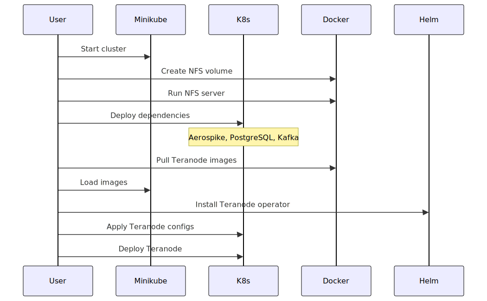

# How to Install Teranode with Kubernetes Helm

Last modified: 27-May-2025

# Index

- [Introduction](#introduction)
- [Prerequisites](#prerequisites)
- [Deployment with Minikube](#deployment-with-minikube)
    1. [Start Minikube](#1-start-minikube)
    2. [Deploy Dependencies](#2-deploy-dependencies)
    3. [Create persistent volume provider](#3-create-persistent-volume-provider)
    4. [Load Teranode Images](#4-load-teranode-images)
    5. [Deploy Teranode](#5-deploy-teranode)
    - [Verifying the Deployment](#verifying-the-deployment)
    - [Production Considerations](#production-considerations)
    - [Other Resources](#other-resources)

## Introduction

This guide provides instructions for deploying Teranode in a Kubernetes environment. While this guide shows the steps to deploy on a single server cluster using Minikube, these configurations can be adapted for production use with appropriate modifications.



## Prerequisites

Before you begin, ensure you have the following tools installed and configured:

- [Docker](https://docs.docker.com/get-docker/)
- [Minikube](https://minikube.sigs.k8s.io/docs/start/)
- [kubectl](https://kubernetes.io/docs/tasks/tools/)
- [Helm](https://helm.sh/docs/intro/install/)
- [AWS CLI](https://aws.amazon.com/cli/)

Additionally, ensure you have a storage provider capable of providing ReadWriteMany (RWX) storage. As an example, this guide includes setting up an NFS server via Docker for this purpose.



## Deployment with Minikube

Minikube creates a local Kubernetes cluster on your machine. For running Teranode, we recommend the following process:



### 1. Start Minikube

```bash
# Start minikube with recommended resources
minikube start --cpus=4 --memory=8192 --disk-size=20gb

# Verify minikube status
minikube status
```

### 2. Deploy Dependencies

Teranode requires several backing services. While these services should be deployed separately in production, for local development we'll deploy them within the same cluster.

```bash
# Create namespace for deployment
kubectl create namespace teranode-operator

# Deploy all dependencies in the teranode namespace
kubectl apply -f deploy/kubernetes/aerospike/ -n teranode-operator
kubectl apply -f deploy/kubernetes/postgres/ -n teranode-operator
kubectl apply -f deploy/kubernetes/kafka/ -n teranode-operator
```

To know more, please refer to the [Third Party Reference Documentation](../../../references/thirdPartySoftwareRequirements.md)

### 3. Create persistent volume provider

For this example, we will create a local folder and expose it to Minikube via a docker based NFS server.

```bash
docker volume create nfs-volume

docker run -d \
    --name nfs-server \
    -e NFS_EXPORT_0='/minikube-storage *(rw,no_subtree_check,fsid=0,no_root_squash)' \
    -v nfs-volume:/minikube-storage \
    --cap-add SYS_ADMIN \
    -p 2049:2049 \
  erichough/nfs-server

# connect the nfs-server to the minikube network
docker network connect minikube nfs-server

# create the PersistentVolume
kubectl apply -f deploy/kubernetes/nfs/
```

Note, for arm based systems, you can use this variant:

```bash
docker volume create nfs-volume

docker run -d --name nfs-server --privileged \
    -v nfs-volume:/minikube-storage \
    alpine:latest \
    sh -c "apk add --no-cache nfs-utils && \
        mkdir -p /minikube-storage && \
        chmod 777 /minikube-storage && \
        echo '/minikube-storage *(rw,sync,no_subtree_check,no_root_squash,insecure,fsid=0)' > /etc/exports && \
        exportfs -r && \
        rpcbind && \
        rpc.statd && \
        rpc.nfsd 8 && \
        rpc.mountd && \
        tail -f /dev/null"

# connect the nfs-server to the minikube network
docker network connect minikube nfs-server

# create the PersistentVolume
kubectl apply -f deploy/kubernetes/nfs/
```

### 4. Load Teranode Images

Pull and load the required Teranode images into Minikube:

```bash

# Identify the latest available Teranode version
aws ecr list-images \
  --repository-name teranode-public \
  --region eu-north-1 \
  --query 'imageIds[*].imageTag' \
  --output text

# Set image versions (please derive the right TERANODE_VERSION from the results of the previous command)
export OPERATOR_VERSION=v0.5.3
export TERANODE_VERSION=v0.9.27
export ECR_REGISTRY=ghcr.io/bsv-blockchain/teranode

# Load Teranode Operator
docker pull $ECR_REGISTRY/teranode-operator:$OPERATOR_VERSION
minikube image load $ECR_REGISTRY/teranode-operator:$OPERATOR_VERSION

# Load Teranode Public
docker pull $ECR_REGISTRY/teranode-public:$TERANODE_VERSION
minikube image load $ECR_REGISTRY/teranode-public:$TERANODE_VERSION
```

### 5. Deploy Teranode

The Teranode Operator manages the lifecycle of Teranode instances:

```bash
# Install operator
helm upgrade --install teranode-operator oci://ghcr.io/bsv-blockchain/teranode/teranode-operator \
    -n teranode-operator \
    -f deploy/kubernetes/teranode/teranode-operator.yaml
```

Apply the Teranode configuration and custom resources:

```bash
kubectl apply -f deploy/kubernetes/teranode/teranode-configmap.yaml -n teranode-operator
kubectl apply -f deploy/kubernetes/teranode/teranode-cr.yaml -n teranode-operator
```

A fresh Teranode starts up in IDLE state by default. To start syncing from the legacy network, you can run:

```bash
kubectl exec -it $(kubectl get pods -n teranode-operator -l app=blockchain -o jsonpath='{.items[0].metadata.name}') -n teranode-operator -- teranode-cli setfsmstate -fsmstate legacysyncing
```

To know more about the syncing process, please refer to the [Teranode Sync Guide](../../../howto/miners/minersHowToSyncTheNode.md)

## Verifying the Deployment


To verify your deployment:

```bash
# Check all pods are running
kubectl get pods -n teranode-operator | grep -E 'aerospike|postgres|kafka|teranode-operator'

# Check Teranode services are ready
kubectl wait --for=condition=ready pod -l app=blockchain -n teranode-operator --timeout=300s

# View Teranode logs
kubectl logs -n teranode-operator -l app=blockchain -f
```

## Production Considerations

For production deployments, consider:

- Deploying dependencies (Aerospike, PostgreSQL, Kafka) in separate clusters or using managed services
- Implementing proper security measures (network policies, RBAC, etc.)
- Setting up monitoring and alerting
- Configuring appropriate resource requests and limits
- Setting up proper backup and disaster recovery procedures

An example CR for a mainnet deployment is available in [kubernetes/teranode/teranode-cr-mainnet.yaml](https://github.com/bsv-blockchain/teranode/blob/main/deploy/kubernetes/teranode/teranode-cr-mainnet.yaml).

## Other Resources

- [Third Party Reference Documentation](../../../references/thirdPartySoftwareRequirements.md)
- [Teranode Sync Guide](../../../howto/miners/minersHowToSyncTheNode.md)
- [How-To Configure the Node.md](minersHowToConfigureTheNode.md)
