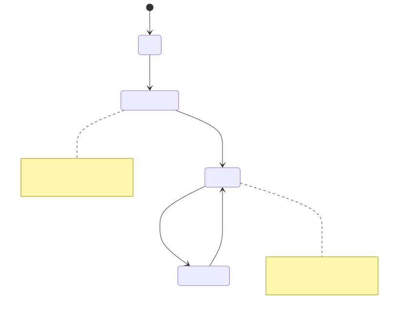
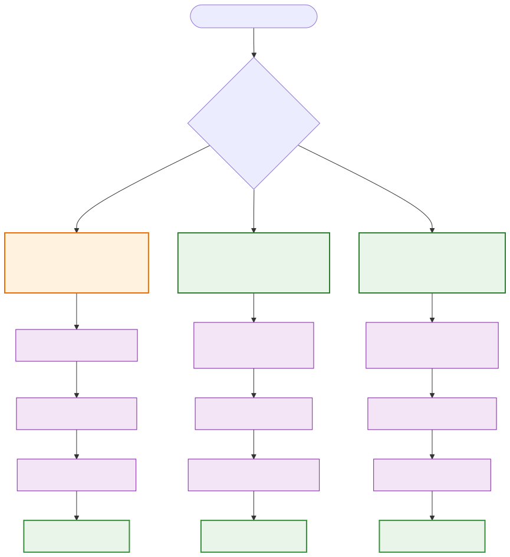

# Syncing the Blockchain

Last modified: 6-March-2025

## Index

- [Introduction](#introduction)
- [Default Synchronization Process](#default-synchronization-process)
- [Optimizing Initial Sync](#optimizing-initial-sync)
    - [Seeding Teranode from a bitcoind instance](#seeding-teranode-from-a-bitcoind-instance)
    - [Seeding Teranode with pre-existing Teranode data](#seeding-teranode-with-pre-existing-teranode-data)
    - [Recovery After Downtime](#recovery-after-downtime)
        - [Handling Extended Downtime:](#handling-extended-downtime)
- [Other Resources](#other-resources)

## Introduction

When a new Teranode instance is started, it begins the synchronization process automatically. This initial block synchronization process involves downloading and validating the entire blockchain history from other nodes in the network.



## Default Synchronization Process

1. **Peer Discovery**:
- Upon startup, the Teranode peer service (typically running in the `peer` pod / container) begins in IDLE state. To begin syncing, you need to explicitly set the state to `legacysyncing`.

```bash
kubectl exec -it $(kubectl get pods -n teranode-operator -l app=blockchain -o jsonpath='{.items[0].metadata.name}') -n teranode-operator -- teranode-cli setfsmstate -fsmstate legacysyncing
```

2. **Block Download**:
- Once connected, Teranode requests blocks from its peers, typically starting with the first node it successfully connects to.

- When in `legacysyncing` status, this peer represents a traditional BSV node (if in `run` state, Teranode can sync from another BSV Teranode).


3. **Validation and Storage**:
- As blocks are received, they are validated by the various Teranode services (e.g., `block-validator`, `subtree-validator`).

- Valid blocks are then stored in the blockchain database, managed by the `blockchain` service.

- The UTXO (Unspent Transaction Output) set is updated accordingly, typically managed by the `asset` service.


4. **Progress Monitoring**:

- You can monitor the synchronization progress by checking the logs of relevant pods:
```
# View Teranode logs
kubectl logs -n teranode-operator -l app=blockchain -f

# Check all pods are running
kubectl get pods -n teranode-operator | grep -E 'aerospike|postgres|kafka|teranode-operator'

# Check Teranode services are ready
kubectl wait --for=condition=ready pod -l app=blockchain -n teranode-operator --timeout=300s
```

- The `getblockchaininfo` command can provide detailed sync status:
```
kubectl exec <blockchain-pod-name> -- /app/teranode.run -blockchain=1 getblockchaininfo
```

(if using Docker Compose, please adapt the commands above accordingly)


## Optimizing Initial Sync

While the default synchronization process is automatic and typically requires no intervention, there are ways to optimize the initial sync to speed up the process.


| Sync Method           | Use Case               | Pros                | Cons                             |
|-----------------------|------------------------|---------------------|----------------------------------|
| Default Network Sync  | Fresh install          | No additional setup | Slowest method                   |
| Bitcoind Seeding      | Have existing BSV node | Faster initial sync | Requires SV Node setup           |
| Teranode Data Seeding | Have existing Teranode | Fastest method      | Requires access to existing data |




### Seeding Teranode from a bitcoind instance

To speed up the initial synchronization process, you have the option to seed Teranode from a bitcoind instance.

If you have access to an SV Node, you can speed up the initial synchronization by seeding the Teranode with an export from SV Node.
Only run this on a gracefully shut down SV Node instance (e.g. after using the RPC `stop` method`).

The below approach is for a Docker based setup, if you are using Kubernetes, you will need to adjust the commands accordingly.

First, you need to generate the UTXO set from the SV Node. You can do this by running the following command:

```bash
docker run -it \
  -v /mnt/teranode/seed:/mnt/teranode/seed \
  --entrypoint="" \
  434394763103.dkr.ecr.eu-north-1.amazonaws.com/ubsv-public:v0.5.50 \
  /app/bitcoin2utxoset.run -bitcoinDir=/home/ubuntu/bitcoin-data -outputDir=/mnt/teranode/seed/export
```

This script assumes your `bitcoin-data` directory is located in `/home/ubuntu/bitcoin-data` and contains the `blocks`
and `chainstate` directories. It will generate `${blockhash}.utxo-headers` and `${blockhash}.utxo-set` files.

> If you get a `Block hash mismatch between last block and chainstate` error message, you should try starting and stopping
the SV Node again, it means there's still a few unprocessed blocks.

Once you have the export, you can seed any fresh Teranode with the following command (important, if the Teranode instance is not fresh, do reset it using the procedure listed [here](./minersHowToResetTeranode.md)):

```bash
docker run -it \
  -e SETTINGS_CONTEXT=docker.m \
  -v ${teranode-location}/docker/base/settings_local.conf:/app/settings_local.conf \
  -v ${teranode-location}/docker/mainnet/data/teranode:/app/data \
  -v /mnt/teranode/seed:/mnt/teranode/seed \
  --network my-teranode-network \
  --entrypoint="" \
  434394763103.dkr.ecr.eu-north-1.amazonaws.com/ubsv-public:v0.5.50 \
  /app/seeder.run -inputDir /mnt/teranode/seed -hash 0000000000013b8ab2cd513b0261a14096412195a72a0c4827d229dcc7e0f7af
```

It's important to provide the correct settings and /app/data folder, as the seeder will write directly to Aerospike,
Postgres and the filesystem. So if you overwrite some of the settings with environment variables, make sure to add them
with `-e` to this command.


### Seeding Teranode with pre-existing Teranode data

Alternatively, you have the option to seed Teranode with pre-existing UTXO set generated by a Teranode Block and UTXO persister.

To do so, you can use the `/app/seeder.run` described in the previous section.


### Recovery After Downtime

Teranode is designed to be resilient and can recover from various types of downtime or disconnections. This is further supported by a right configuration of your Kubernetes cluster.


1. **Automatic Restart**:
- If a pod crashes or is terminated, Kubernetes will automatically restart it based on the deployment configuration.

- This is handled by the ReplicaSet controller in Kubernetes.


2. **Reconnection**:
- Upon restart, the `peer` service will re-establish connections with other nodes in the network.


3. **Block Request**:
- Teranode will determine the last block it has and request subsequent blocks from its peers.

- This process is automatic and doesn't require manual intervention.


4. **Catch-up Synchronization**:
- The node will download and process all blocks it missed during the downtime.

- This process is typically faster than the initial sync as it involves fewer blocks.


5. **Monitoring Recovery**:

- Monitor the recovery process using the same methods as the initial sync:
```
# Check pod status
kubectl get pods -n teranode-operator

# View logs during recovery
kubectl logs -n teranode-operator -l app=blockchain -f

# Check pod events
kubectl describe pod -n teranode-operator -l app=blockchain
```


#### Handling Extended Downtime:

If Teranode has been offline for an extended period, consider the following:

1. **Database Integrity Check**:
- After a long downtime, it's advisable to check the integrity of your blockchain and UTXO databases.

- This can be done by examining the logs for any corruption warnings or errors.


2. **Manual Intervention**:
- In rare cases of significant divergence or data corruption, you might need to manually intervene.

- This could involve reseeding the node with a more recent blockchain snapshot or UTXO set.


3. **Monitoring Catch-up Time**:
- The time required for catch-up synchronization depends on the duration of the downtime and the number of missed blocks.
- Use monitoring tools (e.g., Prometheus and Grafana) to track the sync progress and estimate completion time.


## Other Resources

- [How to Install Teranode](minersHowToInstallation.md)
- [Third Party Reference Documentation](../../../references/thirdPartySoftwareRequirements.md)
- [How to Configure Teranode](minersHowToConfigureTheNode.md)
