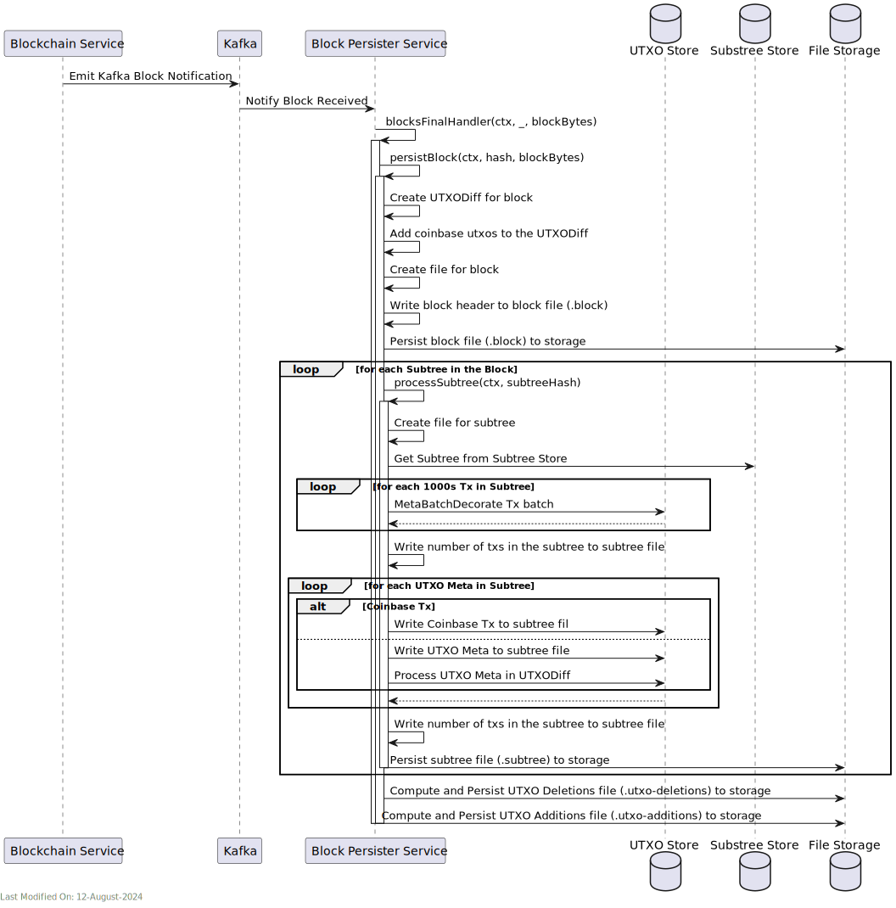

# 🔍 Block Persister Service

## Index

1. [Description](#1-description)
2. [Functionality](#2-functionality)
- [2.1 Service Initialization](#21-service-initialization)
- [2.2 Receiving and Processing a new Block Notification](#22-receiving-and-processing-a-new-block-notification)
3. [Data Model](#3-data-model)
4. [Technology](#4-technology)
5. [Directory Structure and Main Files](#5-directory-structure-and-main-files)
6. [How to run](#6-how-to-run)
7. [Configuration options (settings flags)](#7-configuration-options-settings-flags)

## 1. Description

The Block Persister service functions as an overlay microservice, designed to post-process subtrees after their integration into blocks and persisting them to a separate storage.

Whenever a new block is introduced to the blockchain, the Block Persister service decorates (enriches) all transactions within the block's subtrees, ensuring the inclusion of transaction metadata (UTXO meta data). Then, it will save the decorated block into a file storage system (such as S3).

This service plays a key role within the Teranode network, guaranteeing that txs are accurately post-processed and stored with the essential metadata for necessary audit and traceability purposes.

It's important to note that the post-processed subtree data file is not automatically utilized by any subsequent service. However, the decorated subtrees remain invaluable for future data analysis and inspection.


* The Block Persister consumes notifications from the Blockchain service, and stores the decorated block in a data store (such as S3).


* The Blockchain service relies on Kafka for its new block notifications, to which the Block Persister service subscribes to.


## 2. Functionality

### 2.1 Service Initialization


- The service starts by initializing a connection to the subtree store and subscribing to the new block notifications from Kafka.
- Additionally, it subscribes to internally generated subtree notifications.

### 2.2 Receiving and Processing a new Block Notification


- The Blockchain service, after adding a new block, emits a Kafka notification which is received by the Block Persister service.
- The Block Persister service creates a new file for the block.
- It then creates a new file for each subtree, including the number of transactions in the subtree, and the decorated transactions (as UTXO meta data).
- Additionally, 2 files are created for the block: a `UTXO Diff` and a `UTXO Set`.
  - The UTXO Diff file contains the UTXO Set difference between the previous block and the current block. This is basically a list of added Txs (outputs), including the Coinbase Tx, and removed Txs (inputs).
  - The UTXO Set file contains the UTXO Set for the current block. This is effectively a snapshot of the UTXOs at the time the block was created. A block UTXO Set is used as input for the next block UTXO Set, and so on.


Going into more detail, the Block Persister service iterates each subtree (with some level of concurrency), decorating the transactions (with their UTXO meta data) in batches for each subtree. For each subtree, the service creates a subtree file that contains the transactions decorated with their utxo metadata.



Additionally, the UTXO Diff is built by adding the coinbase tx for the block, and then processing all inputs and outputs from all transactions in all subtrees. Finally, the UTXO Set is built by applying the UTXO Diff to the previous block UTXO Set.

## 3. Data Model

The Block Persister service data model is identical in scope to the Block Validation model. Please refer to the Block Validation documentation [here](blockValidation.md#4-data-model) for more information.

## 4. Technology

1. **Go (Golang):** The primary programming language used for developing the service.

2. **Bitcoin SV (BSV) Libraries:**
  - **Data Models and Utilities:** For handling BSV blockchain data structures and operations, including transaction and block processing.

3. **Apache Kafka:**
  - **Distributed Messaging:** Used for consuming block notifications and producing messages related to subtree processing.

4. **Storage Libraries:**
  - **Blob Store:** For retrieving the subtree blobs.
  - **UTXO Store:** To access and store transaction metadata.
  - **File Storage:** For saving the decorated block files.

5. **Configuration and Logging:**
  - **Dynamic Configuration:** For managing service settings, including Kafka broker URLs and worker configurations.
  - **Logging:** For monitoring service operations, error handling, and debugging.


## 5. Directory Structure and Main Files

The Block Persister service is located in the `services/blockpersister` directory. All logic can be found on the `Server.go` file.

## 6. How to run

To run the Block Persister Service locally, you can execute the following command:

```shell
SETTINGS_CONTEXT=dev.[YOUR_USERNAME] go run -BlockPersister=1
```

Please refer to the [Locally Running Services Documentation](../locallyRunningServices.md) document for more information on running the Block Persister Service locally.


## 7. Configuration options (settings flags)

The `blockpersister` service utilizes specific `gocore` settings for configuration, each serving a distinct purpose in the service's operation:

1. **blockPersister_persistURL**
  - **Purpose:** Defines the URL for the persistence layer storing block files.
  - **Usage:** Initializes the blob store component for data storage during the server setup.

2. **kafka_blocksFinalConfig**
  - **Purpose:** Provides Kafka configuration details for receiving block data.
  - **Usage:** Configures and initiates a Kafka listener to process incoming blocks when the service starts.

3. **blockPersister_workingDir**
  - **Purpose:** Specifies the directory for temporary block processing files.
  - **Usage:** Used for file operations while handling blocks and subtrees, defaulting to the OS's temp directory if unset.

4. **blockPersister_groupLimit**
  - **Purpose:** Sets the concurrency limit for parallel transaction processing in subtrees.
  - **Usage:** Controls the number of goroutines for processing transaction metadata concurrently during subtree processing.

5. **blockPersister_processUTXOSets**

 - **Purpose**: Determines whether the service should process UTXO Sets.
 - **Usage**: If set to `true`, the service will process UTXO Sets for each block.
