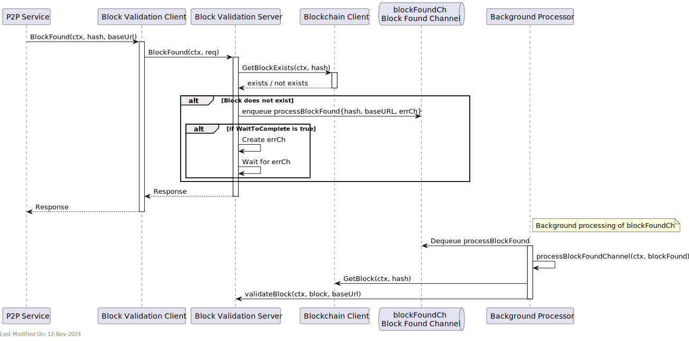
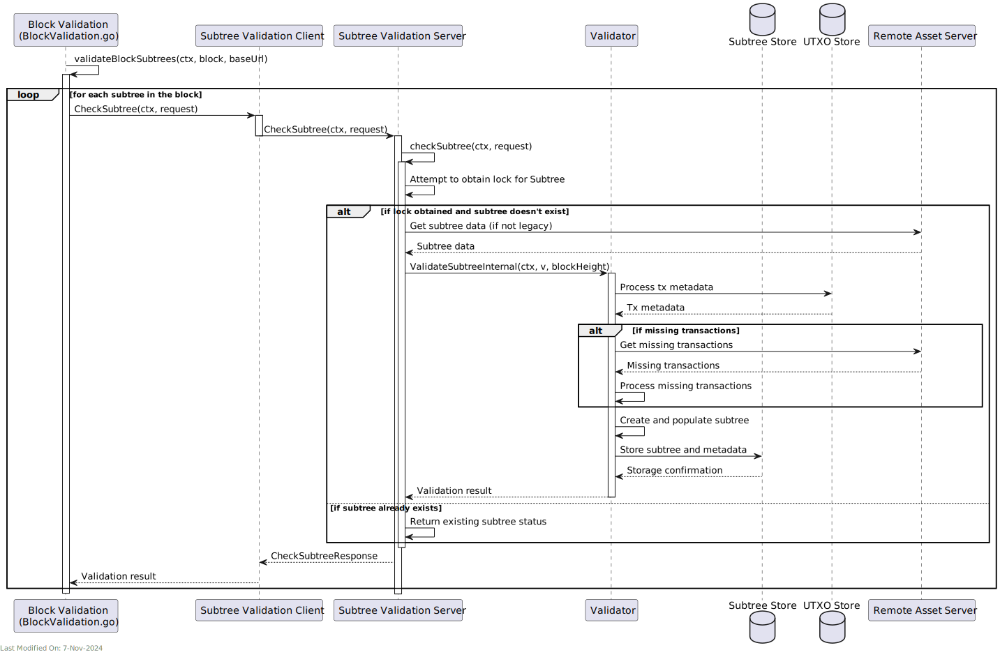
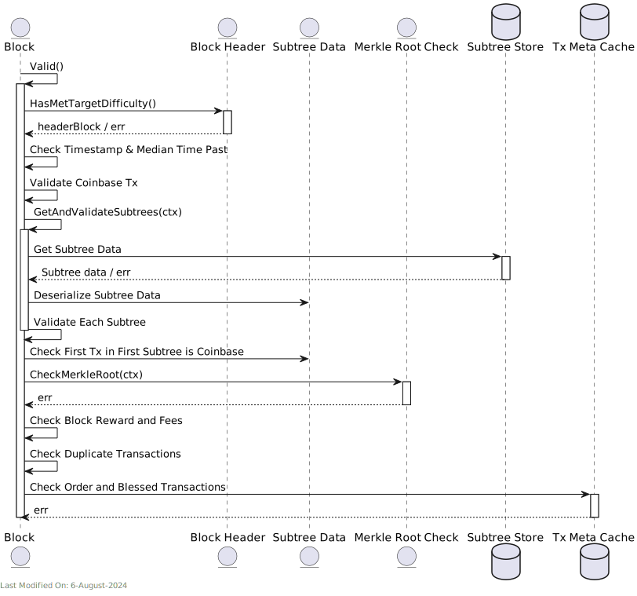

# 🔍 Block Validation Service

## Index


1. [Description](#1-description)
2. [Functionality](#2-functionality)
- [2.1. Receiving blocks for validation](#21-receiving-blocks-for-validation)
- [2.2. Validating blocks](#22-validating-blocks)
  - [2.2.1. Overview](#221-overview)
  - [2.2.2. Catching up after a parent block is not found](#222-catching-up-after-a-parent-block-is-not-found)
  - [2.2.3. Validating the Subtrees](#223-validating-the-subtrees)
  - [2.2.4. Block Data Validation](#224-block-data-validation)
- [2.3. Marking Txs as mined](#23-marking-txs-as-mined)
3. [gRPC Protobuf Definitions](#3-grpc-protobuf-definitions)
4. [Data Model](#4-data-model)
- [4.1. Block Data Model](#41-block-data-model)
  - [4.2. Subtree Data Model](#42-subtree-data-model)
- [4.3. Transaction Data Model](#43-transaction-data-model)
- [4.4. UTXO Metadata Model](#44-utxo-metadata-model)
5. [Technology](#5-technology)
6. [Directory Structure and Main Files](#6-directory-structure-and-main-files)
7. [How to run](#7-how-to-run)
8. [Configuration options (settings flags)](#8-configuration-options-settings-flags)
- [General Settings](#general-settings)
- [Kafka and Concurrency Related](#kafka-and-concurrency-related)
- [Performance and Optimization](#performance-and-optimization)


## 1. Description


The Block Validator is responsible for ensuring the integrity and consistency of each block before it is added to the blockchain. It performs several key functions:

1. **Validation of Block Structure**: Verifies that each block adheres to the defined structure and format, and that their subtrees are known and valid.

2. **Merkle Root Verification**: Confirms that the Merkle root in the block header correctly represents the subtrees in the block, ensuring data integrity.

3. **Block Header Verification**: Validates the block header, including the proof of work , timestamp, and reference to the previous block, maintaining the blockchain's unbroken chain.


The Block Validation Service:

* Receives new blocks from the P2P Service. The P2P Service has received them from other nodes on the network.
* Validates the blocks, after fetching them from the remote asset server.
* Updates stores, and notifies the blockchain service of the new block.

The P2P Service communicates with the Block Validation over either gRPC (Recommended) or fRPC (Experimental) protocols.


To improve performance, the Block Validation Service uses a caching mechanism for UTXO Meta data, called `Tx Meta Cache`. This prevents repeated fetch calls to the store by retaining recently loaded transactions in memory (for a limited time). This can be enabled or disabled via the `blockvalidation_txMetaCacheEnabled` setting. The caching mechanism is implemented in the `txmetacache` package, and is used by the Block Validation Service:

```go
	// create a caching tx meta store
	if gocore.Config().GetBool("blockvalidation_txMetaCacheEnabled", true) {
		logger.Infof("Using cached version of tx meta store")
		bVal.txMetaStore = newTxMetaCache(txMetaStore)
	} else {
		bVal.txMetaStore = txMetaStore
	}
```


Finally, note that the Block Validation service benefits of the use of Lustre Fs (filesystem). Lustre is a type of parallel distributed file system, primarily used for large-scale cluster computing. This filesystem is designed to support high-performance, large-scale data storage and workloads.
Specifically for Teranode, these volumes are meant to be temporary holding locations for short-lived file-based data that needs to be shared quickly between various services
Teranode microservices make use of the Lustre file system in order to share subtree and tx data, eliminating the need for redundant propagation of subtrees over grpc or message queues. The services sharing Subtree data through this system can be seen here:


## 2. Functionality

The block validator is a service that validates blocks. After validating them, it will update the relevant stores and blockchain accordingly.


### 2.1. Receiving blocks for validation



* The P2P service is responsible for receiving new blocks from the network. When a new block is found, it will notify the block validation service via the `BlockFound()` gRPC endpoint.
* The block validation service will then check if the block is already known. If not, it will start the validation process.
* The block is added to a channel for processing. The channel is used to ensure that the block validation process is asynchronous and non-blocking.


### 2.2. Validating blocks

#### 2.2.1. Overview


* As seen in the section 2.1, a new block is queued for validation in the blockFoundCh. The block validation server will pick it up and start the validation process.
* The server will request the block data from the remote node (`DoHTTPRequest()`).
* If the parent block is not known, it will be added to the catchupCh channel for processing. We stop at this point, as we can no longer proceed. The catchup process will be explained in the next section (section 2.2.2).
* If the parent is known, the block will be validated.
  * First, the service validates all the block subtrees.
    * For each subtree, we check if it is known. If not, we kick off a subtree validation process (see section 2.2.3 for more details).
  * The validator retrieves the last 100 block headers, which are used to validate the block data. We can see more about this specific step in the section 2.2.4.
  * The validator stores the coinbase Tx in the UTXO Store and the Tx Store.
  * The validator adds the block to the Blockchain.
  * For each Subtree in the block, the validator updates the TTL (Time To Live) to zero for the subtree. This allows the Store to clear out data the services will no longer use.
  * For each Tx for each Subtree, we set the Tx as mined in the UTXO Store. This allows the UTXO Store to know which block(s) the Tx is in.
  * Should an error occur during the validation process, the block will be invalidated and removed from the blockchain.

Note - there is a `optimisticMining` setting that allows to reverse the block validation and block addition to the blockchain steps.
* In the regular mode, the block is validated first, and, if valid, added to the block.
* If `optimisticMining` is on, the block is optimistically added to the blockchain right away, and then validated in the background next. If it was to be found invalid after validation, it would be removed from the blockchain. This mode is not recommended for production use, as it can lead to a temporary fork in the blockchain. It however can be useful for performance testing purposes.


#### 2.2.2. Catching up after a parent block is not found


When a block parent is not found in the local blockchain, the node will start a catchup process. The catchup process will iterate through the parent blocks until it finds a known block in the blockchain.

When a block is not known, it will be requested from the remote node. Once received, it will be queued for validation (effectively starting the process of validation for the parent block from the beginning, as seen in 2.3.1).

#### 2.2.3. Validating the Subtrees

Should the validation process for a block encounter a subtree it does not know about, it can request its processing off the Subtree Validation service.



If any transaction under the subtree is also missing, the subtree validation process will kick off a recovery process for those transactions.


#### 2.2.4. Block Data Validation

As part of the overall block validation, the service will validate the block data, ensuring the format and integrity of the data, as well as confirming that coinbase tx, subtrees and transactions are valid. This is done in the `Valid()` method under the `Block` struct.



Effectively, the following validations are performed:

- The hash of the previous block must be known and valid. Teranode must always build a block on a previous block that it recognizes as the longest chain.

- The Proof of Work of a block must satisfy the difficulty target (Proof of Work higher than nBits in block header).

- The Merkle root of all transactions in a block must match the value of the Merkle root in the block header.

- A block must include at least one transaction, which is the Coinbase transaction.

- A block timestamp must not be too far in the past or the future.
  - The block time specified in the header must be larger than the Median-Time-Past (MTP) calculated from the previous block index. MTP is calculated by taking the timestamps of the last 11 blocks and finding the median (More details in BIP113).
  - The block time specified in the header must not be larger than the adjusted current time plus two hours (“maximum future block time”).

- The first transaction in a block must be Coinbase. The transaction is Coinbase if the following requirements are satisfied:
  - The Coinbase transaction has exactly one input.
  - The input is null, meaning that the input’s previous hash is 0000…0000 and the input’s previous index is 0xFFFFFFFF.
  - The Coinbase transaction must start with the serialized block height, to ensure block and transaction uniqueness.

- The Coinbase transaction amount may not exceed block subsidy and all transaction fees (block reward).

### 2.3. Marking Txs as mined

When a block is validated, the transactions in the block are marked as mined in the UTXO store. This is done to ensure that the UTXO store knows which block(s) the transaction is in.

The Block Validation service is exclusively responsible for marking block Txs as mined, independently of whether the transaction as mined by the local Block Assembly, or mined by another node.

As a first step, either the `Block Validation` (after a remotely mined block is validated) or the `Block Assembly` (if a block is locally mined) marks the block subtrees as "set", by invoking the `Blockchain` `SetBlockSubtreesSet` gRPC call, as shown in the diagram below.


The `Blockchain` client then notifies subscribers (in this case, the `BlockValidation` service) of a new `NotificationType_BlockSubtreesSet` event.
The `BlockValidation` proceeds to mark all transactions within the block as "mined" in the `UTXOStore`. This allows to identify in which block a given tx was mined. See diagram below:


## 3. gRPC Protobuf Definitions

The Block Validation Service uses gRPC for communication between nodes. The protobuf definitions used for defining the service methods and message formats can be seen [here](protobuf_docs/subtreevalidationProto.md).


## 4. Data Model

### 4.1. Block Data Model

Each block is an abstraction which is a container of a group of subtrees. A block contains a variable number of subtrees, a coinbase transaction, and a header, called a block header, which includes the block ID of the previous block, effectively creating a chain.

| Field       | Type                  | Description                                                 |
|-------------|-----------------------|-------------------------------------------------------------|
| Header      | *BlockHeader          | The Block Header                                            |
| CoinbaseTx  | *bt.Tx                | The coinbase transaction.                                   |
| Subtrees    | []*chainhash.Hash     | An array of hashes, representing the subtrees of the block. |

This table provides an overview of each field in the `Block` struct, including the data type and a brief description of its purpose or contents.

More information on the block structure and purpose can be found in the [Architecture Documentation](docs/architecture/architecture.md).


#### 4.2. Subtree Data Model

A subtree acts as an intermediate data structure to hold batches of transaction IDs (including metadata) and their corresponding Merkle root. Blocks are then built from a collection of subtrees.

More information on the subtree structure and purpose can be found in the [Architecture Documentation](docs/architecture/architecture.md).

Here's a table documenting the structure of the `Subtree` type:

| Field            | Type                  | Description                                                                     |
|------------------|-----------------------|---------------------------------------------------------------------------------|
| Height           | int                   | The height of the subtree within the blockchain.                                |
| Fees             | uint64                | Total fees associated with the transactions in the subtree.                     |
| SizeInBytes      | uint64                | The size of the subtree in bytes.                                               |
| FeeHash          | chainhash.Hash        | Hash representing the combined fees of the subtree.                             |
| Nodes            | []SubtreeNode         | An array of `SubtreeNode` objects, representing individual "nodes" within the subtree. |
| ConflictingNodes | []chainhash.Hash      | List of hashes representing nodes that conflict, requiring checks during block assembly. |

Here, a `SubtreeNode is a data structure representing a transaction hash, a fee, and the size in bytes of said TX.


Note - For subtree files in the `subtree-store` S3 buckets, each subtree has a size of 48MB.

##### Subtree Composition

Each subtree consists of:
- hash: 32 bytes
- fees: 4 bytes
- sizeInBytes: 4 bytes
- numberOfLeaves: 4 bytes
- subtreeHeight: 4 bytes

##### Calculation:
```
1024 * 1024 * (32 + 4 + 4 + 4 + 4) = 48MB
```

##### Data Transfer Between Nodes

However - only 32MB is transferred between the nodes. Each subtree transfer includes:

- hash: 32 bytes
```
1024 * 1024 * (32) = 32MB
```

### 4.3. Transaction Data Model

This refers to the extended transaction format, as seen below:

| Field           | Description                                                                                            | Size                                              |
|-----------------|--------------------------------------------------------------------------------------------------------|---------------------------------------------------|
| Version no      | currently 2                                                                                            | 4 bytes                                           |
| **EF marker**   | **marker for extended format**                                                                         | **0000000000EF**                                  |
| In-counter      | positive integer VI = [[VarInt]]                                                                       | 1 - 9 bytes                                       |
| list of inputs  | **Extended Format** transaction Input Structure                                                        | <in-counter> qty with variable length per input   |
| Out-counter     | positive integer VI = [[VarInt]]                                                                       | 1 - 9 bytes                                       |
| list of outputs | Transaction Output Structure                                                                           | <out-counter> qty with variable length per output |
| nLocktime       | if non-zero and sequence numbers are < 0xFFFFFFFF: block height or timestamp when transaction is final | 4 bytes                                           |

More information on the extended tx structure and purpose can be found in the [Architecture Documentation](docs/architecture/architecture.md).


### 4.4. UTXO Metadata Model

The UTXO Meta data model is defined in `stores/utxo/meta/data.go`:

| Field Name    | Description                                                     | Data Type                         |
|---------------|-----------------------------------------------------------------|-----------------------------------|
| Tx            | The raw transaction data.                                       | *bt.Tx Object                     |
| Hash          | Unique identifier for the transaction.                          | String/Hexadecimal                |
| Fee           | The fee associated with the transaction.                        | Decimal                           |
| Size in Bytes | The size of the transaction in bytes.                           | Integer                           |
| Parents       | List of hashes representing the parent transactions.            | Array of Strings/Hexadecimals     |
| Blocks        | List of IDs of the blocks that include this transaction.        | Array of Integers                 |
| LockTime      | The earliest time or block number that this transaction can be included in the blockchain. | Integer/Timestamp or Block Number |
| IsCoinbase    | Indicates whether the transaction is a coinbase transaction.    | Boolean                           |

Note:

- **Parent Transactions**: 1 or more parent transaction hashes. For each input that our transaction has, we can have a different parent transaction. I.e. a TX can be spending UTXOs from multiple transactions.


- **Blocks**: 1 or more block hashes. Each block represents a block that mined the transaction.
  - Typically, a tx should only belong to one block. i.e. a) a tx is created (and it is stored in the UTXO store) and b) the tx is mined, and the mined block hash is tracked in the UTXO store for the given transaction.
  - However, in the case of a fork, a tx can be mined in multiple blocks by different nodes. In this case, the UTXO store will track multiple block hashes for the given transaction, until such time that the fork is resolved and only one block is considered valid.


## 5. Technology


1. **Go Programming Language (Golang)**.

2. **gRPC (Google Remote Procedure Call)**:
  - Used for implementing server-client communication. gRPC is a high-performance, open-source framework that supports efficient communication between services.

3. **fRPC (Custom or Specific RPC Framework)**:
  - An alternative RPC (Remote Procedure Call) framework, used in experimental mode.

4. **Blockchain Data Stores**:
  - Integration with various stores such as UTXO (Unspent Transaction Output) store, blob store, and transaction metadata store.

5. **Caching Mechanisms (ttlcache)**:
  - Uses `ttlcache`, a Go library for in-memory caching with time-to-live settings, to avoid redundant processing and improve performance.

6. **Configuration Management (gocore)**:
  - Uses `gocore` for configuration management, allowing dynamic configuration of service parameters.

7. **Networking and Protocol Buffers**:
  - Handles network communications and serializes structured data using Protocol Buffers, a language-neutral, platform-neutral, extensible mechanism for serializing structured data.

8. **Synchronization Primitives (sync)**:
  - Utilizes Go's `sync` package for synchronization primitives like mutexes, aiding in managing concurrent access to shared resources.


## 6. Directory Structure and Main Files

```
./services/blockvalidation
│
├── BlockValidation.go             - Contains the core logic for block validation.
├── BlockValidation_test.go        - Unit tests for the `BlockValidation.go` functionalities.
├── Client.go                      - Client-side logic or API for interacting with the block validation service.
├── Interface.go                   - Defines an interface for the block validation service, outlining the methods that any implementation of the service should provide.
├── Server.go                      - Contains the server-side implementation for the block validation service, handling incoming requests and providing validation services.
├── Server_test.go                 - Unit tests for the `Server.go` functionalities,
├── blockvalidation_api
│   ├── blockvalidation_api.frpc.go       - Specific implementation file for the fRPC framework for the block validation API.
│   ├── blockvalidation_api.pb.go         - Auto-generated file from protobuf definitions, containing Go bindings for the API.
│   ├── blockvalidation_api.proto         - Protocol Buffers definition file for the block validation API.
│   └── blockvalidation_api_grpc.pb.go    - gRPC (Google's RPC framework) specific implementation file for the block validation API.
├── frpc.go                        - Alternative RPC (Remote Procedure Call) framework implementation for the block validation service.
├── metrics.go                     - Metrics collection and monitoring of the block validation service's performance.
├── ttl_queue.go                   - Implements a time-to-live (TTL) queue, for managing caching within the service.
├── txmetacache.go                 - Transaction metadata cache, used to improve performance and efficiency in transaction data access.
└── txmetacache_test.go            - Unit tests for the `txmetacache.go` functionalities.
```

## 7. How to run

To run the Block Validation Service locally, you can execute the following command:

```shell
SETTINGS_CONTEXT=dev.[YOUR_USERNAME] go run -BlockValidation=1
```

Please refer to the [Locally Running Services Documentation](../locallyRunningServices.md) document for more information on running the Block Validation Service locally.

## 8. Configuration options (settings flags)

The Block Validation service uses the following configuration options:

### General Settings
- **`blockvalidation_grpcAddress`**: Specifies the gRPC address for the block validation service. It is crucial for initializing the block validation client and establishing communication with the block validation service.
- **`blockvalidation_httpAddress`**: Configures the HTTP address for the block validation service. This setting is optional and, if provided, enables HTTP-based interactions with the block validation service.

### Kafka and Concurrency Related
- **`blockvalidation_subtreeGroupConcurrency`**: Determines the concurrency level for processing subtree groups. This setting is used to optimize the parallel processing of subtrees within blocks, balancing throughput with resource utilization.
- **`blockvalidation_blockFoundCh_buffer_size`** and **`blockvalidation_catchupCh_buffer_size`**: Configure the buffer sizes for channels used in handling block found and catchup events. These settings influence the capacity of the system to buffer incoming block notifications and catchup requests, affecting how the system copes with spikes in load.
- **`blockvalidation_frpcAddress`** and **`blockvalidation_httpListenAddress`**: Define addresses for starting the fRPC and HTTP servers within the block validation service, respectively.
- **`blockvalidation_frpcConcurrency`**: Sets the concurrency level for the fRPC server, adjusting the number of concurrent requests the server can handle.

### Performance and Optimization
- **`blockvalidation_txMetaCacheEnabled`**: Enables or disables the transaction metadata cache. Turning on this cache can significantly improve performance by reducing the need to repeatedly fetch transaction metadata from persistent storage.
- **`blockvalidation_validateBlockSubtreesConcurrency`**: Controls the concurrency level for validating block subtrees, a critical setting for optimizing the validation process of blocks composed of multiple subtrees.
