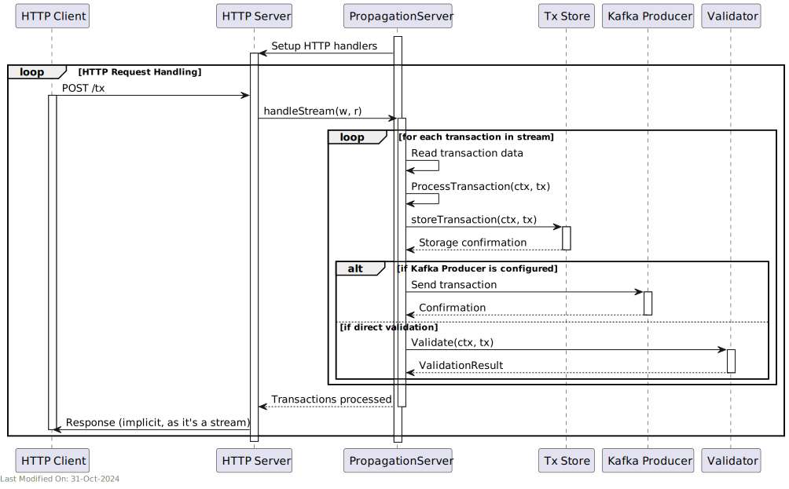
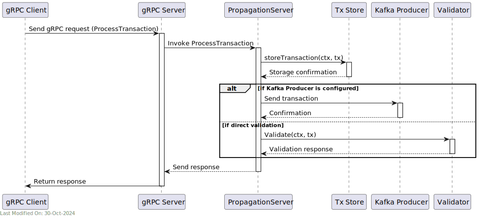
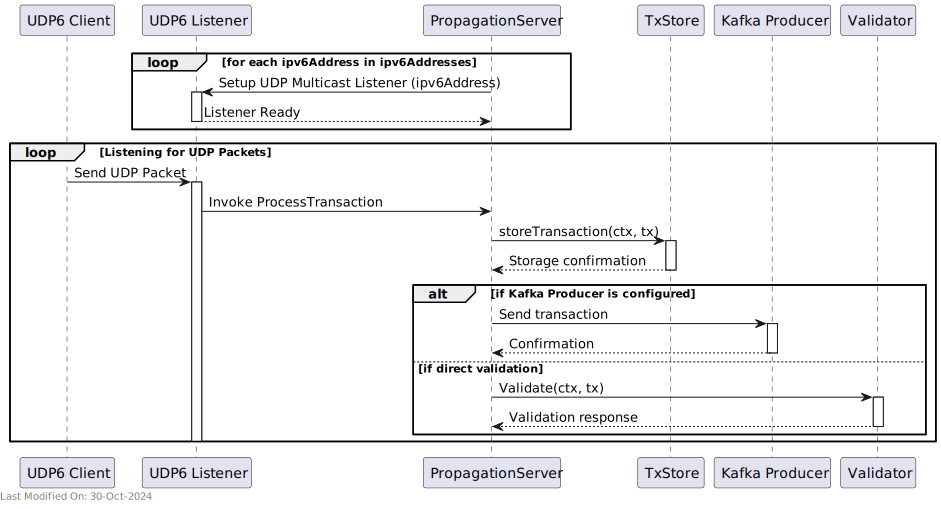

# 🌐 Propagation Service

## Index


1. [Description](#1-description)
2. [Functionality](#2-functionality)
- [2.1. Starting the Propagation Service](#21-starting-the-propagation-service)
- [2.2. Propagating Transactions](#22-propagating-transactions)
3. [gRPC Protobuf Definitions](#3-grpc-protobuf-definitions)
4. [Data Model](#4-data-model)
5. [Technology](#5-technology)
6. [Directory Structure and Main Files](#6-directory-structure-and-main-files)
7. [How to run](#7-how-to-run)
8. [Configuration options (settings flags)](#8-configuration-options-settings-flags)

## 1. Description

The `Propagation Service` is designed to handle the propagation of transactions across a peer-to-peer Teranode network.

At a glance, the Propagation service:
1. Receives new transactions through various communication methods.
2. Stores transactions in the tx store.
3. Sends the transaction to the Validator service for further processing.


The service implements multiple experimental alternative communication methods (e.g. fRPC, QUIC) for transaction propagation, as well as UDP listeners over IPv6. At the time of writing, the gRPC protocol is the primary communication method.

- `StartUDP6Listeners`, `quicServer`, `frpcServer`, `StartHTTPServer`: These functions are designed to start various network listeners for different protocols like UDP, QUIC, DRPC, fRPC, and HTTP. Each function configures and starts a server to listen for incoming connections and requests on specific network addresses and ports.

A node can start multiple parallel instances of the Propagation service. This translates into multiple pods within a Kubernetes cluster. Each instance will have its own gRPC server, and will be able to receive and propagate transactions independently. GRPC load balancing allows to distribute the load across the multiple instances.

The Notice how fRPC does not allow for load balancing.


## 2. Functionality

### 2.1. Starting the Propagation Service


Upon startup, the Propagation service starts the relevant communication channels, as configured via settings.

### 2.2. Propagating Transactions

All communication channels receive txs and delegate them to the `ProcessTransaction()` function. The main communication channels are shown below.

**HTTP:**




**gRPC:**




**UDP IPv6:**




## 3. gRPC Protobuf Definitions

The Propagation Service uses gRPC for communication between nodes. The protobuf definitions used for defining the service methods and message formats can be seen [here](protobuf_docs/propagationProto.md).

## 4. Data Model

The Propagation Service deals with the extended transaction format, as seen below:

| Field           | Description                                                                                            | Size                                              |
|-----------------|--------------------------------------------------------------------------------------------------------|---------------------------------------------------|
| Version no      | currently 2                                                                                            | 4 bytes                                           |
| **EF marker**   | **marker for extended format**                                                                         | **0000000000EF**                                  |
| In-counter      | positive integer VI = [[VarInt]]                                                                       | 1 - 9 bytes                                       |
| list of inputs  | **Extended Format** transaction Input Structure                                                        | <in-counter> qty with variable length per input   |
| Out-counter     | positive integer VI = [[VarInt]]                                                                       | 1 - 9 bytes                                       |
| list of outputs | Transaction Output Structure                                                                           | <out-counter> qty with variable length per output |
| nLocktime       | if non-zero and sequence numbers are < 0xFFFFFFFF: block height or timestamp when transaction is final | 4 bytes                                           |

More information on the extended tx structure and purpose can be found in the [Architecture Documentation](docs/architecture/architecture.md).

## 5. Technology

Main technologies involved:

1. **Go Programming Language (Golang)**:
  - The entire service is written in Go.

2. **Peer-to-Peer (P2P) Networking**:
  - The service is designed for a P2P network environment, where nodes (computers) in the network communicate directly with each other without central coordination.
  - `libsv/go-p2p/wire` is used for P2P transaction propagation in the Teranode BSV network.

3. **Networking Protocols (UDP, HTTP, QUIC, fRPC)**:
  - The service uses various networking protocols for communication:
    - **UDP (User Datagram Protocol)**: A lightweight, connectionless protocol used for low-latency and loss-tolerating connections.
    - **HTTP (Hypertext Transfer Protocol)**.
    - **QUIC (Quick UDP Internet Connections)**: A transport layer network protocol designed by Google to improve the performance of connection-oriented web applications.
    - **fRPC**: fRPC-go is a lightweight, fast, and secure RPC framework implemented for Go.

4. **Cryptography**:
  - The use of `crypto` packages for RSA key generation and TLS (Transport Layer Security) configuration for secure communication.

5. **gRPC and Protocol Buffers**:
  - gRPC, indicated by the use of `google.golang.org/grpc`, is a high-performance, open-source universal RPC framework. It uses Protocol Buffers as its interface definition language.


## 6. Directory Structure and Main Files

```
./services/propagation
│
├── Client.go                    - Contains the client-side logic for interacting with the propagation service.
├── Server.go                    - Contains the main server-side implementation for the propagation service.
├── StreamingClient.go           - Implementation of a client capable of handling streaming data, for real-time data processing or communication.
├── StreamingClient_test.go      - Unit tests for the `StreamingClient.go` functionality.
├── frpc.go                      - Related to the fRPC framework implementation for the propagation service.
├── metrics.go                   - Metrics collection and monitoring of the propagation service.
└── propagation_api              - Directory containing various files related to the API definition and implementation of the propagation service.
    ├── propagation_api.frpc.go         - Specific implementation file for the fRPC framework for the propagation API.
    ├── propagation_api.pb.go           - Auto-generated file from protobuf definitions, containing Go bindings for the API.
    ├── propagation_api.proto           - Protocol Buffers definition file for the propagation API.
    ├── propagation_api_drpc.pb.go      - DRPC (Distributed RPC) specific implementation file for the propagation API.
    └── propagation_api_grpc.pb.go      - gRPC (Google's RPC framework) specific implementation file for the propagation API.

```

## 7. How to run

To run the Propagation Service locally, you can execute the following command:

```shell
SETTINGS_CONTEXT=dev.[YOUR_USERNAME] go run -Propagation=1
```

Please refer to the [Locally Running Services Documentation](../locallyRunningServices.md) document for more information on running the Propagation Service locally.


## 8. Configuration options (settings flags)

The Propagation service uses the following configuration options:

- **`utxostore_grpcAddress`**: gRPC address for the UTXO store is set.
- **`ipv6_addresses`**: Specifies the IPv6 addresses to bind UDP6 listeners for transaction propagation.
- **`ipv6_interface`**: Configures the network interface (e.g., "en0") to use for IPv6 multicast listeners, with a default fallback if not specified.
- **`propagation_quicListenAddress`**: Defines the address and port for the QUIC server used for experimental high-throughput transaction propagation.
- **`grpc_resolver`**: Determines the gRPC resolver to use for client connections, supporting Kubernetes ("k8s" or "kubernetes") and potentially other resolvers.
- **`propagation_grpcAddresses`**: Lists the gRPC server addresses for the propagation service, used by the client to connect and process transactions.
- **`useLocalValidator`**: A boolean flag to use a local validator service for health checks and possibly other validation purposes.
- **`grpc_resolver`** alternatives (`"k8s"`, `"kubernetes"`): Specifies the resolver scheme for Kubernetes service discovery, affecting how the propagation client resolves service addresses within a Kubernetes environment.
