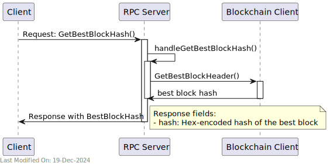
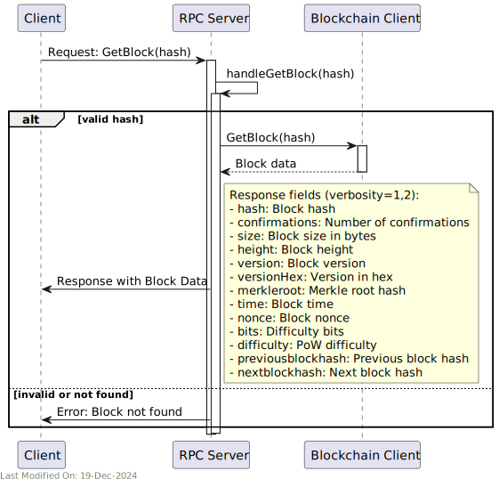

#  🌐 P2P Service

## Index

1. [Introduction](#1-introduction)
2. [Architecture](#2-architecture)
3. [Functionality](#4-functionality)
4. [Technology](#5-technology)
5. [Directory Structure and Main Files](#6-directory-structure-and-main-files)
6. [Settings](#7-settings)
7. [How to run](#8-how-to-run)

## 1. Introduction

The RPC server provides compatibility with the Bitcoin RPC interface, allowing clients to interact with the Teranode node using standard Bitcoin RPC commands. The RPC server listens for incoming requests and processes them, returning the appropriate responses.

Teranode provides partial support, as required for its own services. Additional support for specific commands and features might be added over time.

The below table summarises the services supported in the current version:

### Supported RPC Commands

| RPC Command        | Status     |
|--------------------|------------|
| getbestblockhash   | Supported  |
| getblock           | Supported  |
| stop               | Supported  |
| version            | Supported  |

### Unimplemented RPC Commands

| RPC Command             | Status       |
|-------------------------|--------------|
| addnode                 | Unimplemented|
| createrawtransaction    | Unimplemented|
| debuglevel              | Unimplemented|
| decoderawtransaction    | Unimplemented|
| decodescript            | Unimplemented|
| estimatefee             | Unimplemented|
| generate                | Unimplemented|
| getaddednodeinfo        | Unimplemented|
| getbestblock            | Unimplemented|
| getblockchaininfo       | Unimplemented|
| getblockcount           | Unimplemented|
| getblockhash            | Unimplemented|
| getblockheader          | Unimplemented|
| getblocktemplate        | Unimplemented|
| getcfilter              | Unimplemented|
| getcfilterheader        | Unimplemented|
| getconnectioncount      | Unimplemented|
| getcurrentnet           | Unimplemented|
| getdifficulty           | Unimplemented|
| getgenerate             | Unimplemented|
| gethashespersec         | Unimplemented|
| getheaders              | Unimplemented|
| getinfo                 | Unimplemented|
| getmempoolinfo          | Unimplemented|
| getmininginfo           | Unimplemented|
| getnettotals            | Unimplemented|
| getnetworkhashps        | Unimplemented|
| getpeerinfo             | Unimplemented|
| getrawmempool           | Unimplemented|
| getrawtransaction       | Unimplemented|
| gettxout                | Unimplemented|
| gettxoutproof           | Unimplemented|
| help                    | Unimplemented|
| node                    | Unimplemented|
| ping                    | Unimplemented|
| reconsiderblock         | Unimplemented|
| searchrawtransactions   | Unimplemented|
| sendrawtransaction      | Unimplemented|
| setgenerate             | Unimplemented|
| submitblock             | Unimplemented|
| uptime                  | Unimplemented|
| validateaddress         | Unimplemented|
| verifychain             | Unimplemented|
| verifymessage           | Unimplemented|
| verifytxoutproof        | Unimplemented|


### Command help

A description of the commands can be found in the `rpcserverhelp.go` file in the `bsvd` repository:
https://github.com/bitcoinsv/bsvd/blob/master/rpcserverhelp.go

Teranode RPC server is designed to be compatible with the Bitcoin Core RPC interface, as implemented in the `bsvd` repository.

### Authentication

All RPC commands require a valid username and password for authentication. The server listens on a specified port for incoming requests and processes them accordingly. The server could be opened up only for local (within the node) access, or it could be exposed to the public internet, depending on the deployment requirements. In either case, authentication is required to access the RPC server.


## 2. Architecture


The RPC server is a standalone service that listens for incoming requests and processes them based on the command type. The server starts by initializing the HTTP server and setting up the necessary configurations.
It then listens for incoming requests and routes them to the appropriate handler based on the command type. The handler processes the request, executes the command, and returns the response to the client.

In order to serve some of the requests, the RPC server interacts with the Teranode core services to fetch the required data. For example, when a `getblock` command is received, the server interacts with the blockchain service to fetch the block data.


## 3. Functionality


### 3.1. RPC Server Initialization and Configuration

### 3.2. Command - Request Version

The `version` command is used to retrieve the version information of the RPC server. The RPC server processes this command by constructing a response with the server version information and returning it to the client.


### 3.3. Command - Get Best Block Hash

The `getbestblockhash` command is used to retrieve the hash of the best (most recent) block on the blockchain. The RPC server processes this command by interacting with the blockchain service to fetch the hash of the best block.




### 3.4. Command - Get Block

The `getblock` command is used to retrieve information about a specific block on the blockchain. The RPC server processes this command by interacting with the blockchain service to fetch the block data based on the provided block hash.



### 3.5. Command - Stop

*** TODO

## 4. Technology

### **HTTP Server and RESTful API**
- **Usage**: In `Server.go`, an HTTP server is set up to listen for requests and send responses.
- **Functionality**: Handling HTTP requests and responses, as well as routing, middleware support.

### **Authentication and Security**
- **Basic Authentication**: Handling basic HTTP authentication to secure server access.


## 5. Directory Structure and Main Files


The RPC service is located in the `services/rpc` directory. The main files and directories are as follows:

```
./servers/rpc
├── Server.go          # Main server application file: Initializes and runs the server, sets up configurations, and handles lifecycle events.
└── handlers.go        # Request handlers: Defines functions that process incoming requests based on type and content.
```

## 6. Settings

### Core Settings from `gocore` Configuration:
1. **rpc_user**: Username for RPC authentication. It is used as part of the HTTP Basic Auth.
2. **rpc_pass**: Password for RPC authentication, paired with `rpc_user`.
3. **rpc_limit_user**: A secondary, restricted-access user for the RPC server.
4. **rpc_limit_pass**: Password for the restricted-access user.
5. **rpc_max_clients**: Maximum number of simultaneous RPC clients allowed to connect to the server. Default is 1 if not set.
6. **rpc_quirks**: Boolean setting to enable or disable quirks mode, which may allow non-standard behavior for broader client compatibility. It defaults to `true` if not set.
7. **rpc_listener_url**: URL or network address the RPC server listens on. This is critical for initializing the server's network listener.

### Usage of Settings:
- **Authentication**: The `rpc_user` and `rpc_pass` are used to construct the full HTTP Basic Auth string. Similarly, `rpc_limit_user` and `rpc_limit_pass` are used for a limited access user which might have restrictions on the types of commands that can be executed.
- **Connection Management**: `rpc_max_clients` is used to prevent server overload by limiting the number of active connections.
- **Server Configuration**: `rpc_listener_url` is essential for binding the server to the correct network interface and port.
- **Behavior Customization**: `rpc_quirks` allows the server to handle client requests in a manner that might not strictly adhere to the standard, for compatibility with older or non-standard clients.


## 7. How to run


To run the RPC Service locally, you can execute the following command:

```shell
SETTINGS_CONTEXT=dev.[YOUR_USERNAME] go run -rpc=1
```

Please refer to the [Locally Running Services Documentation](../locallyRunningServices.md) document for more information on running the RPC Service locally.
