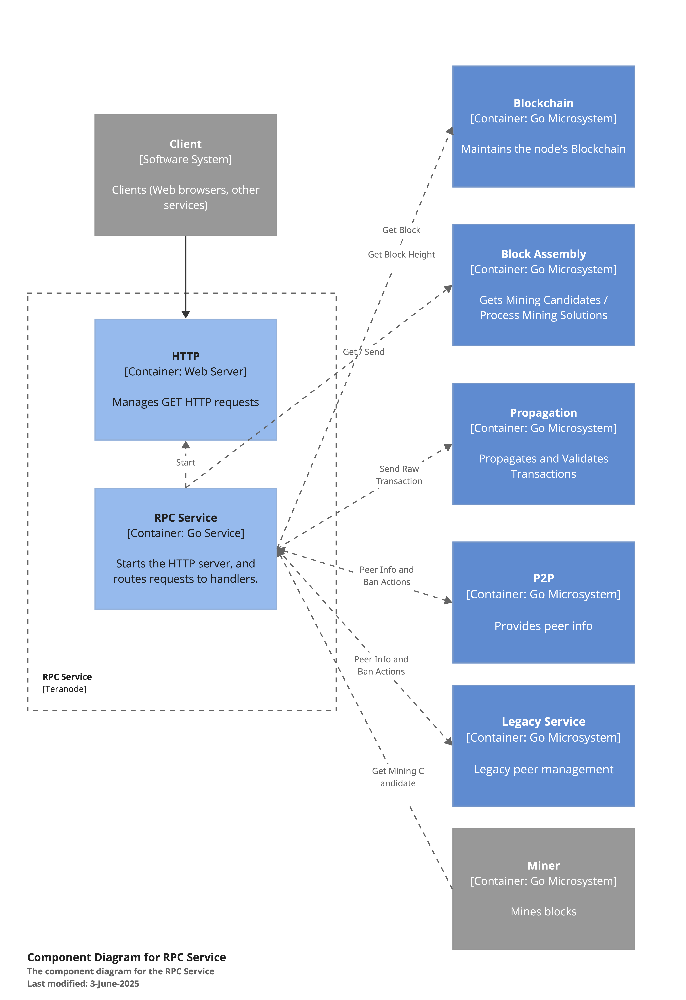

# Teranode Microservices Overview

## Table of Contents

- [Teranode Microservices Overview](#teranode-microservices-overview)
  - [Table of Contents](#table-of-contents)
  - [1. Introduction](#1-introduction)
  - [2. Core Services](#2-core-services)
    - [2.1 Asset Server](#21-asset-server)
    - [2.2 Propagation Service](#22-propagation-service)
    - [2.3 Validator Service](#23-validator-service)
    - [2.4 Subtree Validation Service](#24-subtree-validation-service)
    - [2.5 Block Validation Service](#25-block-validation-service)
    - [2.6 Block Assembly Service](#26-block-assembly-service)
    - [2.7 Blockchain Service](#27-blockchain-service)
    - [2.8 Alert Service](#28-alert-service)
  - [3. Overlay Services](#3-overlay-services)
    - [3.1 Block Persister Service](#31-block-persister-service)
    - [3.2 UTXO Persister Service](#32-utxo-persister-service)
    - [3.3 P2P Service](#33-p2p-service)
    - [3.4 P2P Bootstrap Service](#34-p2p-bootstrap-service)
    - [3.5 P2P Legacy Service](#35-p2p-legacy-service)
    - [3.6 RPC Server](#36-rpc-server)
  - [4. Stores](#4-stores)
    - [4.1 TX and Subtree Store (Blob Server)](#41-tx-and-subtree-store-blob-server)
    - [4.2 UTXO Store](#42-utxo-store)
  - [5. Other Components](#5-other-components)
    - [5.1 Kafka Message Broker](#51-kafka-message-broker)
    - [5.2 Miners](#52-miners)
  - [6. Interaction Patterns](#6-interaction-patterns)
  - [7. Related Resources](#7-related-resources)

## 1. Introduction

Teranode is designed as a collection of microservices that work together to provide a scalable and efficient blockchain network. This document provides an overview of each microservice, its responsibilities, and how it interacts with other components in the system.

## 2. Core Services

### 2.1 Asset Server

The Asset Server acts as an interface to various data stores, handling transactions, subtrees, blocks, and UTXOs. It uses the HTTP protocol for communication.

**Key Responsibilities:**
- Provide access to blockchain data
- Handle data retrieval requests from other services and external clients
- Serve as a facade for various data stores

**Data Models:**
- Blocks
- Block Headers
- Subtrees
- Extended Transactions
- UTXOs

**Key Interactions:**

- Interacts with UTXO Store, Blob Store (Subtree and TX Store), and Blockchain Server
- Provides data to other Teranode components and external clients over HTTP/WebSockets

**HTTP Endpoints:**
- getTransaction() and getTransactions()
- GetTransactionMeta()
- GetSubtree()
- GetBlockHeaders(), GetBlockHeader() and GetBestBlockHeader()
- GetBlock() and GetLastNBlocks()
- GetUTXO() and GetUTXOsByTXID()

You can read more about this service [here](../services/assetServer.md).

### 2.2 Propagation Service

The Propagation Service is responsible for receiving and forwarding transactions across the network.

**Key Responsibilities:**
- Receive transactions from the network through multiple communication channels (gRPC, UDP over IPv6, HTTP and QUIC)
- Perform initial sanity checks on transactions
- Forward valid transactions to the TX Validator Service

**Key Interactions:**

- Receives transactions from other nodes via IPv6 multicast, gRPC, HTTP or Quic
- Forwards transactions to the TX Validator Service

**Technology Stack:**
- Go programming language
- UDP, HTTP, QUIC, and fRPC for network communication
- gRPC and Protocol Buffers for service communication

You can read more about this service [here](../services/propagation.md).

### 2.3 Validator Service

The TX Validator Service checks transactions against network rules and updates their status in the UTXO store.

**Key Responsibilities:**

- Validate transactions against network rules and Bitcoin consensus rules
- Update transaction status in the UTXO store
- Forward validated transaction IDs to the Block Assembly Service
- Notify P2P subscribers about rejected transactions

**Key Processes:**
- Receiving transaction validation requests
- Validating transactions (including checks for double-spending)
- Updating UTXO store with new transaction data
- Propagating validated transactions to Block Assembly and Subtree Validation services

**Data Model:**
- Extended Transaction format

**Technology Stack:**
- Go programming language
- gRPC and fRPC for service communication
- Kafka for message queuing (optional)
- BSV libraries for transaction validation

You can read more about this service [here](../services/validator.md).

### 2.4 Subtree Validation Service

This service validates newly received subtrees, adds metadata, and persists them in the Subtree Store.

**Key Responsibilities:**
- Validate subtrees received from other nodes
- Add metadata to subtrees for block validation
- Store validated subtrees in the Subtree Store

**Key Processes:**
- Real-time validation of subtrees
- UTXO validation for transactions within subtrees
- Handling unvalidated transactions within subtrees

You can read more about this service [here](../services/subtreeValidation.md).

### 2.5 Block Validation Service

The Block Validation Service processes new blocks, checking their validity before they are added to the blockchain.

**Key Responsibilities:**
- Validate new blocks
- Coordinate with Subtree Validation Service for missing subtrees
- Update the blockchain with validated blocks

**Key Processes:**
- Receiving blocks for validation
- Validating block structure, Merkle root, and block header
- Catching up after a parent block is not found
- Marking transactions as mined

**Data Models:**
- Blocks
- Subtrees
- Extended Transactions
- UTXOs

You can read more about this service [here](../services/blockValidation.md).

### 2.6 Block Assembly Service

This service is responsible for creating subtrees and assembling block templates for miners.

**Key Responsibilities:**

- Organize transactions into subtrees
- Create block templates from subtrees
- Broadcast new subtrees and blocks to the network
- Handle blockchain reorganizations and forks

**Key Processes:**
- Receiving transactions from the TX Validator Service
- Grouping transactions into subtrees
- Creating mining candidates
- Processing subtrees and blocks from other nodes
- Handling forks and conflicts

**Data Models:**
- Blocks
- Subtrees
- UTXOs

You can read more about this service [here](../services/blockAssembly.md).

### 2.7 Blockchain Service

The Blockchain Service manages block updates and maintains the node's copy of the blockchain.

**Key Responsibilities:**
- Add new blocks to the blockchain
- Manage block headers and subtree lists
- Provide blockchain state information to other services
- Handle block invalidation and chain reorganization

**Key Processes:**
- Adding new blocks to the blockchain
- Retrieving blocks and block headers
- Invalidating blocks
- Managing subscriptions for blockchain events

**Data Model:**
- Blocks (including block header, coinbase TX, and block merkle root)

You can read more about this service [here](../services/blockchain.md).

### 2.8 Alert Service

The Alert Service handles system-wide alerts and notifications, including UTXO freezing and block invalidation.

**Key Responsibilities:**
- Distribute important network alerts
- Manage alert prioritization and dissemination
- Handle UTXO freezing, unfreezing, and reassignment
- Manage peer banning and unbanning
- Handle block invalidation requests

**Key Processes:**
- UTXO freezing and unfreezing
- UTXO reassignment
- Block invalidation
- Peer management

You can read more about this service [here](../services/alert.md).

## 3. Overlay Services

### 3.1 Block Persister Service

This service post-processes blocks, adding transaction metadata and storing them as files.

**Key Responsibilities:**
- Decorate transactions in blocks with metadata
- Store processed blocks in a block data storage system
- Create and store UTXO addition and deletion files

**Key Processes:**
- Receiving and processing new block notifications
- Decorating transactions with UTXO metadata
- Creating and storing block, subtree, and UTXO files

**Data Models:**
- Blocks
- Subtrees
- UTXOs (additions and deletions)

You can read more about this service [here](../services/blockPersister.md).

### 3.2 UTXO Persister Service

The UTXO Persister maintains an up-to-date record of all unspent transaction outputs.

**Key Responsibilities:**
- Process new blocks to update the UTXO set
- Maintain UTXO set files for each block
- Create and maintain an up-to-date UTXO file set for each block in the blockchain

**Key Processes:**
- Monitoring for new block files
- Processing UTXO additions and deletions
- Generating UTXO set files
- Tracking progress of processed blocks

**Data Model:**
- UTXO set (collection of unspent transaction outputs)
- UTXO components: TxID, Index, Value, Height, Script, Coinbase flag

**Technology Stack:**
- Go programming language
- Blob store for file storage
- Bitcoin SV libraries for blockchain operations

You can read more about this service [here](../services/utxoPersister.md).

### 3.3 P2P Service

The P2P Service manages peer-to-peer communications within the network.

**Key Responsibilities:**
- Handle peer discovery and connection management
- Facilitate message passing between nodes
- Manage subscriptions for blockchain events
- Handle WebSocket connections for real-time notifications

**Key Processes:**
- Peer discovery and connection
- Managing best block messages
- Handling blockchain messages (blocks, subtrees, mining)
- Processing TX validator messages
- Managing WebSocket notifications

You can read more about this service [here](../services/p2p.md).

### 3.4 P2P Bootstrap Service

This service helps new nodes discover peers in the Teranode network.

**Key Responsibilities:**
- Allow nodes to register themselves
- Provide information about existing nodes to new nodes
- Manage a private P2P network using Kademlia and pre-shared keys

**Key Technologies:**
- libp2p
- Kademlia Distributed Hash Table (DHT)
- Private network with Pre-shared Keys (PSK)

You can read more about this service [here](../services/p2pBootstrap.md).

### 3.5 P2P Legacy Service

The P2P Legacy Service facilitates communication between Teranode and traditional Bitcoin SV nodes.

**Key Responsibilities:**
- Receive blocks and transactions from legacy nodes
- Disseminate new blocks to legacy nodes
- Transform data between BSV and Teranode formats

**Key Processes:**
- Receiving inventory notifications from BSV nodes
- Processing new blocks and converting them to Teranode format
- Handling requests from Teranode components for legacy data

You can read more about this service [here](../services/p2pLegacy.md).

### 3.6 RPC Server

The RPC Server provides compatibility with the Bitcoin RPC interface, allowing clients to interact with the Teranode node using standard Bitcoin RPC commands.

**Key Responsibilities:**
- Handle incoming RPC requests
- Process and validate RPC commands
- Interact with core Teranode services to fulfill requests
- Provide responses in Bitcoin-compatible format

**Supported RPC Commands:**
- createrawtransaction, generate, getbestblockhash, getblock, sendrawtransaction, stop, version, getminingcandidate, submitminingsolution, getblockchaininfo, getinfo, getpeerinfo

**Key Processes:**
- Authenticating RPC requests
- Routing requests to appropriate handlers
- Executing commands and interacting with other Teranode services
- Formatting and returning responses

**Technology Stack:**
- Go programming language
- HTTP/HTTPS for RPC communication
- JSON for request/response formatting

You can read more about this service [here](../services/rpc.md).

## 4. Stores

### 4.1 TX and Subtree Store (Blob Server)

The Blob Server is a generic datastore used for storing transactions (extended tx) and subtrees.

**Key Responsibilities:**
- Store and retrieve transaction data
- Store and retrieve subtree data
- Provide a common interface for various storage backends

**Supported Storage Backends:**
- File System
- Google Cloud Storage (GCS)
- Amazon S3
- MinIO
- SeaweedFS
- SQL (PostgreSQL)
- In-memory storage

**Key Interactions:**
- Used by Asset Server for retrieving transaction and subtree data
- Utilized by Block Assembly for storing and retrieving subtrees
- Accessed by Block Validation for transaction and subtree verification

**Data Models:**
- Extended Transaction Data Model
- Subtree Data Model

You can read more about this store [here](../stores/blob.md).

### 4.2 UTXO Store

The UTXO Store is responsible for tracking spendable UTXOs based on the longest honest chain-tip in the network.

**Key Responsibilities:**
- Maintain the current UTXO set
- Handle UTXO creation, spending, and deletion
- Manage block height for determining UTXO spendability
- Support freezing, unfreezing, and reassigning UTXOs

**Supported Storage Backends:**
- Aerospike (primary production datastore)
- In-memory store
- SQL (PostgreSQL and SQLite)
- Nullstore (for testing)

**Key Interactions:**
- Used by Asset Server for UTXO data retrieval
- Accessed by Block Persister for UTXO metadata
- Utilized by Block Assembly for coinbase UTXO management
- Interacts with Block Validation for UTXO verification
- Supports Transaction Validator for UTXO operations

**Data Model:**
- UTXO Meta Data, including transaction details, parent transaction hashes, block IDs, fees, and other metadata

You can read more about this store [here](../stores/utxo.md).

## 5. Other Components

### 5.1 Kafka Message Broker

Kafka serves as the messaging middleware for inter-service communication in Teranode.

**Key Responsibilities:**
- Facilitate asynchronous communication between services
- Ensure reliable message delivery
- Support high-throughput data streaming

**Key Topics and Use Cases:**
- `kafka_validatortxsConfig`: Used for transmitting new transaction notifications from Propagation to Validator
- `kafka_txsConfig`: Used for forwarding valid transactions from Validator to Block Assembly
- `kafka_txmetaConfig`: Used for sending new UTXO metadata from Validator to Subtree Validation
- `kafka_rejectedTxConfig`: Used for notifying P2P about rejected transactions
- `kafka_blocksConfig`: Used for propagating new blocks from P2P to Block Validation
- `kafka_subtreesConfig`: Used for sending new subtrees from P2P to Subtree Validation
- `kafka_blocksFinalConfig`: Used for sending finalized blocks from Blockchain to Block Persister

**Key Features:**
- Supports high-throughput data streaming
- Provides fault-tolerance and durability
- Allows for scalable message consumption

You can read more about how Kafka is used [here](../kafka/kafka.md).

### 5.2 Miners

Miners are responsible for the computational work of finding valid blocks.

**Key Responsibilities:**
- Perform proof-of-work calculations
- Broadcast newly found blocks

## 6. Interaction Patterns

- Propagation Service receives transactions and forwards them to TX Validator via Kafka
- TX Validator validates transactions, updates UTXO Store, and forwards to Block Assembly and Subtree Validation via Kafka
- Block Assembly receives validated transactions from TX Validator via Kafka
- Subtree Validation Service validates subtrees and interacts with TX Validator for missing transactions
- Block Validation Service coordinates with Subtree Validation Service for block processing
- P2P Service propagates new blocks and subtrees to Block Validation and Subtree Validation via Kafka
- Blockchain Service sends finalized blocks to Block Persister via Kafka
- UTXO Store interacts with multiple services for UTXO management and validation

## 7. Related Resources

- [Teranode Architecture Overview](teranode-overall-system-design.md)

- Core Services:
   - [Asset Server](../services/assetServer.md)
   - [Propagation Service](../services/propagation.md)
   - [Validator Service](../services/validator.md)
   - [Subtree Validation Service](../services/subtreeValidation.md)
   - [Block Validation Service](../services/blockValidation.md)
   - [Block Assembly Service](../services/blockAssembly.md)
   - [Blockchain Service](../services/blockchain.md)
   - [Alert Service](../services/alert.md)

- Overlay Services:
   - [Block Persister Service](../services/blockPersister.md)
   - [UTXO Persister Service](../services/utxoPersister.md)
   - [P2P Service](../services/p2p.md)
   - [P2P Bootstrap Service](../services/p2pBootstrap.md)
   - [P2P Legacy Service](../services/p2pLegacy.md)
   - [RPC Server](../services/rpc.md)

- Stores:
   - [Blob Server](../stores/blob.md)
   - [UTXO Store](../stores/utxo.md)

- Messaging:
   - [Kafka](../kafka/kafka.md)
