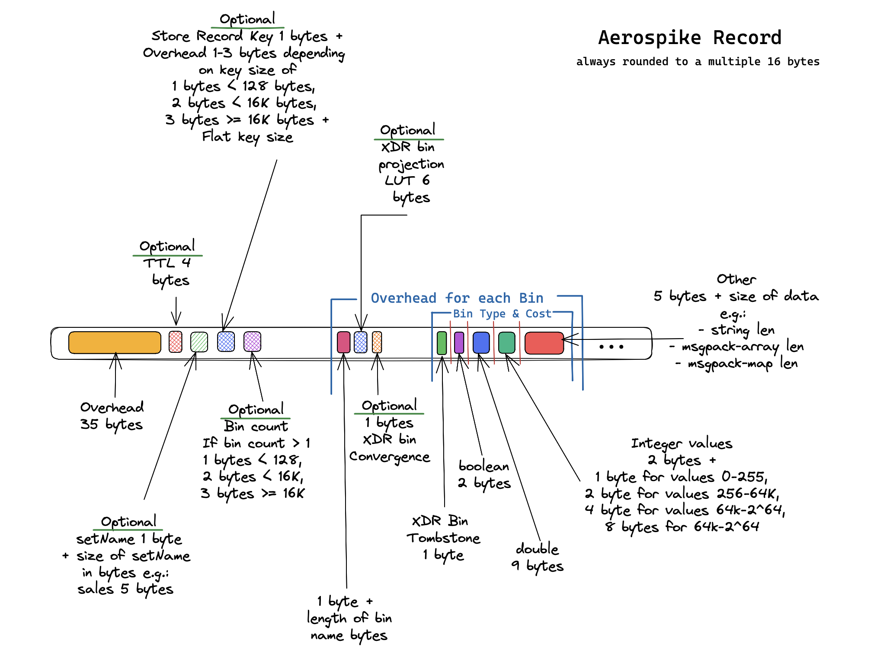

# Teranode Data Model - UTXO

## UTXO Data Model

For every transaction, a UTXO record is stored in the database. The record contains the following fields:

| **Field Name**           | **Data Type**                       | **Description**                                                                                                    |
|--------------------------|-------------------------------------|--------------------------------------------------------------------------------------------------------------------|
| **utxos**                | `Array of Byte[32] or Byte[64]`     | A list of UTXOs, where each UTXO is either 32 bytes (unspent) or 64 bytes (spent).                                 |
| **utxoSpendableIn**      | `Map<Integer, Integer>`             | A map where the key is the UTXO offset and the value is the block height after which the UTXO is spendable.        |
| **nrUtxos**              | `Integer`                           | Total number of UTXOs in this record.                                                                              |
| **spentUtxos**           | `Integer`                           | Number of UTXOs that have been spent in this record.                                                               |
| **frozen**               | `Boolean`                           | Indicates whether the UTXO or transaction is frozen.                                                               |
| **spendingHeight**       | `Integer`                           | If the UTXO is from a coinbase transaction, it stores the block height after which it can be spent.                |
| **blockIDs**             | `Array<Integer>`                    | List of block IDs that reference this UTXO.                                                                        |
| **external**             | `Boolean`                           | Flag indicating whether the transaction is stored externally (used for fetching external raw transaction data).    |
| **nrRecords**            | `Integer (Optional)`                | The number of UTXO records associated with the transaction, used for pagination.                                   |
| **reassignments**        | `Array<Map>`                        | Tracks UTXO reassignments. Contains maps with keys such as `offset`, `utxoHash`, `newUtxoHash`, and `blockHeight`. |
| **tx**                   | `bt.Tx Object`                      | Raw transaction data containing inputs, outputs, version, and locktime.                                            |
| **fee**                  | `Integer`                           | Transaction fee associated with this UTXO.                                                                         |
| **sizeInBytes**          | `Integer`                           | The size of the transaction in bytes.                                                                              |
| **parentTxHashes**       | `Array<chainhash.Hash>`             | List of parent transaction hashes (from the transaction inputs).                                                   |
| **isCoinbase**           | `Boolean`                           | Indicates whether this UTXO is from a coinbase transaction.                                                        |

Within it, each UTXO in the `utxos` array has the following fields:

| **Field Name**            | **Data Type**                       | **Description**                                                                                                    |
|---------------------------|-------------------------------------|--------------------------------------------------------------------------------------------------------------------|
| **utxoHash**              | `Byte[32]`                          | 32-byte little-endian hash representing the UTXO.                                                                  |
| **spendingTxID**          | `Byte[32]`                          | 32-byte little-endian hash representing the transaction ID that spent this UTXO (only present for spent UTXOs).    |
| **existingUTXOHash**      | `Byte[32]`                          | Extracted from a UTXO to validate that the UTXO matches the provided `utxoHash`.                                   |
| **existingSpendingTxID**  | `Byte[32]`                          | If the UTXO has been spent, this field stores the spending transaction ID.                                         |

Additionally, note how the raw transaction data (**tx (bt.Tx Object)**) is stored in the record. This includes:
- **Version**: The transaction version.
- **LockTime**: The transaction lock time.
- **Inputs**: Array of inputs used in the transaction.
- **Outputs**: Array of outputs (UTXOs) created by the transaction.

## Time to Live (TTL) Fields

Typically, UTXO records are kept with a time-to-live value that is set when all UTXOs in a record are spent or reassigned.

| **Field Name**        | **Data Type**                       | **Description**                                                                                           |
|-----------------------|-------------------------------------|-----------------------------------------------------------------------------------------------------------|
| **TTL**               | `Integer`                           | Time-to-live value for the record, based on its status (e.g., if all UTXOs are spent or reassigned).        |

## Aerospike Storage

If storing in Aerospike, the UTXO record is stored as a bin in the Aerospike database. The bin contains the UTXO data in a serialized format, containing up to 1024 bytes.

For more information, please refer to the official Aerospike documentation: https://aerospike.com.

## UTXO MetaData

For convenience, the UTXO can be decorated using the `UTXO MetaData` format, widely used in Teranode:

| Field Name    | Description                                                     | Data Type                         |
|---------------|-----------------------------------------------------------------|-----------------------------------|
| Tx            | The raw transaction data.                                       | *bt.Tx Object                     |
| Hash          | Unique identifier for the transaction.                          | String/Hexadecimal                |
| Fee           | The fee associated with the transaction.                        | Decimal                           |
| Size in Bytes | The size of the transaction in bytes.                           | Integer                           |
| ParentTxHashes       | List of hashes representing the parent transactions.            | Array of Strings/Hexadecimals     |
| BlockIDs        | List of IDs of the blocks that include this transaction.        | Array of Integers                 |
| LockTime      | The earliest time or block number that this transaction can be included in the blockchain. | Integer/Timestamp or Block Number |
| IsCoinbase    | Indicates whether the transaction is a coinbase transaction.    | Boolean                           |

Note:

- **Parent Transactions**: 1 or more parent transaction hashes. For each input that our transaction has, we can have a different parent transaction. I.e. a TX can be spending UTXOs from multiple transactions.

- **Blocks**: 1 or more block hashes. Each block represents a block that mined the transaction.

- Typically, a tx should only belong to one block. i.e. a) a tx is created (and its meta is stored in the UTXO store) and b) the tx is mined, and the mined block hash is tracked in the UTXO store for the given transaction.

- However, in the case of a fork, a tx can be mined in multiple blocks by different nodes. In this case, the UTXO store will track multiple block hashes for the given transaction, until such time that the fork is resolved and only one block is considered valid.
