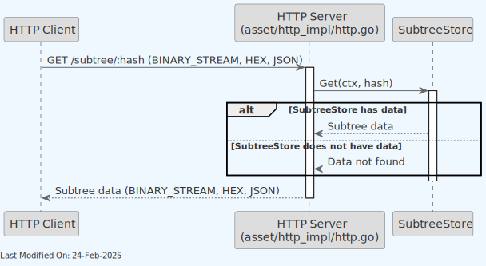
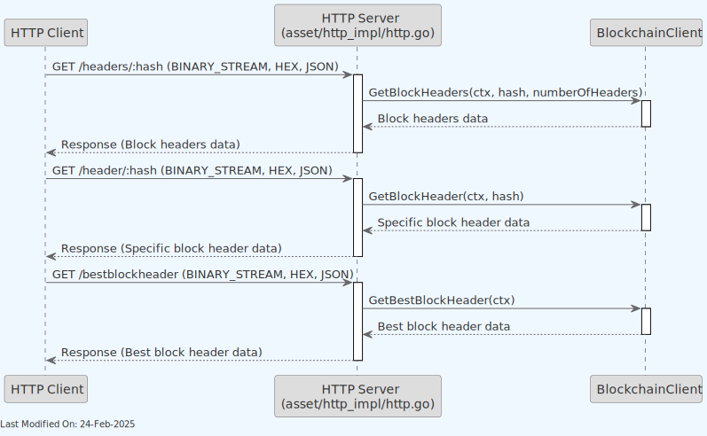
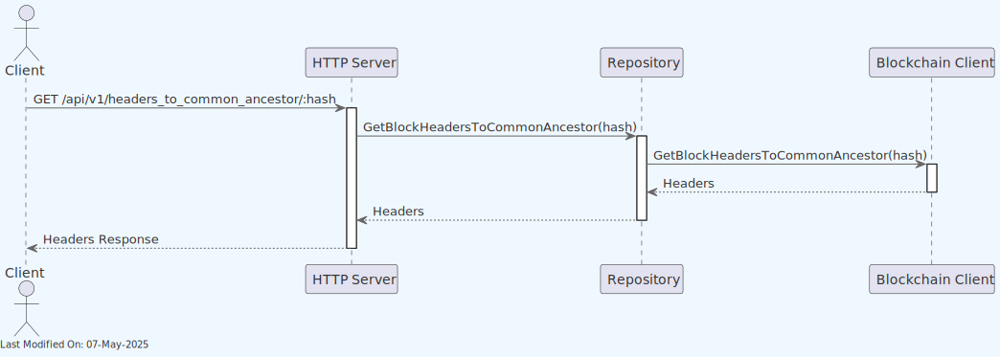
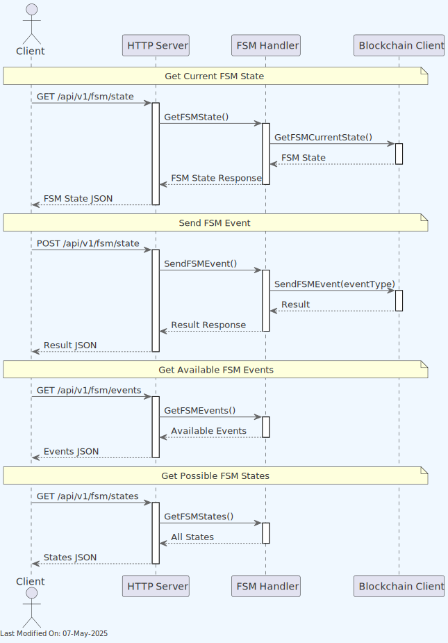

# 🗂️ Asset Server

## Index

1. [Description](#1-description)
2. [Architecture](#2-architecture)
3. [Data Model](#3-data-model)
4. [Use Cases](#4-use-cases)
    - [4.1. HTTP](#41-http)
        - [4.1.1. getTransaction() and getTransactions()](#411-gettransaction-and-gettransactions)
        - [4.1.2. GetTransactionMeta()](#412-gettransactionmeta)
        - [4.1.3. GetSubtree()](#413-getsubtree)
        - [4.1.4. GetBlockHeaders(), GetBlockHeader() and GetBestBlockHeader()](#414-getblockheaders-getblockheader-and-getbestblockheader)
        - [4.1.5. GetBlockByHash(), GetBlocks and GetLastNBlocks()](#415-getblockbyhash-getblocks-and-getlastnblocks)
        - [4.1.6. GetUTXO() and GetUTXOsByTXID()](#416-getutxo-and-getutxosbytxid)
        - [4.1.7. Search()](#417-search)
        - [4.1.8. GetBlockStats()](#418-getblockstats)
        - [4.1.9. GetBlockGraphData()](#419-getblockgraphdata)
        - [4.1.10. GetBlockForks()](#4110-getblockforks)
        - [4.1.11. GetBlockSubtrees()](#4111-getblocksubtrees)
        - [4.1.12. GetLegacyBlock()](#4112-getlegacyblock)
5. [Technology](#5-technology)
6. [Directory Structure and Main Files](#6-directory-structure-and-main-files)
7. [How to run](#7-how-to-run)
    - [7.1. How to run](#71-how-to-run)
    - [7.2 Configuration options (settings flags)](#72-configuration-options-settings-flags)
8. [Other Resources](#8-other-resources)


## 1. Description

The Asset Service acts as an interface ("Front" or "Facade") to various data stores. It deals with several key data elements:

- **Transactions (TX)**.


- **SubTrees**.


- **Blocks and Block Headers**.


- **Unspent Transaction Outputs (UTXO)**.


The server uses HTTP as communication protocol:

- **HTTP**: A ubiquitous protocol that allows the server to be accessible from the web, enabling other nodes or clients to interact with the server using standard web requests.


The server being externally accessible implies that it is designed to communicate with other nodes and external clients across the network, to share blockchain data or synchronize states.

The various micro-services typically write directly to the data stores, but the asset service fronts them as a common interface.

Finally, the Asset Service also offers a WebSocket interface, allowing clients to receive real-time notifications when new subtrees and blocks are added to the blockchain.

## 2. Architecture


Using HTTP, the Asset Server provides data both to other Teranode components, and to remote Teranodes. It also provides data to external clients over HTTP / Websockets, such as the Teranode UI Dashboard.

All data is retrieved from other Teranode services / stores.

Here we can see the Asset Server's relationship with other Teranode components in more detail:


The Asset Server is composed of the following components:


* **UTXO Store**: Provides UTXO data to the Asset Server.
* **Blob Store**: Provides Subtree and Extended TX data to the Asset Server, referred here as Subtree Store and TX Store.
* **Blockchain Server**: Provides blockchain data (blocks and block headers) to the Asset Server.


Finally, note that the Asset Server benefits of the use of Lustre Fs (filesystem). Lustre is a type of parallel distributed file system, primarily used for large-scale cluster computing. This filesystem is designed to support high-performance, large-scale data storage and workloads.
Specifically for Teranode, these volumes are meant to be temporary holding locations for short-lived file-based data that needs to be shared quickly between various services
Teranode microservices make use of the Lustre file system in order to share subtree and tx data, eliminating the need for redundant propagation of subtrees over grpc or message queues. The services sharing Subtree data through this system can be seen here:


## 3. Data Model

The following data types are provided by the Asset Server:

- [Block Data Model](../datamodel/block_data_model.md): Contain lists of subtree identifiers.
- [Block Header Data Model](../datamodel/block_header_data_model.md): a block header includes the block ID of the previous block.
- [Subtree Data Model](../datamodel/subtree_data_model.md): Contain lists of transaction IDs and their Merkle root.
- [Extended Transaction Data Model](../datamodel/transaction_data_model.md): Include additional metadata to facilitate processing.
- [UTXO Data Model](../datamodel/utxo_data_model.md): Include additional metadata to facilitate processing.


## 4. Use Cases

### 4.1. HTTP

The Asset Service exposes the following HTTP methods:

### 4.1.1. getTransaction() and getTransactions()


### 4.1.2. GetTransactionMeta()


### 4.1.3. GetSubtree()



### 4.1.4. GetBlockHeaders(), GetBlockHeader() and GetBestBlockHeader()



### 4.1.5. GetBlockByHash(), GetBlocks and GetLastNBlocks()


The server also provides a legacy `/rest/hash/:hash.bin` endpoint for retrieving raw block data by hash. This is a deprecated legacy endpoint that might not have support in future versions.

### 4.1.6. GetUTXO() and GetUTXOsByTXID()


* For specific UTXO by hash requests (/utxo/:hash), the HTTP Server requests UTXO data from the UtxoStore using a hash.


* For getting UTXOs by a transaction ID (/utxos/:hash/json), the HTTP Server requests transaction meta data from the UTXO Store using a transaction hash. Then for each output in the transaction, it queries the UtxoStore to get UTXO data for the corresponding output hash.

### 4.1.7. Search()

Generic hash search. The server searches for a hash in the Blockchain, the UTXO store and the subtree store.


### 4.1.8. GetBlockStats()

Retrieves block statistics


### 4.1.9. GetBlockGraphData()

Retrieves block graph data for a given period


### 4.1.10. GetBlockForks()

Retrieves information about block forks


### 4.1.11. GetBlockSubtrees()

Retrieves subtrees for a block in JSON format


### 4.1.12. GetLegacyBlock()

Retrieves a block in legacy format, and as a binary stream.


### 4.1.13. GetBlockHeadersToCommonAncestor()

Retrieves block headers up to a common ancestor point between two chains. This is useful for chain reorganization and fork resolution.



### 4.1.14. FSM State Management

The Asset Server provides an interface to the Finite State Machine (FSM) of the blockchain service. These endpoints allow for monitoring and controlling the blockchain state:



- **GET /api/v1/fsm/state**: Retrieves the current FSM state
- **POST /api/v1/fsm/state**: Sends a custom event to the FSM
- **GET /api/v1/fsm/events**: Lists all available FSM events
- **GET /api/v1/fsm/states**: Lists all possible FSM states

### 4.1.15. Block Validation Management

The Asset Server offers endpoints for block validation control:


- **POST /api/v1/block/invalidate**: Invalidates a specified block
- **POST /api/v1/block/revalidate**: Revalidates a previously invalidated block
- **GET /api/v1/blocks/invalid**: Retrieves a list of invalid blocks


## 5. Technology

Key technologies involved:

1. **Go Programming Language (Golang)**:
    - A statically typed, compiled language known for its simplicity and efficiency, especially in concurrent operations and networked services.
    - The primary language used for implementing the service's logic.

2. **HTTP/HTTPS Protocols**:
    - HTTP for transferring data over the web. HTTPS adds a layer of security with SSL/TLS encryption.
    - Used for communication between clients and the server, and for serving web pages or APIs.

3. **Echo Web Framework**:
    - A high-performance, extensible, minimalist Go web framework.
    - Used for handling HTTP requests and routing, including upgrading HTTP connections to WebSocket connections.
    - Library: github.com/labstack/echo

4. **JSON (JavaScript Object Notation)**:
    - A lightweight data-interchange format, easy for humans to read and write, and easy for machines to parse and generate.
    - Used for structuring data sent to and from clients, especially in contexts where HTTP is used.


## 6. Directory Structure and Main Files

```
./services/asset
├── Server.go                  # Server logic for the Asset Service.
├── Server_test.go             # Tests for the server functionality.
├── asset_api
│   ├── asset_api.pb.go        # Generated protobuf code for the asset API.
│   └── asset_api.proto        # Protobuf definitions for the asset API.
├── centrifuge_impl            # Implementation using Centrifuge for real-time updates.
│   ├── centrifuge.go          # Core Centrifuge implementation.
│   ├── client
│   │   ├── client.go          # Client-side implementation for Centrifuge.
│   │   └── index.html         # HTML template for client-side rendering.
│   └── websocket.go           # WebSocket implementation for real-time communication.
├── httpimpl                   # HTTP implementation of the asset service.
│   ├── GetBestBlockHeader.go  # Logic to retrieve the best block header.
│   ├── GetBlock.go            # Logic to retrieve a specific block.
│   ├── GetBlockForks.go       # Logic to retrieve information about block forks.
│   ├── GetBlockGraphData.go   # Logic to retrieve block graph data.
│   ├── GetBlockHeader.go      # Logic to retrieve a block header.
│   ├── GetBlockHeaders.go     # Logic to retrieve multiple block headers.
│   ├── GetBlockHeadersToCommonAncestor.go # Logic to retrieve headers to common ancestor.
│   ├── GetBlockStats.go       # Logic to retrieve block statistics.
│   ├── GetBlockSubtrees.go    # Logic to retrieve block subtrees.
│   ├── GetBlocks.go           # Logic to retrieve multiple blocks.
│   ├── GetLastNBlocks.go      # Logic to retrieve the last N blocks.
│   ├── GetLegacyBlock.go      # Logic to retrieve legacy block format.
│   ├── GetNBlocks.go          # Logic to retrieve N blocks from a specific point.
│   ├── GetSubtree.go          # Logic to retrieve a subtree.
│   ├── GetSubtreeTxs.go       # Logic to retrieve transactions in a subtree.
│   ├── GetTransaction.go      # Logic to retrieve a specific transaction.
│   ├── GetTransactionMeta.go  # Logic to retrieve transaction metadata.
│   ├── GetTransactions.go     # Logic to retrieve multiple transactions.
│   ├── GetTxMetaByTXID.go     # Logic to retrieve transaction metadata by TXID.
│   ├── GetUTXO.go             # Logic to retrieve UTXO data.
│   ├── GetUTXOsByTXID.go      # Logic to retrieve UTXOs by a transaction ID.
│   ├── Readmode.go            # Manages read-only mode settings.
│   ├── Search.go              # Implements search functionality.
│   ├── block_handler.go       # Handles block validation operations.
│   ├── blockHeaderResponse.go # Formats block header responses.
│   ├── fsm_handler.go         # Handles FSM state and event operations.
│   ├── helpers.go             # Helper functions for HTTP implementation.
│   ├── http.go                # Core HTTP implementation.
│   ├── metrics.go             # HTTP-specific metrics.
│   ├── sendError.go           # Utility for sending error responses.
│   └── *_test.go files        # Various test files for each component.
└── repository                 # Repository layer managing data interactions.
    ├── GetLegacyBlock.go      # Repository logic for retrieving legacy blocks.
    ├── GetLegacyBlock_test.go # Tests for GetLegacyBlock functionality.
    ├── repository.go          # Core repository implementation.
    └── repository_test.go     # Tests for the repository implementation.
```


## 7. How to run

### 7.1. How to run

To run the Asset Server locally, you can execute the following command:

```shell
SETTINGS_CONTEXT=dev.[YOUR_USERNAME] go run -Asset=1
```

Please refer to the [Locally Running Services Documentation](../../howto/locallyRunningServices.md) document for more information on running the Asset Server locally.


### 7.2 Configuration options (settings flags)

1. **HTTP Server Configuration**
    - `asset_httpListenAddress`: Address for the Asset Service to listen for HTTP requests.
      Example: asset_httpListenAddress=:8090
    - `asset_httpAddress`: URL of the Asset Service HTTP server.
      Example: asset_httpAddress=http://localhost:8090
    - `securityLevelHTTP`: Determines the security level for HTTP communication. 0 for HTTP, non-zero for HTTPS.
      Example: securityLevelHTTP=1
    - `server_certFile`: Path to the SSL certificate file for HTTPS.
      Example: server_certFile=/path/to/cert.pem
    - `server_keyFile`: Path to the SSL key file for HTTPS.
      Example: server_keyFile=/path/to/key.pem
    - `http_sign_response`: Enables or disables signing of HTTP responses.
      Example: http_sign_response=true
    - `asset_apiPrefix`: Specifies the API prefix for HTTP routes.
      Example: asset_apiPrefix=/api/v1

2. **Centrifuge Configuration**
    - `asset_centrifuge_disable`: Disables the Centrifuge service if set to true.
      Example: asset_centrifuge_disable=false
    - `asset_centrifugeListenAddress`: Specifies the listen address for the Centrifuge service integration.
      Example: asset_centrifugeListenAddress=:8101

3. **P2P Configuration**
    - `p2p_httpAddress`: HTTP address for P2P communication.
      Example: p2p_httpAddress=localhost:9906
    - `p2p_private_key`: Private key for P2P communication.
      Example: p2p_private_key=<your-private-key>

4. **UTXO Store Configuration**
    - `utxostore`: URL for the UTXO store.
      Example: utxostore=http://localhost:8080

5. **Block Validation Configuration**
    - blockvalidation_processTxMetaUsingStore_BatchSize: Batch size for processing transaction metadata.
      Example: blockvalidation_processTxMetaUsingStore_BatchSize=1024
    - blockvalidation_processTxMetaUsingStor_Concurrency: Concurrency level for processing transaction metadata.
      Example: blockvalidation_processTxMetaUsingStor_Concurrency=4

6. **Debugging Configuration**
    - ECHO_DEBUG: Enables or disables debug mode for the Echo framework.
      Example: ECHO_DEBUG=true

7. **FSM Configuration**
    - fsm_state_restore: Enables or disables the restore state for the Finite State Machine.
      Example: fsm_state_restore=false
    - The FSM provides state management for the blockchain system with endpoints for querying and manipulating states.

8. **Coinbase Configuration**
    - coinbase_grpcAddress: gRPC address for coinbase-related operations.
      Example: coinbase_grpcAddress=localhost:50051

9. **Dashboard Configuration**
    - dashboard_enabled: Enables or disables the Teranode dashboard UI.
      Example: dashboard_enabled=true
    - dashboard-related settings control authentication and user interface features.

10. **Block Validation**
    - The Asset Server provides endpoints to invalidate and revalidate blocks, which is useful for managing forks and recovering from errors.


## 8. Other Resources

[Asset Reference](../../references/services/asset_reference.md)
