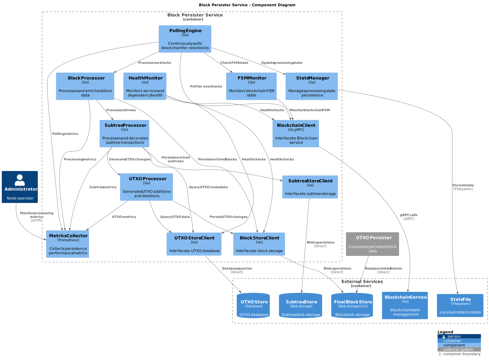
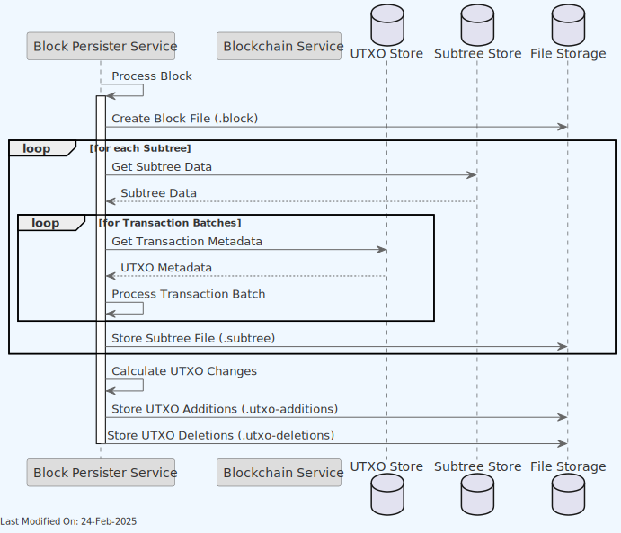

# 🔍 Block Persister Service

## Index

1. [Description](#1-description)
2. [Functionality](#2-functionality)
    - [2.1 Service Initialization](#21-service-initialization)
    - [2.2 Block Discovery and Processing](#22-block-discovery-and-processing)
    - [2.3 Subtree Processing Details](#23-subtree-processing-details)
3. [Data Model](#3-data-model)
4. [Technology](#4-technology)
5. [Directory Structure and Main Files](#5-directory-structure-and-main-files)
6. [How to run](#6-how-to-run)
7. [Configuration options (settings flags)](#7-configuration-options-settings-flags)
8. [Other Resources](#8-other-resources)

## 1. Description

The Block Persister service functions as an overlay microservice, designed to post-process subtrees after their integration into blocks and persisting them to a separate storage.

The Block Persister service operates as a **background processing service** that continuously polls the blockchain service for new blocks. Unlike other Teranode services, it does not expose a gRPC API and functions purely as a data persistence layer. When new blocks are detected through polling, the Block Persister service decorates (enriches) all transactions within the block's subtrees, ensuring the inclusion of transaction metadata (UTXO meta data). Then, it will save a number of files into a file storage system (such as S3):

- A file for the block (`.block` extension).
- A file for each subtree in a block (`.subtree` extension), containing the decorated transactions.
- A file for the UTXO Additions (`.utxo-additions` extension) per block, containing the newly created UTXOs.
- A file for the UTXO Deletions ( `.utxo-deletions` extension) per block, containing the spent UTXOs.

This service plays a key role within the Teranode network, guaranteeing that txs are accurately post-processed and stored with the essential metadata for necessary audit and traceability purposes. The decorated subtrees remain invaluable for future data analysis and inspection.

The Block Persister files are optionally post-processed by the UTXO Persister, which maintains a UTXO Set in a similar disk format.

> **Note**: For information about how the Block Persister service is initialized during daemon startup and how it interacts with other services, see the [Teranode Daemon Reference](../../references/teranodeDaemonReference.md#service-initialization-flow).


- The Block Persister polls the Blockchain service for new blocks and stores the decorated block in a data store (such as S3).


- The Block Persister service operates independently by polling the Blockchain service directly for new blocks, rather than relying on external notification systems.

- The Blockchain client is directly accessed to wait for the node State Management to change to `RUNNING` state before beginning block processing operations. For more information on this, please refer to the [State Management](../architecture/stateManagement.md) documentation.

### Detailed Component View

The following diagram provides a deeper level of detail into the Block Persister Service's internal components and their interactions:




## 2. Functionality

### 2.1 Service Initialization


The service initializes through the following sequence:

1. Loads configuration settings
2. Initializes state management
3. Establishes connection with blockchain client
4. Waits for FSM transition from IDLE state
5. Starts block processing loop

### 2.2 Block Discovery and Processing


The service processes blocks through a **continuous polling mechanism**:

1. **Block Discovery**
    - Retrieves last persisted block height from the local state
    - Polls the Blockchain service to get the current best block header
    - Determines if new blocks need processing based on `BlockPersisterPersistAge`. Blocks are only processed when `(currentTip - lastPersistedHeight) > BlockPersisterPersistAge`. This means the service intentionally stays at least `BlockPersisterPersistAge` blocks behind the tip to avoid reorgs and ensure block finality.

2. **Processing Flow**
    - Retrieves the next block to process from the Blockchain service
    - Converts block to bytes
    - Persists block data to storage
    - Creates and stores the associated files:

    - Block file (.block)
    - A Subtree file for each subtree in the block (.subtree), including the number of transactions in the subtree, and the decorated transactions (with UTXO meta data).
    - UTXO additions (.utxo-additions), containing the UTXOs created in the block. This represents a list of new transaction outputs, including the Coinbase transaction outputs.
    - UTXO deletions (.utxo-deletions), containing the UTXOs spent in the block. This represents a list of transaction inputs that reference and spend previous outputs.
    - Updates the local state with the new block height

3. **Sleep Mechanisms**
    - On error: the service sleeps for a 1-minute period before retrying
    - If no new blocks: The service sleeps for a configurable period (`BlockPersisterPersistSleep`) before polling again

4. **Service Dependencies**
    - **FSM State Dependency**: The service waits for the blockchain FSM (Finite State Machine) to transition from the IDLE state to RUNNING before beginning block processing operations
    - **No gRPC API**: Unlike other Teranode services, the Block Persister does not expose a gRPC API and operates purely as a background processing service

### 2.3 Subtree Processing Details



The detailed subtree processing workflow includes:

1. **Subtree Retrieval**
    - Retrieves subtree data from the blockchain service
    - Deserializes transaction data within the subtree

2. **Transaction Metadata Loading**
    - Loads transaction metadata in batches for efficiency
    - Decorates transactions with UTXO metadata
    - Processes transactions individually if batch processing fails

3. **File Creation**
    - Stores decorated subtree files (.subtree extension)
    - Calculates and stores UTXO changes (additions and deletions)
    - Updates the UTXO difference tracking

4. **Concurrency**
    - Processes multiple subtrees concurrently using configurable concurrency limits
    - Uses error groups to handle concurrent processing errors

## 3. Data Model

The Block Persister service data model is identical in scope to the Block Validation model. Please refer to the [Block Validation documentation](blockValidation.md#4-data-model) for more information.

In addition to blocks and subtrees, utxo additions and deletions files are created for each block, containing the newly created and spent UTXOs, respectively.

### UTXO Files

#### .utxo-additions file

**Content**: A series of UTXO records, each containing:

- TxID (32 bytes)
- Output Index (4 bytes)
- Value (8 bytes)
- Block Height (4 bytes)
- Locking Script Length (4 bytes)
- Locking Script (variable length)
- Coinbase flag (1 bit, packed with block height)

**Format**: Binary encoded, as per the UTXO struct:

```go
type UTXO struct {
    TxID     *chainhash.Hash
    Index    uint32
    Value    uint64
    Height   uint32
    Script   []byte
    Coinbase bool
}
```

#### .utxo-deletions file

**Content**: A series of UTXO deletion records, each containing:

- TxID (32 bytes)
- Output Index (4 bytes)

**Format**: Binary encoded, as per the UTXODeletion struct:

```go
type UTXODeletion struct {
    TxID  *chainhash.Hash
    Index uint32
}
```

### 3.1 Storage Architecture

The Block Persister service uses two distinct storage buckets:

#### Block Store

The block-store bucket contains all the persistent data needed for blockchain reconstruction:

- **Block files** (`.block`) - Complete serialized block data including all transactions
- **Detailed subtree files** (`.subtree`) - Complete transaction data for each subtree, containing full transaction contents
- **UTXO files** (`.utxo-additions`, `.utxo-deletions`, `.utxo-set`) - UTXO state changes and complete sets

#### Subtree Store

The subtree-store bucket contains lightweight subtree information:

- **Lightweight subtree files** (no extension) - Minimal transaction metadata (hash, fee, size)
- **Optional meta files** (`.meta`) - Additional transaction metadata created by block validation

This dual-storage approach serves different purposes:

1. The **subtree-store** acts as a shared, lightweight transaction reference used by multiple services (block validation, subtree validation, block assembly, and asset services)

2. The **block-store** contains comprehensive blockchain data with complete transaction details needed for audit, analysis and blockchain reconstruction

If you need all transaction information in a subtree, you should access the `.subtree` file in the block-store bucket. If you only need basic transaction references (hashes, fees), you can use the more efficient files in the subtree-store bucket.

## 4. Technology

1. **Go (Golang):** The primary programming language used for developing the service.

2. **Bitcoin SV (BSV) Libraries:**
    - **Data Models and Utilities:** For handling BSV blockchain data structures and operations, including transaction and block processing.

3. **Storage Libraries:**
    - **Blob Store:** For retrieving the subtree blobs.
    - **UTXO Store:** To access and store transaction metadata.
    - **File Storage:** For saving the decorated block files.

4. **Configuration and Logging:**
    - **Dynamic Configuration:** For managing service settings, including transaction metadata caching configurations and worker settings.
    - **Logging:** For monitoring service operations, error handling, and debugging.

## 5. Directory Structure and Main Files

The Block Persister service is located in the `services/blockpersister` directory.

```text
services/blockpersister/
├── state/          # State management
├── server.go       # Main service implementation
└── metrics.go      # Prometheus metrics
```

## 6. How to run

To run the Block Persister Service locally, you can execute the following command:

```shell
SETTINGS_CONTEXT=dev.[YOUR_USERNAME] go run -BlockPersister=1
```

Please refer to the [Locally Running Services Documentation](../../howto/locallyRunningServices.md) document for more information on running the Block Persister Service locally.

## 7. Configuration options (settings flags)

The Block Persister service configuration is organized into several categories that control different aspects of the service's behavior. All settings can be provided via environment variables or configuration files.

### Storage Configuration

#### State Management

- **State File (`blockpersister_stateFile`)**
    - Type: `string`
    - Default Value: `"file://./data/blockpersister_state.txt"`
    - Purpose: Maintains the persister's processing state (last persisted block height and hash)
    - Format: Supports both local file paths (`file://./path`) and remote storage URLs
    - Impact: Critical for recovery after service restart and maintaining processing continuity
    - Recovery Implications: If this file is lost, the service will need to reprocess blocks from the beginning

#### Block Storage

- **Block Store URL (`blockPersisterStore`)**
    - Type: `*url.URL`
    - Default Value: `"file://./data/blockstore"`
    - Purpose: Defines where block data files are stored
    - Supported Formats:

        - S3: `s3://bucket-name/prefix`
        - Local filesystem: `file://./path/to/dir`

    - Impact: Determines the persistence mechanism and reliability characteristics

- **HTTP Listen Address (`blockPersister_httpListenAddress`)**
    - Type: `string`
    - Default Value: `":8083"`
    - Purpose: Controls the network interface and port for the HTTP server that serves block data
    - Usage: If empty, no HTTP server is started; when configured, enables external access to blob store
    - Security Consideration: In production environments, should be configured based on network security requirements

### Processing Configuration

#### Block Selection and Timing

- **Persist Age (`BlockPersisterPersistAge`)**
    - Type: `uint32`
    - Default Value: Not specified in settings (varies by configuration)
    - Purpose: Determines how many blocks behind the tip the persister stays
    - Impact: Critical for avoiding reorgs by ensuring blocks are sufficiently confirmed
    - Example: If set to 100, only blocks that are at least 100 blocks deep are processed
    - Tuning Advice:

        - Lower values: More immediate processing but higher risk of reprocessing due to reorgs
        - Higher values: More conservative approach with minimal reorg risk

- **Persist Sleep (`BlockPersisterPersistSleep`)**
    - Type: `time.Duration`
    - Default Value: Not specified in settings (varies by configuration)
    - Purpose: Sleep duration between polling attempts when no blocks are available to process
    - Impact: Controls polling frequency and system load during idle periods
    - Tuning Advice:

        - Shorter durations: More responsive but higher CPU usage
        - Longer durations: More resource-efficient but less responsive

#### Performance Tuning

- **Processing Concurrency (`blockpersister_concurrency`)**
    - Type: `int`
    - Default Value: `8`
    - Purpose: Controls the number of concurrent goroutines for processing subtrees
    - Impact: Directly affects CPU utilization, memory usage, and throughput
    - Tuning Advice:

        - Optimal value typically depends on available CPU cores
        - For systems with 8+ cores, the default value is usually appropriate
        - For high-performance systems, consider increasing to match available cores

- **Batch Missing Transactions (`blockpersister_batchMissingTransactions`)**
    - Type: `bool`
    - Default Value: `true`
    - Purpose: Controls whether transactions are fetched in batches from the store
    - Impact: Can significantly improve performance by reducing the number of individual queries
    - Tuning Advice: Generally should be kept enabled unless encountering specific issues

- **Process TxMeta Using Store Batch Size (`blockvalidation_processTxMetaUsingStore_BatchSize`)**
    - Type: `int`
    - Default Value: `1024`
    - Purpose: Controls the batch size when processing transaction metadata from the store
    - Impact: Affects performance and memory usage when fetching transaction data
    - Tuning Advice: Higher values improve throughput at the cost of increased memory usage

#### UTXO Management

- **Skip UTXO Delete (`SkipUTXODelete`)**
    - Type: `bool`
    - Default Value: `false`
    - Purpose: Controls whether UTXO deletions are skipped during processing
    - Impact: When enabled, improves performance but affects UTXO set completeness
    - Usage Scenarios:

        - Enable during initial sync or recovery to improve performance
        - Disable for normal operation to maintain complete UTXO tracking

- **UTXO Store URL (`UtxoStore`)**
    - Type: `*url.URL`
    - Default Value: `nil` (not configured by default)
    - Purpose: UTXO store URL for transaction metadata access
    - Impact: Provides transaction metadata storage for UTXO processing operations
    - Usage: Required when UTXO processing features are enabled

- **UTXO Persister Buffer Size (`UTXOPersisterBufferSize`)**
    - Type: `string`
    - Default Value: Not specified in settings
    - Purpose: Buffer size for UTXO persister operations
    - Impact: Controls memory allocation for UTXO processing operations
    - Supported Formats: Standard size units (KB, MB, GB)

- **UTXO Persister Direct Mode (`UTXOPersisterDirect`)**
    - Type: `bool`
    - Default Value: `false`
    - Purpose: Enable direct UTXO persister mode (bypasses intermediate buffering)
    - Impact: Controls UTXO processing mode for performance optimization
    - Tuning Advice:

        - Direct mode: Better performance for most scenarios
        - Buffered mode: May be useful for specific memory-constrained environments

### Additional Block Settings

The Block Persister service also uses several additional settings from the BlockSettings struct that affect its operation:

- **Transaction Store URL (`TxStore`)**
    - Type: `*url.URL`
    - Default Value: `nil` (not configured by default)
    - Purpose: Transaction store URL for accessing transaction data
    - Impact: Provides transaction data storage for block processing operations
    - Usage: Required when transaction processing features are enabled

- **Block Store (`BlockStore`)**
    - Type: `*url.URL`
    - Default Value: `nil` (not configured by default)
    - Purpose: Block store URL for storing complete block data
    - Impact: Determines where block files are persisted
    - Usage: Required for block persistence operations

### Configuration Interactions and Dependencies

#### Block Processing Pipeline

The Block Persister's processing behavior is controlled by multiple interacting settings:

1. **Block Discovery and Selection**
    - `BlockPersisterPersistAge` determines which blocks are eligible for processing
    - The service checks the blockchain tip and calculates which blocks to process based on this setting

2. **Processing Performance**
    - `BlockPersisterConcurrency` controls parallelism during subtree processing
    - `BatchMissingTransactions` and `ProcessTxMetaUsingStoreBatchSize` affect how transaction data is fetched
    - Together, these settings determine overall throughput and resource utilization

3. **Wait Behavior**
    - `BlockPersisterPersistSleep` controls polling frequency when no blocks are available
    - On errors, the service applies a fixed 1-minute backoff regardless of this setting

### Dependency Injection

The Block Persister service receives several dependencies through dependency injection:

- **Block Store** - Injected blob store for block persistence (configured via daemon)
- **Subtree Store** - Injected blob store for subtree storage (configured via daemon)
- **UTXO Store** - Injected UTXO store for transaction processing (configured via daemon)
- **Blockchain Client** - Injected client for block retrieval and coordination (configured via daemon)
- **Context** - Service context for listener management and lifecycle control

These dependencies are configured and injected by the daemon during service initialization, ensuring proper integration with the overall Teranode system.

## 8. Other Resources

[Block Persister Reference](../../references/services/blockpersister_reference.md)
