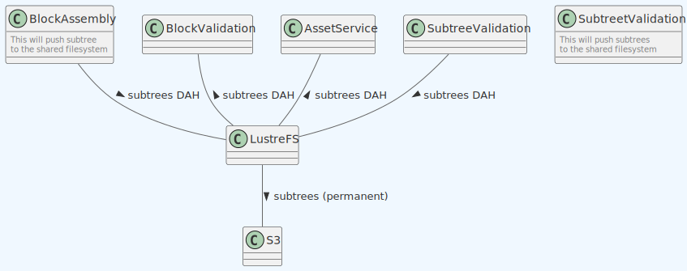
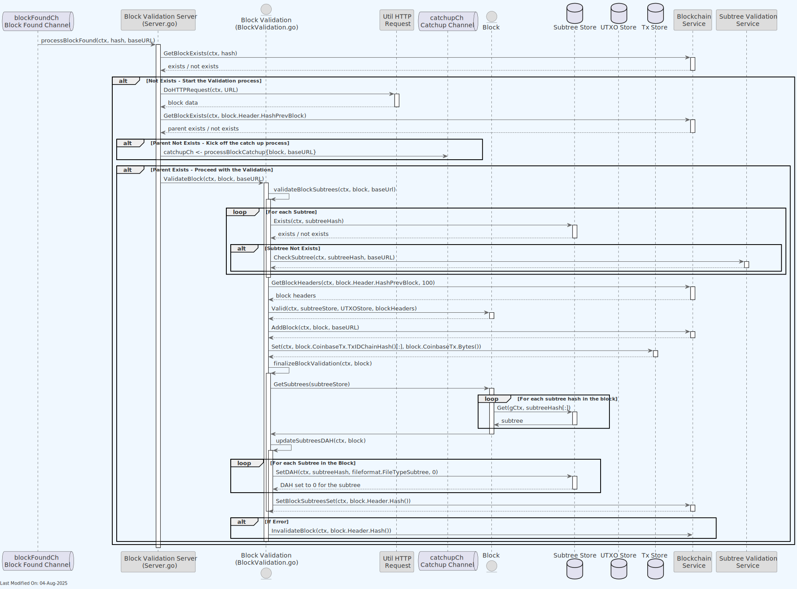
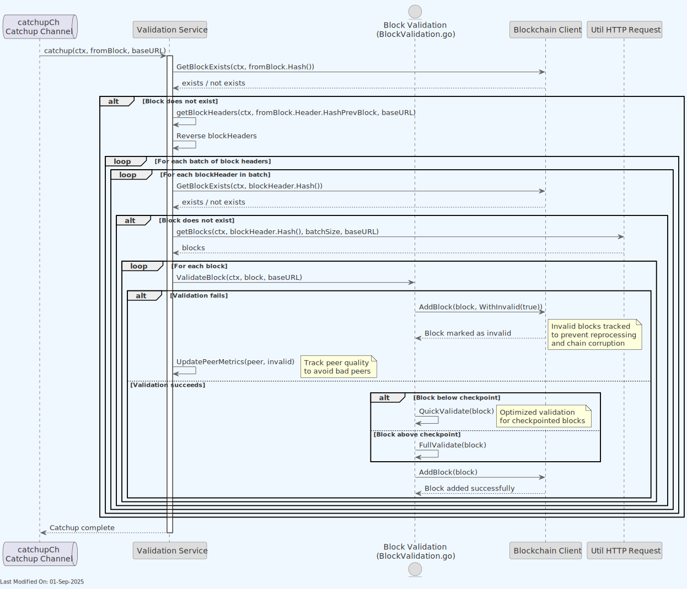
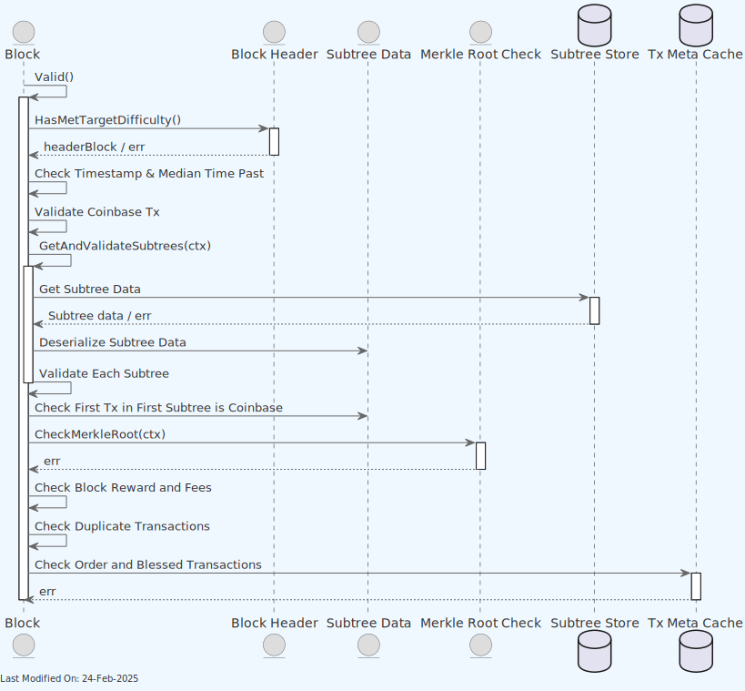
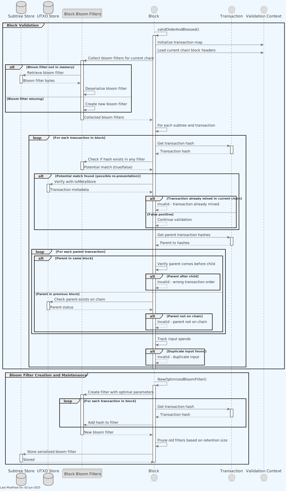

# 🔍 Block Validation Service

## Index

1. [Description](#1-description)
2. [Functionality](#2-functionality)
    - [2.1. Receiving blocks for validation](#21-receiving-blocks-for-validation)
    - [2.2. Validating blocks](#22-validating-blocks)
    - [2.2.1. Overview](#221-overview)
    - [2.2.2. Catching up after a parent block is not found](#222-catching-up-after-a-parent-block-is-not-found)
    - [2.2.3. Validating the Subtrees](#223-validating-the-subtrees)
    - [2.2.4. Block Data Validation](#224-block-data-validation)
    - [2.2.5. Transaction Re-presentation Detection](#225-transaction-re-presentation-detection)
    - [2.3. Marking Txs as mined](#23-marking-txs-as-mined)
3. [gRPC Protobuf Definitions](#3-grpc-protobuf-definitions)
4. [Data Model](#4-data-model)
5. [Technology](#5-technology)
6. [Directory Structure and Main Files](#6-directory-structure-and-main-files)
7. [How to run](#7-how-to-run)
8. [Configuration options (settings flags)](#8-configuration-options-settings-flags)
    - [Network and Communication Settings](#network-and-communication-settings)
    - [Kafka and Concurrency Settings](#kafka-and-concurrency-settings)
    - [Performance and Optimization](#performance-and-optimization)
    - [Transaction Processing](#transaction-processing)
    - [Bloom Filter Management](#bloom-filter-management)
    - [Advanced Settings](#advanced-settings)
    - [Storage and State Management](#storage-and-state-management)
9. [Other Resources](#9-other-resources)

## 1. Description

The Block Validator is responsible for ensuring the integrity and consistency of each block before it is added to the blockchain. It performs several key functions:

1. **Validation of Block Structure**: Verifies that each block adheres to the defined structure and format, and that their subtrees are known and valid.

2. **Merkle Root Verification**: Confirms that the Merkle root in the block header correctly represents the subtrees in the block, ensuring data integrity.

3. **Block Header Verification**: Validates the block header, including the proof of work , timestamp, and reference to the previous block, maintaining the blockchain's unbroken chain.


The Block Validation Service:

- Receives new blocks from the Legacy Service. The Legacy Service has received them from other nodes on the network.
- Validates the blocks, after fetching them from the remote asset server.
- Updates stores, and notifies the blockchain service of the new block.

The Legacy Service communicates with the Block Validation over the gRPC protocol.


> **Note**: For information about how the Block Validation service is initialized during daemon startup and how it interacts with other services, see the [Teranode Daemon Reference](../../references/teranodeDaemonReference.md#service-initialization-flow).

Finally, note that the Block Validation service benefits of the use of Lustre Fs (filesystem). Lustre is a type of parallel distributed file system, primarily used for large-scale cluster computing. This filesystem is designed to support high-performance, large-scale data storage and workloads.
Specifically for Teranode, these volumes are meant to be temporary holding locations for short-lived file-based data that needs to be shared quickly between various services
Teranode microservices make use of the Lustre file system in order to share subtree and tx data, eliminating the need for redundant propagation of subtrees over grpc or message queues. The services sharing Subtree data through this system can be seen here:


## 2. Functionality

The block validator is a service that validates blocks. After validating them, it will update the relevant stores and blockchain accordingly.
### 2.1. Receiving blocks for validation


- The Legacy Service is responsible for receiving new blocks from the network. When a new block is found, it will notify the block validation service via the `BlockFound()` gRPC endpoint.
- The block validation service will then check if the block is already known. If not, it will start the validation process.
- The block is added to a channel for processing. The channel is used to ensure that the block validation process is asynchronous and non-blocking.
### 2.2. Validating blocks

#### 2.2.1. Overview



- As seen in the section 2.1, a new block is queued for validation in the blockFoundCh. The block validation server will pick it up and start the validation process.
- The server will request the block data from the remote node (`DoHTTPRequest()`).
- If the parent block is not known, it will be added to the catchupCh channel for processing. We stop at this point, as we can no longer proceed. The catchup process will be explained in the next section (section 2.2.2).
- If the parent is known, the block will be validated.
    - First, the service validates all the block subtrees.
        - For each subtree, we check if it is known. If not, we kick off a subtree validation process (see section 2.2.3 for more details).
    - The validator retrieves the last 100 block headers, which are used to validate the block data. We can see more about this specific step in the section 2.2.4.
    - The validator stores the coinbase Tx in the UTXO Store and the Tx Store.
    - The validator adds the block to the Blockchain.
    - For each Subtree in the block, the validator updates the TTL (Time To Live) to zero for the subtree. This allows the Store to clear out data the services will no longer use.
    - For each Tx for each Subtree, we set the Tx as mined in the UTXO Store. This allows the UTXO Store to know which block(s) the Tx is in.
    - Should an error occur during the validation process, the block will be invalidated and removed from the blockchain.

Note - there is a `optimisticMining` setting that allows to reverse the block validation and block addition to the blockchain steps.

- In the regular mode, the block is validated first, and, if valid, added to the block.
- If `optimisticMining` is on, the block is optimistically added to the blockchain right away, and then validated in the background next. If it was to be found invalid after validation, it would be removed from the blockchain. This mode is not recommended for production use, as it can lead to a temporary fork in the blockchain. It however can be useful for performance testing purposes.
#### 2.2.2. Catching up after a parent block is not found



When a block parent is not found in the local blockchain, the node will start a catchup process. The catchup process will iterate through the parent blocks until it finds a known block in the blockchain.

When a block is not known, it will be requested from the remote node. Once received, it will be queued for validation (effectively starting the process of validation for the parent block from the beginning, as seen in 2.3.1).

Notice that, when catching up, the Block Validator will set the machine state of the node to `CATCHING_UP`. This is done to prevent the node from processing new blocks while it is still catching up. The node will only assemble or process new blocks once it has caught up with the blockchain. For more information on this, please refer to the [State Management](../architecture/stateManagement.md)  documentation.

#### 2.2.3. Validating the Subtrees

Should the validation process for a block encounter a subtree it does not know about, it can request its processing off the Subtree Validation service.


If any transaction under the subtree is also missing, the subtree validation process will kick off a recovery process for those transactions.
#### 2.2.4. Block Data Validation

As part of the overall block validation, the service will validate the block data, ensuring the format and integrity of the data, as well as confirming that coinbase tx, subtrees and transactions are valid. This is done in the `Valid()` method under the `Block` struct.



Effectively, the following validations are performed:

- The hash of the previous block must be known and valid. Teranode must always build a block on a previous block that it recognizes as the longest chain.

- The Proof of Work of a block must satisfy the difficulty target (Proof of Work higher than nBits in block header).

- The Merkle root of all transactions in a block must match the value of the Merkle root in the block header.

- A block must include at least one transaction, which is the Coinbase transaction.

- A block timestamp must not be too far in the past or the future.
    - The block time specified in the header must be larger than the Median-Time-Past (MTP) calculated from the previous block index. MTP is calculated by taking the timestamps of the last 11 blocks and finding the median (More details in BIP113).
    - The block time specified in the header must not be larger than the adjusted current time plus two hours (“maximum future block time”).

- The first transaction in a block must be Coinbase. The transaction is Coinbase if the following requirements are satisfied:

    - The Coinbase transaction has exactly one input.
    - The input is null, meaning that the input’s previous hash is 0000…0000 and the input’s previous index is 0xFFFFFFFF.
    - The Coinbase transaction must start with the serialized block height, to ensure block and transaction uniqueness.

- The Coinbase transaction amount may not exceed block subsidy and all transaction fees (block reward).

#### 2.2.5. Transaction Re-presentation Detection

The Block Validation service implements a robust mechanism for detecting re-presented transactions using bloom filters. This mechanism, implemented in the `validOrderAndBlessed` function, is critical for preventing double-spending and ensuring transaction integrity in the blockchain.



##### Bloom Filter Implementation

Teranode maintains bloom filters for recent blocks to efficiently detect re-presented transactions:

- **Creation**: Each validated block generates a bloom filter containing all of its transaction hashes
- **Storage**: Bloom filters are stored in both memory (for active validation) and in the subtree store (for persistence)
- **Retention**: Filters are maintained for a configurable number of recent blocks (`blockvalidation_bloom_filter_retention_size`)
- **TTL Ordering**: The system enforces a strict TTL (Time-To-Live) ordering: txmetacache < utxo store < bloom filter
    - This ensures that even if a transaction is pruned from txmetacache, the bloom filter can still detect its re-presentation
    - The longer retention period for bloom filters provides an extended window for detecting re-presented transactions

##### The validOrderAndBlessed Mechanism

The `validOrderAndBlessed` function performs several critical validations during block processing:

1. **Transaction Ordering Validation**:

    - Ensures child transactions appear after their parent transactions within the same block
    - For each transaction, verifies that all of its parent transactions either appear earlier in the same block or exist in a previous block on the current chain

2. **Re-presented Transaction Detection**:

    - Efficiently checks if transactions have already been mined in the current chain using bloom filters
    - For potential matches in the bloom filter (which may include false positives), performs definitive verification against the txMetaStore
    - Rejects blocks containing transactions that have already been mined in the current chain

3. **Duplicate Input Prevention**:

    - Tracks all inputs being spent within the block to detect duplicate spends
    - Ensures no two transactions in the block spend the same input

4. **Orphaned Transaction Prevention**:

    - Verifies that parent transactions of each transaction either exist in the current block (before the child) or in a previous block on the current chain
    - Prevents situations where transactions depend on parents that don't exist or aren't accessible

This comprehensive validation mechanism operates with high concurrency (configurable via `block_validOrderAndBlessedConcurrency`) to maintain performance while ensuring the integrity of the blockchain by preventing double-spends and transaction re-presentations.

### 2.3. Marking Txs as mined

When a block is validated, the transactions in the block are marked as mined in the UTXO store. This process includes:

1. **Updating Transaction Status**: The Block Validation service marks each transaction as mined by setting its block information.

2. **Unsetting the Locked Flag**: For any transaction that still has the "locked" flag set, the flag is unset during the mined transaction update process.

3. **Storing Subtree Information**: The service also stores the subtree index in the block where the transaction was located, enabling more efficient transaction lookups.

The Block Validation service is exclusively responsible for marking block transactions as mined and ensuring their flags are properly updated, regardless of whether the transaction was mined by the local Block Assembly service or by another node in the network.

As a first step, either the `Block Validation` (after a remotely mined block is validated) or the `Block Assembly` (if a block is locally mined) marks the block subtrees as "set", by invoking the `Blockchain` `SetBlockSubtreesSet` gRPC call, as shown in the diagram below.


The `Blockchain` client then notifies subscribers (in this case, the `BlockValidation` service) of a new `NotificationType_BlockSubtreesSet` event.
The `BlockValidation` proceeds to mark all transactions within the block as "mined" in the `UTXOStore`. This allows to identify in which block a given tx was mined. See diagram below:


> **For a comprehensive explanation of the two-phase commit process across the entire system, including how Block Validation plays a role in the second phase, see the [Two-Phase Transaction Commit Process](../features/two_phase_commit.md) documentation.**
## 3. gRPC Protobuf Definitions

The Block Validation Service uses gRPC for communication between nodes. The protobuf definitions used for defining the service methods and message formats can be seen [here](../../references/protobuf_docs/blockvalidationProto.md).
## 4. Data Model

- [Block Data Model](../datamodel/block_data_model.md): Contain lists of subtree identifiers.
- [Subtree Data Model](../datamodel/subtree_data_model.md): Contain lists of transaction IDs and their Merkle root.
- [Extended Transaction Data Model](../datamodel/transaction_data_model.md): Includes additional metadata to facilitate processing.
- [UTXO Data Model](../datamodel/utxo_data_model.md): UTXO and UTXO Metadata data models for managing unspent transaction outputs.
## 5. Technology
1. **Go Programming Language (Golang)**.

2. **gRPC (Google Remote Procedure Call)**:

    - Used for implementing server-client communication. gRPC is a high-performance, open-source framework that supports efficient communication between services.

3. **Blockchain Data Stores**:

    - Integration with various stores such as UTXO (Unspent Transaction Output) store, blob store, and transaction metadata store.

4. **Caching Mechanisms (ttlcache)**:

    - Uses `ttlcache`, a Go library for in-memory caching with time-to-live settings, to avoid redundant processing and improve performance.

5. **Configuration Management (gocore)**:

    - Uses `gocore` for configuration management, allowing dynamic configuration of service parameters.

6. **Networking and Protocol Buffers**:

    - Handles network communications and serializes structured data using Protocol Buffers, a language-neutral, platform-neutral, extensible mechanism for serializing structured data.

7. **Synchronization Primitives (sync)**:

    - Utilizes Go's `sync` package for synchronization primitives like mutexes, aiding in managing concurrent access to shared resources.
## 6. Directory Structure and Main Files

```text
./services/blockvalidation
│
├── BlockValidation.go             - Contains the core logic for block validation.
├── BlockValidation_test.go        - Unit tests for the `BlockValidation.go` functionalities.
├── Client.go                      - Client-side logic or API for interacting with the block validation service.
├── Interface.go                   - Defines an interface for the block validation service, outlining the methods that any implementation of the service should provide.
├── Server.go                      - Contains the server-side implementation for the block validation service, handling incoming requests and providing validation services.
├── Server_test.go                 - Unit tests for the `Server.go` functionalities,
├── blockvalidation_api
│   ├── blockvalidation_api.pb.go         - Auto-generated file from protobuf definitions, containing Go bindings for the API.
│   ├── blockvalidation_api.proto         - Protocol Buffers definition file for the block validation API.
│   └── blockvalidation_api_grpc.pb.go    - gRPC (Google's RPC framework) specific implementation file for the block validation API.
├── metrics.go                     - Metrics collection and monitoring of the block validation service's performance.
├── ttl_queue.go                   - Implements a time-to-live (TTL) queue, for managing caching within the service.
├── txmetacache.go                 - Transaction metadata cache, used to improve performance and efficiency in transaction data access.
└── txmetacache_test.go            - Unit tests for the `txmetacache.go` functionalities.
```

## 7. How to run

To run the Block Validation Service locally, you can execute the following command:

```shell
SETTINGS_CONTEXT=dev.[YOUR_USERNAME] go run -BlockValidation=1
```

Please refer to the [Locally Running Services Documentation](../../howto/locallyRunningServices.md) document for more information on running the Block Validation Service locally.

## 8. Configuration options (settings flags)

The Block Validation service configuration can be adjusted through environment variables or command-line flags. This section provides a comprehensive overview of all available configuration options organized by functional category.

### Network and Communication Settings

| Setting | Type | Default | Description | Impact |
|---------|------|---------|-------------|--------|
| `blockvalidation_grpcAddress` | string | "localhost:8088" | Address that other services use to connect to this service | Affects how other services discover and communicate with the Block Validation service |
| `blockvalidation_grpcListenAddress` | string | ":8088" | Network interface and port the service listens on for gRPC connections | Controls network binding and accessibility of the service |

### Kafka and Concurrency Settings

| Setting | Type | Default | Description | Impact |
|---------|------|---------|-------------|--------|
| `kafka_blocksConfig` | string | (none) | Kafka configuration for block messages | Required for consuming blocks from Kafka |
| `blockvalidation_kafkaWorkers` | int | 0 (auto) | Number of Kafka consumer workers | Controls parallelism for Kafka-based block validation |

### Performance and Optimization

| Setting | Type | Default | Description | Impact |
|---------|------|---------|-------------|--------|
| `blockvalidation_batch_missing_transactions` | bool | false | When enabled, missing transactions are fetched in batches | Improves network efficiency at the cost of slightly increased latency |
| `blockvalidation_processTxMetaUsingCache_BatchSize` | int | 1024 | Batch size for processing transaction metadata using cache | Affects performance and memory usage during cache operations |
| `blockvalidation_processTxMetaUsingCache_Concurrency` | int | 32 | Concurrency level for processing transaction metadata using cache | Controls parallel cache operations |
| `blockvalidation_processTxMetaUsingCache_MissingTxThreshold` | int | 1 | Threshold for switching to store-based processing when missing transactions | Controls fallback behavior when cache misses occur |
| `blockvalidation_processTxMetaUsingStore_BatchSize` | int | CPU/2 (min 4) | Batch size for processing transaction metadata using store | Affects performance during store operations |
| `blockvalidation_processTxMetaUsingStore_Concurrency` | int | 32 | Concurrency level for processing transaction metadata using store | Controls parallel store operations |
| `blockvalidation_processTxMetaUsingStore_MissingTxThreshold` | int | 1 | Threshold for store-based processing when missing transactions | Controls fallback behavior for store operations |
| `blockvalidation_skipCheckParentMined` | bool | false | Skips checking if parent block is mined during validation | Performance optimization that may reduce validation accuracy |
| `blockvalidation_subtreeFoundChConcurrency` | int | 1 | Concurrency level for subtree found channel processing | Controls parallel subtree processing |
| `blockvalidation_subtree_validation_abandon_threshold` | int | 1 | Threshold for abandoning subtree validation | Controls when to give up on problematic subtrees |
| `blockvalidation_validateBlockSubtreesConcurrency` | int | CPU/2 (min 4) | Concurrency level for validating block subtrees | Higher values improve performance but increase resource usage |
| `blockvalidation_validation_max_retries` | int | 3 | Maximum number of retries for validation operations | Controls resilience to transient failures |
| `blockvalidation_validation_retry_sleep` | duration | 5s | Sleep duration between validation retries | Controls backoff timing for retry operations |
| `blockvalidation_isParentMined_retry_max_retry` | int | 20 | Maximum retries for checking if parent block is mined | Controls persistence when checking parent block status |
| `blockvalidation_isParentMined_retry_backoff_multiplier` | int | 30 | Backoff multiplier for parent mined check retries | Controls exponential backoff timing |
| `blockvalidation_subtreeGroupConcurrency` | int | 1 | Concurrency level for subtree group processing | Controls parallel processing of subtree groups |
| `blockvalidation_blockFoundCh_buffer_size` | int | 1000 | Buffer size for block found channel | Controls memory usage and throughput for block notifications |
| `blockvalidation_catchupCh_buffer_size` | int | 10 | Buffer size for catchup channel | Controls memory usage for catchup operations |
| `blockvalidation_useCatchupWhenBehind` | bool | false | Enables catchup mechanism when node is behind | Improves sync performance but increases complexity |
| `blockvalidation_catchupConcurrency` | int | CPU/2 (min 4) | Concurrency level for catchup operations | Controls parallel processing during catchup |
| `blockvalidation_check_subtree_from_block_timeout` | duration | 5m | Timeout for checking subtree from block | Controls maximum wait time for subtree operations |
| `blockvalidation_check_subtree_from_block_retries` | int | 5 | Maximum retries for subtree from block checks | Controls resilience for subtree operations |
| `blockvalidation_check_subtree_from_block_retry_backoff_duration` | duration | 30s | Backoff duration for subtree check retries | Controls timing between retry attempts |
| `blockvalidation_secret_mining_threshold` | uint32 | 10 | Threshold for detecting secret mining attacks | Security parameter for chain reorganization detection |
| `blockvalidation_previous_block_header_count` | uint64 | 100 | Number of previous block headers to maintain | Controls memory usage and validation depth |
| `blockvalidation_maxPreviousBlockHeadersToCheck` | uint64 | 100 | Maximum previous block headers to check during validation | Limits validation scope for performance |
| `blockvalidation_fail_fast_validation` | bool | true | Enables fail-fast validation mode | Improves performance by stopping validation early on errors |
| `blockvalidation_finalizeBlockValidationConcurrency` | int | 8 | Concurrency level for finalizing block validation | Controls parallel finalization operations |
| `blockvalidation_getMissingTransactions` | int | 32 | Concurrency level for retrieving missing transactions | Controls parallel transaction retrieval |

### Transaction Processing

| Setting | Type | Default | Description | Impact |
|---------|------|---------|-------------|--------|
| `blockvalidation_localSetTxMinedConcurrency` | int | 8 | Concurrency level for marking transactions as mined | Higher values improve performance but increase memory usage |
| `blockvalidation_missingTransactionsBatchSize` | int | 5000 | Batch size for retrieving missing transactions | Larger batches improve throughput but increase memory usage |

### Bloom Filter Management

| Setting | Type | Default | Description | Impact |
|---------|------|---------|-------------|--------|
| `blockvalidation_bloom_filter_retention_size` | uint32 | GlobalBlockHeightRetention + 2 | Number of recent blocks to maintain bloom filters for | Affects memory usage and duplicate transaction detection efficiency. Automatically set based on global retention settings |

### Advanced Settings

| Setting | Type | Default | Description | Impact |
|---------|------|---------|-------------|--------|
| `blockvalidation_optimistic_mining` | bool | true | When enabled, blocks are conditionally accepted before full validation | Dramatically improves throughput at the cost of temporary chain inconsistency if validation fails |
| `blockvalidation_validation_warmup_count` | int | 128 | Number of validation operations during warmup | Helps prime caches and establish performance baselines |
| `excessiveblocksize` | int | 4GB | Maximum allowed block size | Limits resource consumption for extremely large blocks |

### Storage and State Management

| Setting | Type | Default | Description | Impact |
|---------|------|---------|-------------|--------|
| `blockValidationMaxRetries` | int | 3 | Maximum retry attempts for block validation operations | Controls resilience and retry behavior for failed validation operations |
| `blockValidationRetrySleep` | duration | 1s | Sleep duration between retry attempts | Controls retry timing and system load during failures |
| `utxostore` | URL | (none) | URL for the UTXO store | Required for UTXO validation and updates |
| `fsm_state_restore` | bool | false | Enables FSM state restoration | Affects recovery behavior after service restart |
| `blockvalidation_subtreeBlockHeightRetention` | uint32 | (global setting) | How long to keep subtrees (in terms of block height) | Affects storage utilization and historical data availability |

### Validator Integration Settings

| Setting | Type | Default | Description | Impact |
|---------|------|---------|-------------|--------|
| `blockValidationDelay` | int | 0 | Delay for block validation operations in validator | Controls timing of validation operations within the validator component |
| `blockValidationMaxRetries` | int | 3 | Maximum retries for validator block validation operations | Controls validator-specific retry behavior for block validation |
| `blockValidationRetrySleep` | string | "1s" | Sleep duration between validator retry attempts | Controls validator retry timing and backoff behavior |

### Policy and Chain Configuration Dependencies

| Setting | Type | Default | Description | Impact |
|---------|------|---------|-------------|--------|
| `excessiveblocksize` | int | 4GB | Maximum allowed block size (Policy.ExcessiveBlockSize) | Controls block size validation limits in ValidateBlock() - blocks exceeding this size are rejected |
| `network` | string | "mainnet" | Network type (mainnet/testnet/regtest) affecting ChainCfgParams | Controls chain-specific parameters including MaxCoinbaseScriptSigSize for coinbase validation |

### Missing Retry and Backoff Settings

| Setting | Type | Default | Description | Impact |
|---------|------|---------|-------------|--------|
| `blockvalidation_arePreviousBlocksProcessed_max_retry` | int | 20 | Maximum retries for previous block processing checks | Controls retry behavior when verifying previous block processing status |
| `blockvalidation_arePreviousBlocksProcessed_retry_backoff_multiplier` | int | 30 | Backoff multiplier for previous block processing retries | Controls exponential backoff timing for previous block processing verification |

## Configuration Interactions and Dependencies

Many configuration settings interact with each other to affect overall system behavior. Understanding these interactions is crucial for optimal tuning.

### Optimistic Mining

The `blockvalidation_optimistic_mining` setting enables a performance optimization where blocks are conditionally accepted before full validation completes. This dramatically improves blockchain throughput but introduces a risk of temporary chain inconsistency if validation later fails.

When enabled:

- The system achieves higher throughput and lower latency
- Validation continues asynchronously after block acceptance
- If validation fails, a chain reorganization may be necessary

Related settings that affect this behavior include:

- `blockvalidation_validation_max_retries` - Controls resilience during validation
- `blockvalidation_validation_retry_sleep` - Affects backoff behavior during retries

### Bloom Filter Operations

Bloom filters are used to efficiently detect duplicate transactions and optimize validation performance. The Block Validation Service manages bloom filters with the following operational characteristics:

**Creation and Storage**:

- Bloom filters are created for each validated block containing transaction hashes
- Filters are stored in the subtree store with automatic expiration based on `blockvalidation_bloom_filter_retention_size`
- The retention size is automatically calculated as `GlobalBlockHeightRetention + 2` to ensure adequate coverage

**Performance Impact**:

- **Memory Usage**: Each bloom filter consumes memory proportional to the number of transactions in the block
- **CPU Overhead**: Filter creation requires hashing all transaction IDs in the block
- **Storage I/O**: Filters are persisted to disk and retrieved during validation operations

**Operational Considerations**:

- Bloom filters reduce false positive rates for duplicate transaction detection
- Automatic pruning prevents unbounded storage growth
- Filter retrieval from subtree store may introduce latency during validation
- Consider increasing retention size for nodes with high transaction volumes

### Transaction Processing Pipeline

The transaction processing pipeline uses a hybrid approach combining cache and store operations:

- **Subtree Validation Integration**: Transaction metadata operations are delegated to the Subtree Validation Service, which may use caching internally via `subtreevalidation_txMetaCacheEnabled`
- **Batch Processing**: Transaction operations are batched using `blockvalidation_processTxMetaUsingStore_BatchSize` and `blockvalidation_processTxMetaUsingCache_BatchSize`
- **Concurrency Control**: Parallel processing is controlled by `blockvalidation_processTxMetaUsingStore_Concurrency` and related settings
- **Fallback Behavior**: When cache operations fail, the system falls back to store-based processing based on threshold settings

### Synchronization Strategy

When a node falls behind the blockchain tip, its synchronization strategy is controlled by:

- `blockvalidation_useCatchupWhenBehind` - Enables specialized catchup mode
- `blockvalidation_catchupConcurrency` - Controls parallel processing during catchup
- `blockvalidation_catchupCh_buffer_size` - Affects buffer capacity for catchup operations

Optimal settings depend on hardware capabilities and network conditions.

## 9. Other Resources

[Block Validation Reference](../../references/services/blockvalidation_reference.md)
