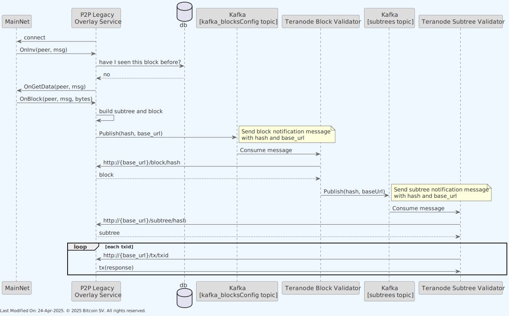
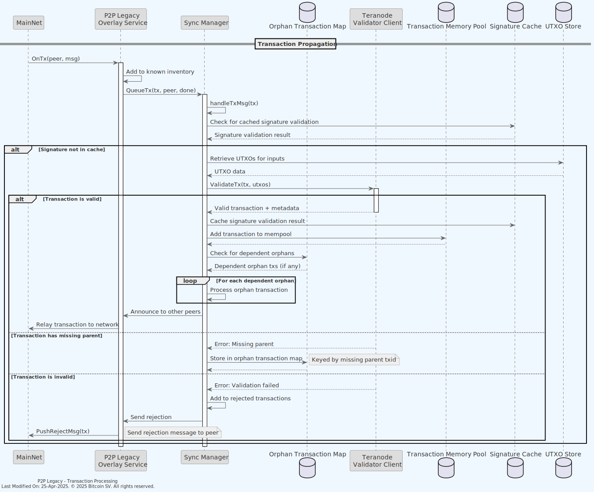
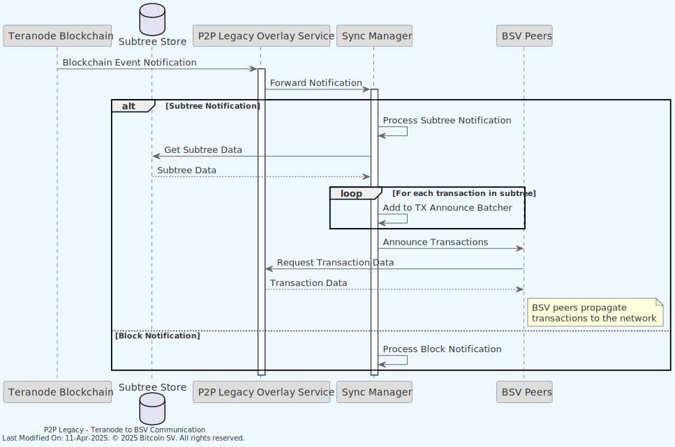

#  🔗 Legacy Service

## Index


1. [Introduction](#1-introduction)
    - [1.1. Summary](#11-summary)
    - [1.2. Data Transformation for Compatibility](#12-data-transformation-for-compatibility)
    - [1.3. Phased Migration Towards Teranode](#13-phased-migration-towards-teranode)
2. [Architecture](#2-architecture)
    - [2.1 Validator Integration](#21-validator-integration)
3. [Data Model](#3-data-model)
4. [Functionality](#4-functionality)
    - [4.1. BSV to Teranode Communication](#41-bsv-to-teranode-communication)
        - [4.1.1. Receiving Inventory Notifications](#411-receiving-inventory-notifications)
        - [4.1.2. Processing New Blocks](#412-processing-new-blocks)
5. [Technology](#5-technology)
6. [How to run](#6-how-to-run)
7. [Other Resources](#7-other-resources)


## 1. Introduction

### 1.1. Summary

The Legacy Service bridges the gap between the traditional BSV nodes and the advanced Teranode-BSV nodes, ensuring seamless communication and data translation between the two. By facilitating this integration, the Legacy Service enables both historical BSV nodes and modern Teranode nodes to operate concurrently, supporting a smooth and gradual transition to the Teranode infrastructure.

The core functionality of the Legacy Service revolves around managing and translating communications between historical BSV nodes and Teranode-BSV nodes. This includes:

- **Receiving Blocks and Transactions:** The service accepts blocks and transactions from legacy BSV nodes, ensuring that these can be efficiently propagated to Teranode nodes within the network.


- **Disseminating Newly Mined Blocks:** It also sends newly mined blocks from Teranode nodes back to the legacy nodes, maintaining the continuity and integrity of the blockchain across different node versions.


### 1.2. Data Transformation for Compatibility

The Legacy Service performs a major data transformation processes, designed to ensure full compatibility between the differing data structures of BSV and Teranode.

Legacy blocks and their transactions are encapsulated into subtrees, aligning with the Teranode model's approach to data management. In a similar way, the service can transparently convert blocks, subtrees, and transactions from the Teranode format back into the conventional block and transaction format used by BSV. This bidirectional conversion capability allows to maintain operational continuity across the network.

### 1.3. Phased Migration Towards Teranode

The Legacy Service allows for BSV and Teranode BSV nodes to operate side by side. This is intended as a temporary solution until all historical BSV nodes are phased out. As transaction volumes on the BSV network continue to grow, the demand for more scalable and feature-rich infrastructure will necessitate a complete migration to Teranode. The Legacy Service is a critical enabler of this transition, ensuring that the migration can occur gradually and without disrupting the network's ongoing operations.


## 2. Architecture

The Legacy Service acts as a BSV node, connecting to the BSV mainnet and receiving txs and blocks. It then processes these txs and blocks, converting them into the Teranode format and propagating them to the Teranode network.
The service also receives blocks from the Teranode network and converts them back into the BSV format for dissemination to the BSV mainnet.


As it can be seen in the diagram above, the service maintains its own block database (in historical format).

When the service receives a block message from the network, the service will propagate it to the Teranode Block Validator Service for validation and inclusion in the Teranode blockchain.


Both the Block Validation and the Subtree validation will query the Legacy Service (using the same endpoints the Asset Server offers) for the block and subtree data, respectively. The Legacy Service will respond with the requested data in the same format the Asset Server uses. The following endpoints are offered by the Legacy Service:

```go
	e.GET("/block/:hash", tb.BlockHandler)
	e.GET("/subtree/:hash", tb.SubtreeHandler)
	e.GET("/tx/:hash", tb.TxHandler)
	e.POST("/txs", tb.TxBatchHandler())
```

In addition to the block database, the service maintains an in-memory peer database, tracking peers it receives / sends messages from /to.

Also, note how the Blockchain client is used in order to wait for the node State to change to `RUNNING` state. For more information on this, please refer to the [State Management](../architecture/stateManagement.md)  documentation.

### 2.1 Validator Integration

The Legacy service interacts with the Validator service to validate incoming transactions from the BSV network. This interaction can happen in two different configurations:

1. **Local Validator**:
   - When `useLocalValidator=true` (recommended for production)
   - The Validator is instantiated directly within the Legacy service
   - Direct method calls are used without network overhead
   - This provides the best performance and lowest latency

2. **Remote Validator Service**:
   - When `useLocalValidator=false`
   - The Legacy service connects to a separate Validator service via gRPC
   - Useful for development, testing, or specialized deployment scenarios
   - Has higher latency due to additional network calls

This configuration is controlled by the settings passed to `GetValidatorClient()` in daemon.go.

## 3. Data Model

When we announce a teranode block, the format is:
* Blockheader
* Block meta data (size, tx count etc etc)
* Coinbase TX (the actual payload / bytes of the coinbase TX itself)
* A slice of subtrees.

* Each subtree has a list of txid's, and to calculate the merkle root, you replace the coinbase placeholder with the txid of the coinbase transaction and then do the merkle tree calculation as normal.  The result should match the merkle root in the block header.

## 4. Functionality

### 4.1. BSV to Teranode Communication

The overall cycle is:



1) An inventory (inv) notification is received, indicating that a new block or transaction is available from a BSV node. The Legacy Service processes this notification and requests the block or transaction data from the BSV node.

2) When a new block is received from the BSV node, it is transformed into a Teranode subtree and block propagation format. The block hash is then sent to the Teranode network for further processing.

3) The Teranode network processes the block hash and requests the full block data from the Legacy Service.
   3.1) Upon receipt of the full block data, Teranode will notice that it contains subtrees it is not aware of, and request them from the Legacy Service.
   3.2) Upon receipt of the full subtree data, the list of transactions will be known, and will be requested from the Legacy Service.
   3.3) With all the information now available, the block is then added to the Teranode blockchain.

In the next sections, we will detail the steps involved.

#### 4.1.1. Receiving Inventory Notifications

In the Bitcoin network, an "inv" message is a component of the network's communication protocol, used to indicate inventory. The term "inv" stands for inventory, and these messages are utilized by nodes to inform other nodes about the existence of certain items, such as blocks and transactions, without transmitting the full data of those items. This mechanism is crucial for the efficient propagation of information across the network, helping to minimize bandwidth usage and improve the overall scalability of the system.

The primary purpose of an inv message is to advertise the availability of specific data objects, like new transactions or blocks, to peer nodes. It allows a node to broadcast to its peers that it has something of interest, which the peers might not yet have. The peers can then decide whether they need this data based on the inventory vectors provided in the inv message and request the full data using a "getdata" message if necessary.

An inv message consists of a list of inventory vectors, where each vector specifies the type and identifier of a particular item. The structure of an inventory vector is as follows:

- **Type:** This field indicates the type of item being advertised. It could represent a block, a transaction, or other data types defined in the protocol.
- **Identifier:** This is a hash that uniquely identifies the item, such as the hash of a block or a transaction.

There are several types of inventory that can be advertised using inv messages, including but not limited to:

- **Transaction:** Indicates the presence of a new transaction.
- **Block:** Signifies the availability of a new block.
- **Filtered Block:** Used in connection with Bloom filters to indicate a block that matches the filter criteria, allowing lightweight clients to download only a subset of transactions.

Inv messages are critical in the data dissemination process within the Bitcoin network.

1. **Broadcasting New Transactions:** When a node receives or creates a new transaction, it broadcasts an inv message containing the transaction's hash to its peers, signaling that this transaction is available.
2. **Announcing New Blocks:** Similarly, when a node learns about a new block (whether by mining it or receiving it from another node), it uses an inv message to announce this block to its peers.
3. **Data Request:** Upon receiving an inv message, a node can send a "getdata" message to request the full data for any items it does not already have but is interested in obtaining.

In the context of the Legacy Service, the reception of inv messages is a crucial step in the communication process between BSV nodes and Teranode nodes. These messages serve as the initial trigger for data exchange, allowing the service to identify new blocks or transactions and initiate the necessary actions to retrieve and process this data.


1. **Connection Establishment:** The Legacy Overlay Service establishes a connection with the MainNet, setting the stage for data exchange.

2. **Block and Transaction Advertisement:**
    - The MainNet node sends an `OnInv` message to the Legacy Service, advertising available blocks or transactions.
    - The Legacy Service checks with its database (`db`) to determine if the advertised item (block or transaction) is already known.
    - If the item is new, the Legacy Service requests the full data using `OnGetData`.

3. **Receiving Full Data:**
    - For a new block, the MainNet responds with `OnBlock`, containing the block data. The Legacy Service processes this block and stores its details in the database.
    - For a new transaction, the MainNet responds with `OnTx`, containing the transaction data. Similarly, the Legacy Service processes and stores this information.

#### 4.1.2. Processing New Transactions

When the Legacy Service receives a new transaction from the BSV network, it undergoes several validation and processing steps before being accepted or rejected. The validator client plays a crucial role in this process.



The sequence of steps involved in processing a new transaction is as follows:

1. **Receiving a Transaction:**
    - The MainNet sends a transaction to the Legacy Service using the `OnTx` message, which includes the peer identifier and the transaction data.

2. **Basic Transaction Validation:**
    - The Legacy Service adds the transaction to the known inventory for the peer.
    - It then queues the transaction to be handled by the Sync Manager for more detailed processing.

3. **Transaction Validation with Validator Client:**
    - The transaction is converted to a binary format and passed to the Teranode Validator client.
    - The Teranode Validator client performs comprehensive validation on the transaction, including:
        - Checking transaction syntax and structure
        - Verifying that inputs reference valid UTXOs
        - Validating transaction scripts
        - Ensuring the transaction follows consensus rules

4. **Handling Validation Results:**
    - If the validation fails due to missing parent transactions, the transaction is stored in an orphan pool to be processed when parent transactions arrive.
    - If the validation fails for other reasons (like invalid scripts or consensus violations), the transaction is rejected, and a reject message is sent to the peer.
    - If the validation succeeds, the transaction is accepted into the mempool and announced to other peers.

5. **Orphan Transaction Processing:**
    - After a transaction is accepted, the Legacy Service checks if any orphan transactions were waiting for this transaction.
    - If found, those orphan transactions are recursively processed in the same manner.

The use of the validator client ensures that all transactions follow the protocol rules before they are propagated to the Teranode network, maintaining consistency across both networks.

#### 4.1.3. Processing New Blocks

Once a new block is received by the Legacy Service, it undergoes a series of transformations to align with the Teranode model. This process involves encapsulating the block into subtrees and converting the block data into a format that is compatible with the Teranode blockchain structure.

The sequence of steps involved in processing a new block is as follows:


Process flow:

1. **Receiving a Block:**
    - The MainNet sends a block to the Legacy Service using the `OnBlock` message, which includes the peer identifier, message metadata, and the block data in bytes.

2. **Block Processing:**
    - The Legacy Service constructs a block from the received bytes and initiates the `HandleBlock` function to process the block.

3. **Subtree Creation and Transaction Processing:**
    - The concept of subtrees is unique to Teranode, so, when processing legacy blocks, we must make sure to convert to the internal Teranode format. A new, empty subtree is created, and a placeholder coinbase transaction is added to this subtree.
    - For each transaction in the block, the Legacy Service:
        - Converts the transaction into an Extended Transaction format.
        - Adds the Extended Transaction to the Subtree.
        - Caches the Extended Transaction in the "Tx Cache" (a short term Tx cache DB).

    This process is detailed at the end of the current section in more detail.

4. **Caching and Block Building:**
    - The entire subtree is cached in the "Subtree Cache" (a short term subtree cache DB).
    - A Teranode block is constructed using the processed block and the subtree, and this block is cached in the "Block Cache" (a short term block cache DB).

5. **Block Validation:**
    - The Legacy Service notifies the Block Validator (part of Teranode) about the new block through Kafka using the `kafka_blocksConfig` topic, providing the block hash and a base URL for accessing the block and its components.
      - It must be noted that this base URL would typically represent a native Teranode Asset server. However, in this case, the Legacy Service will handle the endpoints, providing responses in the same format as the Teranode Asset server, to allow Teranode to request data in the same way they would do it with a remote asset server.
      - Notice how the local Teranode does not understand that the new blocks are being added by the Legacy Service. As far as the Teranode is concerned, a notification for a new block is received via Kafka as if it came from an internal Teranode service. And when requesting data from the provided baseURL, it receives information as if it was a remote asset server. In all senses, the Legacy Service impersonates a remote asset server for the Teranode.
    - The Block Validator requests the block using the provided URL, and the Legacy Service responds with the block data.

6. **Subtree Validation:**
    - The Block Validator notifies the Subtree Validator about the new subtree via Kafka using the `subtrees` topic, providing the subtree hash and base URL.
    - The Subtree Validator requests the subtree using the provided URL, and the Legacy Service responds with the subtree data.
    - For each transaction ID in the subtree, the Subtree Validator requests the corresponding transaction data using the base URL, and the Legacy Service provides the transaction data in response.

7. **Finalization:**
    - Upon successful validation, the Block Validator coordinates with other Teranode microservices and stores, and adds the block to the blockchain, completing the process.


**Block to Subtree Conversion Process (detail):**

The Legacy Service converts standard BSV blocks (which don't have subtrees) into the Teranode format (which uses blocks + subtrees) through the following process:

1. **Subtree Creation:**
   - A new subtree structure is created based on the number of transactions in the block (depending on the number of transactions, one or more subtrees are required to fit the transactions)
   - A coinbase placeholder node is added to the first subtree
   - Each transaction from the block is processed and added to the subtree

2. **Transaction Processing:**
   - For each transaction, the service calculates:
     - Transaction fee
     - Transaction size
   - It then adds the transaction hash to the subtree(s) at the appropriate position

3. **Data Organization:**
   - **Subtree Data:** The service stores the full extended transaction data (inputs, outputs, scripts)
   - **Subtree Metadata:** Parent transaction references are stored to maintain the transaction dependency structure

4. **Validation:**
   - In legacy sync mode, a quick validation is performed assuming blocks are valid
   - In normal mode, more thorough validation is performed via the Teranode validation services

5. **Storage:**
   - The subtree, its data, and metadata are stored in the Subtree Store
   - The subtree hash is then ready to be included in the Teranode block structure


### 4.2. Teranode to BSV Communication

The Legacy Service not only processes data from the BSV network to Teranode but also propagates data from Teranode back to the BSV network. This bidirectional flow is essential for maintaining consistency within the network.

#### 4.2.1. Processing New Subtrees from Teranode

When new subtrees are created within the Teranode environment, the Legacy Service receives notifications via a blockchain subscription mechanism and propagates the associated transactions to the BSV network:



1. **Subscription to Blockchain Events:**
   - The Legacy Service's Sync Manager subscribes to blockchain events from Teranode using the `Subscribe` method.
   - This subscription allows the Legacy Service to receive notifications about new blocks and subtrees created in the Teranode environment.

2. **Receiving Subtree Notifications:**
   - When a new subtree is created in Teranode, a notification is sent to the subscribed Legacy Service.
   - The notification includes the hash of the new subtree.

3. **Retrieving Subtree Data:**
   - Upon receiving a subtree notification, the Legacy Service retrieves the subtree data from the Subtree Store.
   - The subtree data contains information about all transactions included in the subtree.

    Note - subtrees are a unique feature of Teranode. We will discuss this Teranode - to BSV data abstraction conversion process later in this section.
4. **Transaction Announcement:**
   - For each transaction in the subtree, the Legacy Service announces it to connected BSV peers.
   - These announcements are managed by a transaction batcher that de-duplicates transactions that have been recently sent.
   - BSV peers that receive these announcements can then request the full transaction data if needed.

5. **Propagation to BSV Network:**
   - The announced transactions are propagated throughout the BSV network, ensuring that blocks mined in Teranode are reflected in the BSV blockchain.

This bidirectional communication ensures that both networks remain synchronized, with transactions and blocks being properly reflected in both environments. The Legacy Service acts as a critical bridge, enabling seamless interoperability between the legacy BSV protocol and the more scalable Teranode architecture.


**Subtree to Transaction Conversion Process:**

The Legacy Service converts Teranode subtree container abstractions back to "flat" BSV transactions through the following process:

1. **Notification Reception:**
   - The Legacy Service subscribes to Kafka-based blockchain events from Teranode
   - When a new subtree is created, a notification with the subtree hash is received

2. **Subtree Retrieval:**
   - The service retrieves the subtree data from the Subtree Store using the hash in the notification
   - The subtree is deserialized from its binary format into a structured subtree object

3. **Transaction Extraction:**
   - The service extracts each transaction hash from the subtree nodes
   - For each transaction, it also retrieves the associated fee and size information

4. **Transaction Announcement:**
   - Each transaction hash is added to a transaction announcement batcher
   - The batcher de-duplicates transactions that have been recently announced to prevent flooding
   - Transactions are then announced to connected BSV peers

5. **Data Fulfillment:**
   - When BSV peers request the full transaction data, the Legacy Service retrieves it from the Subtree Data store
   - Transactions are served to the BSV network in their standard format, with no reference to the subtree structure

This process effectively bridges the gap between Teranode's subtree-based architecture and the BSV network's traditional transaction model, ensuring that data originating in Teranode can be properly propagated to the BSV network.


## 5. Technology

The entire codebase is written in Go (Golang), a statically typed, compiled programming language designed for simplicity and efficiency.

Technology highlights:

- **Bitcoin SV (BSV):** An implementation of the Bitcoin protocol that follows the vision set out by Satoshi Nakamoto's original Bitcoin whitepaper. BSV focuses on scalability, aiming to provide high transaction throughput and enterprise-level capabilities.
- **Teranode:** A high-performance implementation of the Bitcoin protocol designed to handle a massive scale of transactions.

- **Echo Framework:** The code uses Echo, a high-performance, extensible web framework for Go, to create an HTTP server. This server exposes endpoints for block, transaction, and subtree data retrieval.

- **ExpiringMap:** An expiring map is used for caching transactions, subtrees, and blocks with a time-based eviction policy.
- **Chainhash:** A library for handling SHA-256 double hash values, commonly used as identifiers in blockchain (e.g., transaction IDs, block hashes).

- **Database Technologies** (ffldb, leveldb, sqlite): Used as block data stores. Each has its use cases:

    - **ffldb**: Optimized for blockchain data storage and retrieval. Default and recommended choice.
    - **leveldb**: A fast key-value storage library suitable for indexing blockchain data.
    - **sqlite**: An embedded SQL database engine for simpler deployment and structured data queries.


## 6. How to run

To run the Legacy Service locally, you can execute the following command:

```shell
SETTINGS_CONTEXT=dev.[YOUR_USERNAME] go run -Legacy=1
```

Please refer to the [Locally Running Services Documentation](../../howto/locallyRunningServices.md) document for more information on running the Legacy Service locally.


## 7. Configuration options (settings flags)

The Legacy service bridges traditional Bitcoin nodes with the Teranode architecture, making its configuration particularly important for network integration. This section provides a comprehensive overview of all configuration options, organized by functional category.

### Network and Communication Settings

| Setting | Type | Default | Description | Impact |
|---------|------|---------|-------------|--------|
| `legacy_listen_addresses` | []string | [] (falls back to external IP:8333) | Network addresses for the service to listen on for peer connections | Controls which interfaces and ports accept connections from other nodes |
| `legacy_connect_peers` | []string | [] | Peer addresses to connect to on startup | Forces connections to specific peers rather than using automatic peer discovery |
| `legacy_grpcAddress` | string | "" | Address for other services to connect to the Legacy service | Enables service-to-service communication |
| `legacy_grpcListenAddress` | string | "" | Interface and port to listen on for gRPC connections | Controls network binding for the gRPC server |
| `network` | string | "mainnet" | Specifies which blockchain network to connect to | Determines network rules, consensus parameters, and compatibility |

### Memory and Storage Management

| Setting | Type | Default | Description | Impact |
|---------|------|---------|-------------|--------|
| `legacy_orphanEvictionDuration` | duration | 10m | How long orphan transactions are kept before eviction | Affects memory usage and ability to process delayed transactions |
| `legacy_writeMsgBlocksToDisk` | bool | false | **Enable disk-based block queueing during synchronization** | **Significantly reduces memory usage** by writing incoming blocks to temporary disk storage with 4MB buffered I/O and automatic 10-minute cleanup. Essential for resource-constrained environments and high-volume sync operations. |
| `legacy_storeBatcherSize` | int | 1024 | Batch size for store operations | Affects efficiency of storage operations and memory usage |
| `legacy_spendBatcherSize` | int | 1024 | Batch size for spend operations | Affects efficiency of spend operations and memory usage |
| `legacy_outpointBatcherSize` | int | 1024 | Batch size for outpoint operations | Affects efficiency of outpoint processing |
| `legacy_workingDir` | string | "../../data" | Directory where service stores data files | Controls where peer information and other data is stored |

### Concurrency and Performance

| Setting | Type | Default | Description | Impact |
|---------|------|---------|-------------|--------|
| `legacy_storeBatcherConcurrency` | int | 32 | Number of concurrent store operations | Controls parallelism for storage operations |
| `legacy_spendBatcherConcurrency` | int | 32 | Number of concurrent spend operations | Controls parallelism for spend operations |
| `legacy_outpointBatcherConcurrency` | int | 32 | Number of concurrent outpoint operations | Controls parallelism for outpoint operations |
| `legacy_config_Upnp` | bool | false | Use UPnP for automatic port forwarding | Affects service accessibility from the internet |

### Peer Management

| Setting | Type | Default | Description | Impact |
|---------|------|---------|-------------|--------|
| `legacy_savePeers` | bool | false | Save peer information to disk for reuse on restart | Enables persistent peer connections across service restarts |
| `legacy_allowSyncCandidateFromLocalPeers` | bool | false | Allow local peers as sync candidates | Affects peer selection for blockchain synchronization |
| `legacy_printInvMessages` | bool | false | Print inventory messages to logs | Increases log verbosity for debugging |

### Feature Flags

| Setting | Type | Default | Description | Impact |
|---------|------|---------|-------------|--------|
| `legacy_allowBlockPriority` | bool | false | Prioritize transactions based on block priority | Affects transaction selection for block creation |
| `useLocalValidator` | bool | false | Use a local validator instance embedded in the service | Improves performance by eliminating network overhead for validation |
| `excessiveblocksize` | uint64 | 4GB | Maximum allowed block size | Limits resource consumption for extremely large blocks |

## Configuration Interactions and Dependencies

### Peer Discovery and Connection Management

The Legacy service's peer connection behavior is controlled by several interrelated settings:

- `legacy_listen_addresses` determines where the service listens for incoming connections
- `legacy_connect_peers` forces outbound connections to specific peers
- `legacy_savePeers` enables storing peer information across restarts
- If no `legacy_listen_addresses` are specified, the service detects the external IP and uses port 8333
- When `legacy_config_Upnp` is enabled, the service attempts to configure port forwarding automatically

These settings should be configured together based on your network architecture and security requirements.

### Memory Management Considerations

Several settings affect the memory usage patterns of the Legacy service:

- `legacy_writeMsgBlocksToDisk` significantly reduces memory usage during blockchain synchronization by writing blocks to disk rather than keeping them in memory
- `legacy_orphanEvictionDuration` controls how aggressively orphan transactions are removed from memory
- The various batcher size settings control memory usage during batch operations

For resource-constrained environments, enable `legacy_writeMsgBlocksToDisk` and use smaller batch sizes.

#### Disk-Based Block Queueing (`legacy_writeMsgBlocksToDisk`)

The `legacy_writeMsgBlocksToDisk` setting enables a sophisticated disk-based queueing mechanism that fundamentally changes how the Legacy service handles incoming blocks during synchronization.

**How It Works:**
- It creates a streaming pipeline that writes blocks directly to disk, employing 4MB buffered readers for optimal disk performance.
- Blocks are stored with a 10-minute TTL to prevent disk accumulation

**Technical Implementation:**
```
Incoming Block → io.Pipe() → 4MB Buffer → Temporary Disk Storage → Validation Queue
                     ↓
              Background Goroutine
```

**Benefits:**
- **Memory Efficiency**: Prevents memory exhaustion during large-scale synchronization
- **Scalability**: Handles high-volume block arrivals without resource constraints
- **Reliability**: Reduces risk of out-of-memory errors during initial sync
- **Performance**: Maintains processing throughput while using minimal memory

**When to Enable:**
- ✅ **Initial blockchain synchronization** - Essential for syncing from genesis
- ✅ **Resource-constrained environments** - Servers with limited RAM
- ✅ **High-throughput scenarios** - Networks with frequent block arrivals
- ✅ **Production deployments** - Recommended for stability

**Storage Requirements:**
- Temporary disk space for concurrent blocks (typically < 1GB)
- Fast storage (SSD recommended) for optimal I/O performance
- Automatic cleanup prevents long-term storage accumulation

**Configuration Example:**
```bash
# Enable disk-based block queueing
export legacy_writeMsgBlocksToDisk=true

# Ensure adequate working directory space
export legacy_workingDir="/path/to/fast/storage"
```


### Batch Processing Pipeline

The Legacy service uses a batching system for various operations, controlled by these settings:

- Batch sizes (`legacy_storeBatcherSize`, `legacy_spendBatcherSize`, `legacy_outpointBatcherSize`) determine how many operations are grouped together
- Concurrency settings (`legacy_storeBatcherConcurrency`, `legacy_spendBatcherConcurrency`, `legacy_outpointBatcherConcurrency`) control parallelism

Larger batch sizes improve throughput but use more memory, while higher concurrency improves performance but increases CPU utilization.

## 8. Other Resources

[Legacy Reference](../../references/services/legacy_reference.md)
