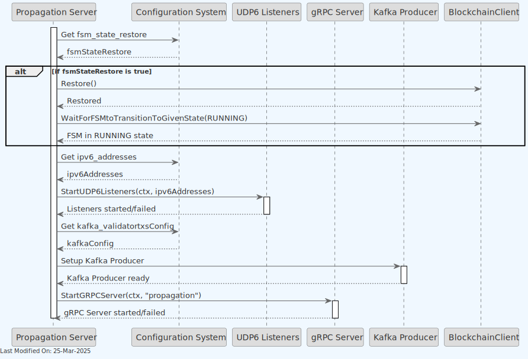
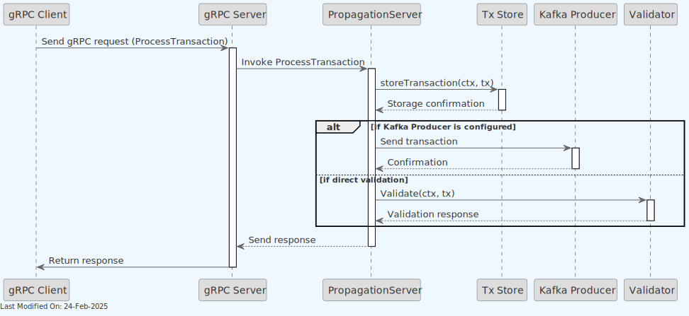

# 🌐 Propagation Service

## Index


1. [Description](#1-description)
2. [Functionality](#2-functionality)
    - [2.1. Starting the Propagation Service](#21-starting-the-propagation-service)
        - [2.1.1 Validator Integration](#211-validator-integration)
    - [2.2. Propagating Transactions](#22-propagating-transactions)
    - [2.3. Transaction Processing Workflow](#23-transaction-processing-workflow)
    - [2.4. Error Handling](#24-error-handling)
3. [gRPC Protobuf Definitions](#3-grpc-protobuf-definitions)
4. [Data Model](#4-data-model)
5. [Technology](#5-technology)
6. [Directory Structure and Main Files](#6-directory-structure-and-main-files)
7. [How to run](#7-how-to-run)
8. [Configuration options (settings flags)](#8-configuration-options-settings-flags)
9. [Other Resources](#9-other-resources)


## 1. Description

The `Propagation Service` is designed to handle the propagation of transactions across a peer-to-peer Teranode network.

At a glance, the Propagation service:

1. Receives new transactions through various communication methods.
2. Stores transactions in the tx store.
3. Sends the transaction to the Validator service for further processing.


The gRPC protocol is the primary communication method, although HTTP is also accepted.

-  `StartHTTPServer`: This function is designed to start a network listener for the HTTP protocol. Each function configures and starts a server to listen for incoming connections and requests on specific network addresses and ports.

A node can start multiple parallel instances of the Propagation service. This translates into multiple pods within a Kubernetes cluster. Each instance will have its own gRPC server, and will be able to receive and propagate transactions independently. GRPC load balancing allows to distribute the load across the multiple instances.


Notice that the Validator, as shown in the diagram above, can be either a local validator or a remote validator service, depending on the Node configuration. To know more, please refer to the Transaction Validator documentation.

Also, note how the Blockchain client is used in order to wait for the node State to change to `RUNNING` state. For more information on this, please refer to the [State Management](../architecture/stateManagement.md)  documentation.

## 2. Functionality

### 2.1. Starting the Propagation Service



Upon startup, the Propagation service starts the relevant communication channels, as configured via settings.

### 2.1.1 Validator Integration

The Propagation service can work with the Validator in two different configurations:

1. **Local Validator**:
   - When `validator.useLocalValidator=true` (recommended for production)
   - The Validator is instantiated directly within the Propagation service
   - Direct method calls are used without network overhead
   - This provides the best performance and lowest latency

2. **Remote Validator Service**:
   - When `validator.useLocalValidator=false`
   - The Propagation service connects to a separate Validator service via gRPC
   - Useful for development, testing, or specialized deployment scenarios
   - Has higher latency due to additional network calls

This configuration is controlled by the settings passed to `GetValidatorClient()` in daemon.go.

> **Note**: For detailed information about how services are initialized and connected during daemon startup, see the [Teranode Daemon Reference](../../references/teranodeDaemonReference.md#service-initialization-flow).

### 2.2. Propagating Transactions

All communication channels receive txs and delegate them to the `ProcessTransaction()` function. The main communication channels are shown below.

**HTTP:**


**gRPC:**



### 2.3. Transaction Processing Workflow

The transaction processing involves several steps to ensure proper validation and propagation:

1. **Initial Validation**: Each transaction is validated for correct format and to ensure it's not a coinbase transaction.
2. **Storage**: Valid transactions are stored in the transaction store using the transaction hash as the key.
3. **Validation Submission**: Transactions are submitted to the validator service through one of two channels:
   - **Kafka**: Normal-sized transactions are sent to the validator through Kafka for asynchronous processing.
   - **HTTP Fallback**: Large transactions exceeding Kafka message size limits are sent directly to the validator's HTTP endpoint.

### 2.4. Error Handling

The Propagation Service implements comprehensive error handling:

1. **Transaction Format Errors**: Malformed transactions are rejected with appropriate error messages.
2. **Storage Failures**: If transaction storage fails, the error is logged and propagated to the client.
3. **Validation Errors**: Errors during validation are captured and returned to the client.
4. **Batch Processing**: When processing transaction batches, each transaction is handled independently, allowing some transactions to succeed even if others fail.
5. **Request Limiting**: Implements limits on transaction size and batch counts to prevent resource exhaustion.


## 3. gRPC Protobuf Definitions

The Propagation Service uses gRPC for communication between nodes. The protobuf definitions used for defining the service methods and message formats can be seen [here](../../references/protobuf_docs/propagationProto.md).

## 4. Data Model

The Propagation Service deals with the extended transaction format, as seen below:

- [Extended Transaction Data Model](../datamodel/transaction_data_model.md): Include additional metadata to facilitate processing.

## 5. Technology

Main technologies involved:

1. **Go Programming Language (Golang)**:
    - The entire service is written in Go.

2. **Peer-to-Peer (P2P) Networking**:
    - The service is designed for a P2P network environment, where nodes (computers) in the network communicate directly with each other without central coordination.
    - `libsv/go-p2p/wire` is used for P2P transaction propagation in the Teranode BSV network.

3. **Networking Protocols (HTTP)**

4. **Cryptography**:
    - The use of `crypto` packages for RSA key generation and TLS (Transport Layer Security) configuration for secure communication.

5. **gRPC and Protocol Buffers**:
    - gRPC, indicated by the use of `google.golang.org/grpc`, is a high-performance, open-source universal RPC framework. It uses Protocol Buffers as its interface definition language.


## 6. Directory Structure and Main Files

```
./services/propagation
│
├── Client.go                            - Contains the client-side logic for interacting with the propagation service.
├── Client_test.go                       - Unit tests for the Client.go functionality.
├── Server.go                            - Contains the main server-side implementation for the propagation service.
├── Server_test.go                       - Unit tests for the Server.go functionality.
├── client_large_tx_fallback_test.go     - Tests the large transaction fallback mechanism in the client.
├── http_handlers_test.go                - Unit tests for HTTP handler functions.
├── large_tx_fallback_test.go            - Tests for the large transaction fallback mechanism.
├── metrics.go                           - Metrics collection and monitoring of the propagation service.
├── propagation_error_test.go            - Unit tests for error handling in the propagation service.
└── propagation_api                      - Directory containing various files related to the API definition and implementation of the propagation service.
    ├── propagation_api.pb.go            - Auto-generated file from protobuf definitions, containing Go bindings for the API.
    ├── propagation_api.proto            - Protocol Buffers definition file for the propagation API.
    └── propagation_api_grpc.pb.go       - gRPC (Google's RPC framework) specific implementation file for the propagation API.
```

## 7. How to run

To run the Propagation Service locally, you can execute the following command:

```shell
SETTINGS_CONTEXT=dev.[YOUR_USERNAME] go run -Propagation=1
```

Please refer to the [Locally Running Services Documentation](../../howto/locallyRunningServices.md) document for more information on running the Propagation Service locally.


## 8. Configuration options (settings flags)

The Propagation service serves as the transaction intake and distribution system for the Teranode network, critical for handling transaction flow between clients and the internal services. This section provides a comprehensive overview of all configuration options, organized by functional category.

### Network and Communication Settings

| Setting | Type | Default | Description | Impact |
|---------|------|---------|-------------|--------|
| `propagation_grpcListenAddress` | string | "" | Address for gRPC server to listen on | Controls the endpoint where the gRPC API is exposed |
| `propagation_grpcAddresses` | []string | [] | List of gRPC addresses for other services to connect to | Affects how other services discover and communicate with this service |
| `propagation_httpListenAddress` | string | "" | Address for HTTP server to listen on | Controls if and where the HTTP transaction API is exposed |
| `propagation_httpAddresses` | []string | [] | List of HTTP addresses for other services to connect to | Affects how other services discover this service's HTTP API |
| `ipv6_addresses` | string | "" | Comma-separated list of IPv6 multicast addresses | Controls which IPv6 multicast addresses are used for transaction reception |
| `ipv6_interface` | string | "" (falls back to "en0") | Network interface name for IPv6 multicast | Determines which network interface is used for multicast communication |

### Performance and Throttling Settings

| Setting | Type | Default | Description | Impact |
|---------|------|---------|-------------|--------|
| `propagation_grpcMaxConnectionAge` | duration | 90s | Maximum duration for gRPC connections before forced renewal | Controls connection lifecycle and helps with load balancing |
| `propagation_httpRateLimit` | int | 1024 | Rate limit for HTTP API requests (per second) | Controls how many requests per second the HTTP API can handle |
| `propagation_sendBatchSize` | int | 100 | Maximum number of transactions to send in a batch | Affects efficiency and throughput of transaction processing |
| `propagation_sendBatchTimeout` | int | 5 | Timeout in seconds for batch sending operations | Controls how long the service waits to collect a full batch |

### Validator Integration Settings

| Setting | Type | Default | Description | Impact |
|---------|------|---------|-------------|--------|
| `validator.useLocalValidator` | bool | false | Use a local validator instance embedded in the service | Eliminates network overhead for validation, improving performance |
| `propagation_alwaysUseHTTP` | bool | false | Forces using HTTP instead of Kafka for transaction validation | Affects how transactions are sent to the validator service |
| `validator_httpAddress` | url | null | URL for validator HTTP API | Used as fallback for large transactions exceeding Kafka limits |

### 8.4 Configuration Interactions and Dependencies

### Transaction Ingestion Paths

The Propagation service supports multiple methods for receiving transactions, controlled by several related settings:

- HTTP API (`propagation_httpListenAddress`): REST-based transaction submission, rate-limited by `propagation_httpRateLimit`
- gRPC API (`propagation_grpcListenAddress`): High-performance RPC interface for transaction submission
- IPv6 Multicast (`ipv6_addresses` on the specified `ipv6_interface`): Efficient multicast reception of transactions

At least one ingestion path must be configured for the service to be functional. For production deployments, all three methods should be configured for maximum compatibility and performance.

### Transaction Validation Architecture

The Propagation service interacts with the Validator service using one of two architectural patterns:

- **Local Validator Mode** (`validator.useLocalValidator=true`):
  - Validator runs in-process with the Propagation service
  - Eliminates network overhead for validation operations
  - Recommended for production deployments to minimize latency

- **Remote Validator Mode** (`validator.useLocalValidator=false`):
  - Propagation service communicates with a separate Validator service
  - Transactions are sent via Kafka or HTTP, controlled by `propagation_alwaysUseHTTP`
  - Large transactions exceeding Kafka limits are automatically sent via HTTP using `validator_httpAddress`

### Batch Processing Optimization

The transaction processing pipeline uses batching to optimize throughput, controlled by:

- `propagation_sendBatchSize`: Determines maximum batch size for transaction processing
- `propagation_sendBatchTimeout`: Controls how long to wait for a batch to fill before processing

These settings should be tuned together based on expected transaction volume and size characteristics. Higher batch sizes improve throughput but increase latency, while shorter timeouts decrease latency but may result in smaller, less efficient batches.

## 9. Other Resources

[Propagation Service Reference](../../references/services/propagation_reference.md)
