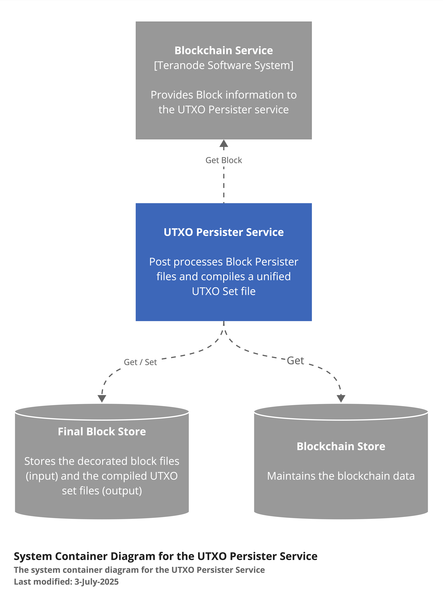
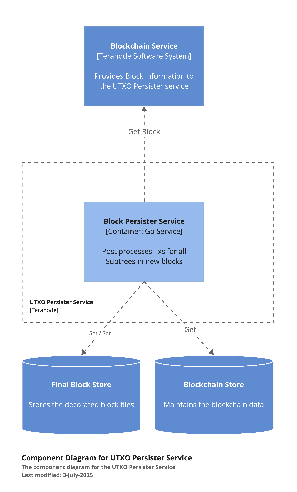
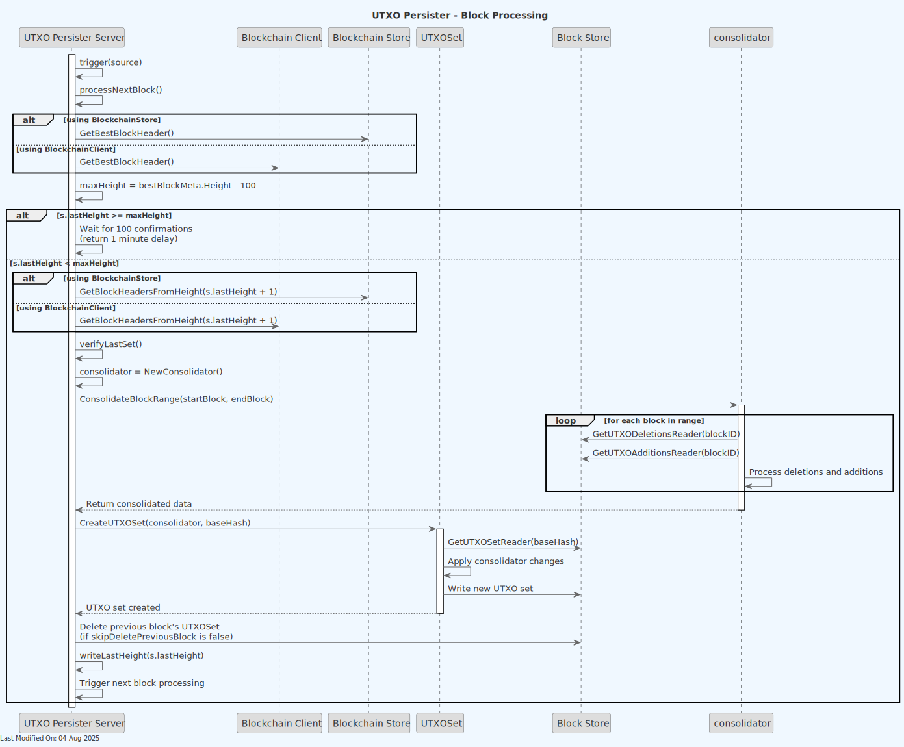

# 🔍 UTXO Persister Service

## Index

1. [Description](#1-description)
2. [Functionality](#2-functionality)
    - [2.1 Service Initialization](#21-service-initialization)
    - [2.2 Receiving and Processing a new UTXO Set](#22-receiving-and-processing-a-new-utxo-set)
    - [2.2 Processing Blocks and Creating UTXO Sets](#22-processing-blocks-and-creating-utxo-sets)
3. [Data Model](#3-data-model)
4. [Technology](#4-technology)
5. [Directory Structure and Main Files](#5-directory-structure-and-main-files)
6. [How to run](#6-how-to-run)
7. [Configuration options (settings flags)](#7-configuration-options-settings-flags)
8. [Other Resources](#8-other-resources)

## 1. Description

The UTXO Persister primary function is to create and maintain an up-to-date Unspent Transaction Output (UTXO) file set for each block in the blockchain.

To achieve its target, the UTXO Persister uses the output of the Block Persister service, and outputs an updated UTXO set file.

The UTXO set file can be exported and used as an input for initializing the UTXO store in a new Teranode instance.

1. Input Processing:
    - The UTXO Persister works with the output of the Block Persister, which includes:
        - `utxo-additions`: New UTXOs created in a block,
        - `utxo-deletions`: UTXOs spent in a block,
        - `.block`: The block data,
        - `.subtree`: Subtree information for the block.

2. UTXO Set Generation:
    - For each new block fileset detected, the UTXO Persister creates a 'utxo-set' file.
    - This file represents the complete set of unspent transaction outputs up to and including the current block.

3. File Monitoring and Processing:
    - The service continuously monitors the shared storage for new .block files and additional related files.
    - When new files are detected, it triggers the UTXO set creation process.

4. Progress Tracking:
    - The service maintains a `lastProcessed.dat` file to keep track of the last block height processed.
    - This ensures continuity and allows the service to resume from the correct point after restarts or interruptions.

5. Efficient Data Handling:
    - The service uses optimized data structures and file formats to handle large volumes of UTXO data efficiently.
    - It implements binary encoding for UTXOs and UTXO deletions to minimize storage requirements and improve processing speed.

6. File Management:
    - The service interacts with the storage system to read and write necessary files.

> **Note**: For information about how the UTXO Persister service is initialized during daemon startup and how it interacts with other services, see the [Teranode Daemon Reference](../../references/teranodeDaemonReference.md#service-initialization-flow).



The service interacts with the storage system to read and write necessary files (shared with the Block Persister service), and requests block information from the Blockchain service (or, optionally, directly from the Blockchain store)




## 2. Functionality

### 2.1 Service Initialization


1. The service starts by creating connections to:

    - A blob store (shared with the block persister) for file storage
    - Either the Blockchain service or the Blockchain store for block information


2. It reads the last processed height from `lastProcessed.dat`.

3. The service then enters a loop, waiting for new blocks to process.


### 2.2 Receiving and Processing a new UTXO Set



### 2.2 Processing Blocks and Creating UTXO Sets

The UTXO Persister processes blocks and creates UTXO sets as follows:

1) **Trigger and Block Height Check**:
    - The service is triggered to process the next block (via notification, timer, or startup).
    - It checks if the next block to process is at least 100 blocks behind the current best block height.

2) **Block Headers Retrieval**:
    - If processing is needed, the service retrieves block headers from either the Blockchain Store or Blockchain Client.
    - It verifies the chain continuity using these headers.

3) **Last Set Verification**:
    - The service verifies the last UTXO set using `verifyLastSet()` to ensure data integrity.

4) **Block Range Consolidation**:
    - A new Consolidator is created to process a range of blocks efficiently.
    - The `ConsolidateBlockRange()` method is called to handle multiple blocks at once if needed.

5) **UTXO Set Preparation**:
    - The service calls `GetUTXOSetWithDeletionsMap()` to prepare the UTXO set for the new block.
    - This retrieves the UTXO deletions from the Block Store and creates a deletions map.

6) **UTXO Set Creation**:
    - The `CreateUTXOSet()` method is called on the UTXOSet object.
    - This method:
      - Retrieves the previous block's UTXO set from the Block Store.
      - Applies the deletions from the deletions map.
      - Incorporates new UTXOs from the block's transactions.
      - Writes the new UTXO set to the Block Store.

7) **Cleanup**:
    - If not skipped (based on configuration), the service deletes the previous block's UTXO set to save space.

8) **Update Last Processed Height**:
    - The service calls `writeLastHeight()` to update its record of the last processed block height.

9) **Trigger Next Block Processing**:
    - The service initiates the processing of the next block, continuing the cycle.

If the current height is less than 100 blocks behind the best block height, the service waits for more confirmations before processing.


## 3. Data Model


1. **Basic Structure:**
   The UTXO set is essentially a collection of all unspent transaction outputs in the blockchain up to a specific block height. Each UTXO represents a piece of cryptocurrency that can be spent in future transactions.


2. **UTXO Components:**
   The UTXOs are stored in a hierarchical structure, with the following components:

**UTXOWrapper**:
   ```go
   type UTXOWrapper struct {
       TxID     chainhash.Hash
       Height   uint32
       Coinbase bool
       UTXOs    []*UTXO
   }
   ```
**UTXO**:
   ```go
   type UTXO struct {
       Index  uint32
       Value  uint64
       Script []byte
   }
   ```


- **TxID**: The transaction ID where this UTXO was created (32 bytes)
- **Index**: The output index in the transaction (4 bytes)
- **Value**: The amount of cryptocurrency in this UTXO (8 bytes)
- **Height**: The block height where this UTXO was created (4 bytes)
- **Script**: The locking script that must be satisfied to spend this UTXO (variable length)
- **Coinbase**: A flag indicating whether this UTXO is from a coinbase transaction (1 bit, packed with Height)


3. **Binary Encoding:**
   The UTXO is encoded into a binary format for efficient storage and retrieval:
    - 32 bytes: TxID
    - 4 bytes: Index (little-endian)
    - 8 bytes: Value (little-endian)
    - 4 bytes: Height and Coinbase flag (Height << 1 | CoinbaseFlag)
    - 4 bytes: Script length (little-endian)
    - Variable bytes: Script


4. **UTXO Set File**:
   The UTXO set for each block is stored in a file with the extension `utxo-set`. This file contains a series of encoded UTXOs representing all unspent outputs up to that block.


5. **UTXO Diff**:
   The UTXO Persister uses a diff-based approach to update the UTXO set:
    - `utxo-additions`: New UTXOs created in a block
    - `utxo-deletions`: UTXOs spent in a block


6. **UTXO Deletion Model**:
   When a UTXO is spent, it's recorded in the `utxo-deletions` file. The deletion record contains:
    - TxID (32 bytes)
    - Index (4 bytes)


7. **Set Operations**:
    - Creating a new UTXO set involves:
      1. Starting with the previous block's UTXO set
      2. Removing UTXOs listed in the current block's `utxo-deletions`
      3. Adding UTXOs listed in the current block's `utxo-additions`


8. **Persistence:**
   The UTXO set is persisted using a _FileStorer_, which writes the data to a blob store.


## 4. Technology


1. **Programming Language:**
    - Go (Golang): The entire service is written in Go.


2. **Blockchain-specific Libraries:**
    - github.com/libsv/go-bt/v2: A Bitcoin SV library for Go, used for handling Bitcoin transactions and blocks.
    - github.com/bitcoin-sv/teranode: Custom package for Bitcoin SV operations.


3. **Storage:**
    - Blob Store: Used for reading block data, subtrees, and UTXO diff files, and for writing UTXO Set files.


4. **Configuration Management:**
    - github.com/ordishs/gocore: Used for configuration management (e.g., reading config values).


## 5. Directory Structure and Main Files

The Block Persister service is located in the `services/utxopersister` directory.

```
./services/utxopersister/
│
├── Server.go
│   Main implementation of the UTXO Persister server. It contains the core logic for
│   initializing the service, handling requests, and coordinating UTXO set updates.
│
├── UTXO.go
│   Defines the UTXO (Unspent Transaction Output) data structure and related methods.
│
├── UTXOSet.go
│   Implements the UTXOSet structure and related methods.
│
├── UTXODeletion.go
│   Implements the logic for UTXO deletions, which occur when UTXOs are spent in a transaction.
|
└── filestorer/
    │
    └── FileStorer.go
        Implements a custom file storage mechanism, optimized for the specific
        needs of storing and retrieving UTXO data efficiently.
```

## 6. How to run

To run the UTXO Persister Service locally, you can execute the following command:

```shell
SETTINGS_CONTEXT=dev.[YOUR_USERNAME] go run -UTXOPersister=1
```

Please refer to the [Locally Running Services Documentation](../../howto/locallyRunningServices.md) document for more information on running the UTXO Persister Service locally.


## 7. Configuration Settings

The UTXO Persister service relies on a set of configuration settings that control its behavior, performance, and resource usage. This section provides a comprehensive overview of these settings, organized by functional category, along with their impacts, dependencies, and recommended configurations for different deployment scenarios.

### 7.1 Configuration Categories

UTXO Persister service settings can be organized into the following functional categories:

1. **Performance Tuning**: Settings that control I/O performance and memory usage
2. **Storage Management**: Settings that manage file storage and retention policies
3. **Deployment Architecture**: Settings that determine how the service interacts with other components
4. **Operational Controls**: Settings that affect general service behavior

### 7.2 Performance Tuning Settings

These settings control the I/O performance and memory usage patterns of the UTXO Persister service.

| Setting | Type | Default | Description | Impact |
|---------|------|---------|-------------|--------|
| `utxoPersister_buffer_size` | string | `"4KB"` | Controls the buffer size for reading from and writing to UTXO files | Affects I/O performance and memory usage when processing UTXO data |

#### Performance Tuning Interactions and Dependencies

The buffer size setting directly affects how efficiently the service reads and writes UTXO data:

- Larger buffer sizes (e.g., 64KB to 1MB) can significantly improve I/O throughput by reducing the number of system calls needed for file operations
- Smaller buffer sizes reduce memory usage but may increase CPU overhead due to more frequent I/O operations
- The optimal buffer size depends on the hardware characteristics, particularly disk I/O capabilities, available memory, and the size of typical UTXO files

For high-throughput environments with fast storage systems (like SSDs), larger buffer sizes provide better performance. For memory-constrained environments, smaller buffers may be necessary despite the performance impact.

### 7.3 Storage Management Settings

These settings control how UTXO data is stored and retained.

| Setting | Type | Default | Description | Impact |
|---------|------|---------|-------------|--------|
| `blockpersister_skipUTXODelete` | bool | `false` | When true, previous block's UTXO sets aren't deleted after processing | Controls storage usage and retention policy for historical UTXO sets |
| `blockstore` | *url.URL | `"file://./data/blockstore"` | Specifies the URL for the block storage backend | Determines where block data, including UTXO sets, are stored |

#### Storage Management Interactions and Dependencies

These settings determine the storage footprint and data persistence behavior of the service:

- When `blockpersister_skipUTXODelete` is `false` (default), the service maintains minimal storage by only keeping the UTXO set for the most recent processed block
- When set to `true`, the service preserves all historical UTXO sets, which increases storage requirements but enables historical analysis and validation
- The `blockstore` setting defines where all block-related data is stored, affecting both read and write performance based on the underlying storage system

Storage requirements grow significantly when keeping historical UTXO sets, as each set contains the complete state of all unspent outputs at a given block height.

### 7.4 Deployment Architecture Settings

These settings control how the UTXO Persister interacts with other components in the system.

| Setting | Type | Default | Description | Impact |
|---------|------|---------|-------------|--------|
| `direct` | bool | `true` | Controls whether the service connects directly to the blockchain store or uses the client interface | Affects performance and deployment architecture |

#### Deployment Architecture Interactions and Dependencies

The deployment architecture settings determine how the service integrates with the broader system:

- When `direct` is `true`, the service bypasses the blockchain client interface and connects directly to the blockchain store, which improves performance but requires the service to be deployed in the same process
- When `direct` is `false`, the service uses the blockchain client interface, allowing for distributed deployment at the cost of additional network overhead

This setting has significant implications for system design and deployment flexibility. Direct access provides better performance but limits deployment options, while client-based access enables more flexible deployment topologies but may impact performance.

### 7.5 Operational Controls Settings

These settings control general operational aspects of the service.

| Setting | Type | Default | Description | Impact |
|---------|------|---------|-------------|--------|
| `fsm_state_restore` | bool | `false` | When true, the service restores state from a previously saved state file | Controls recovery behavior after restarts or failures |
| `network` | string | Varies by deployment | Specifies the blockchain network (mainnet, testnet, etc.) | Determines which network's rules and parameters are used |

#### Operational Controls Interactions and Dependencies

These settings affect how the service operates and recovers from failures:

- The `fsm_state_restore` setting enables recovery from a previously saved state, which can be crucial for maintaining data continuity after unexpected shutdowns
- The `network` setting ensures the service applies the correct rules and parameters for the target blockchain network

These settings typically interact with broader system configuration and are often shared across multiple services.

### 7.6 Deployment Recommendations

#### Development Environment

```
utxoPersister_buffer_size="4KB"
blockpersister_skipUTXODelete=false
direct=true
fsm_state_restore=false
blockstore="file://./data/blockstore"
```

**Rationale**: Development environments benefit from default settings that minimize resource usage and storage requirements. Direct access simplifies development and testing workflow by keeping components together.

#### Production Environment

```
utxoPersister_buffer_size="64KB"
blockpersister_skipUTXODelete=false
direct=true
fsm_state_restore=true
blockstore="file:///var/teranode/blockstore"
```

**Rationale**: Production environments should optimize for performance with larger buffer sizes while still maintaining efficient storage usage. Direct access provides the best performance, and state restoration enables recovery from failures. A persistent filesystem location ensures data durability.

#### High-Throughput Environment

```
utxoPersister_buffer_size="1MB"
blockpersister_skipUTXODelete=false
direct=true
fsm_state_restore=true
blockstore="file:///var/teranode/blockstore"
```

**Rationale**: High-throughput environments maximize performance with very large buffer sizes to reduce I/O overhead. Keeping only the latest UTXO set optimizes storage usage. Direct access minimizes latency in the critical path.

#### Archival Environment

```
utxoPersister_buffer_size="256KB"
blockpersister_skipUTXODelete=true
direct=true
fsm_state_restore=true
blockstore="file:///var/teranode/blockstore"
```

**Rationale**: Archival environments preserve historical UTXO sets for analysis, auditing, or recovery purposes. This configuration accepts the increased storage requirements in exchange for maintaining complete historical data.

### 7.7 Configuration Best Practices

1. **Performance Monitoring**: Regularly monitor I/O performance metrics when adjusting buffer sizes. Balance memory usage against throughput based on your specific hardware capabilities.

2. **Storage Planning**: When using `blockpersister_skipUTXODelete=true`, implement a storage monitoring and management strategy. UTXO sets grow significantly over time and may require substantial storage capacity.

3. **Deployment Architecture**: Choose direct access (`direct=true`) whenever possible for best performance, unless your system architecture specifically requires distributed deployment.

4. **Recovery Testing**: Regularly test the recovery process with `fsm_state_restore=true` to ensure continuity after failures or planned restarts.

5. **Storage Location**: Use persistent, reliable storage locations for the `blockstore` setting in production environments, ideally on dedicated, high-performance storage systems.

6. **Backup Strategy**: Implement regular backups of your UTXO data, especially the most recent UTXO set, to enable rapid recovery in case of data corruption or storage failures.

7. **Service Coordination**: Ensure that blockchain services and UTXO Persister services are properly coordinated in terms of startup sequence and operational dependencies, particularly when using direct access mode.


## 8. Other Resources

[UTXO Persister Reference](../../references/services/utxopersister_reference.md)
