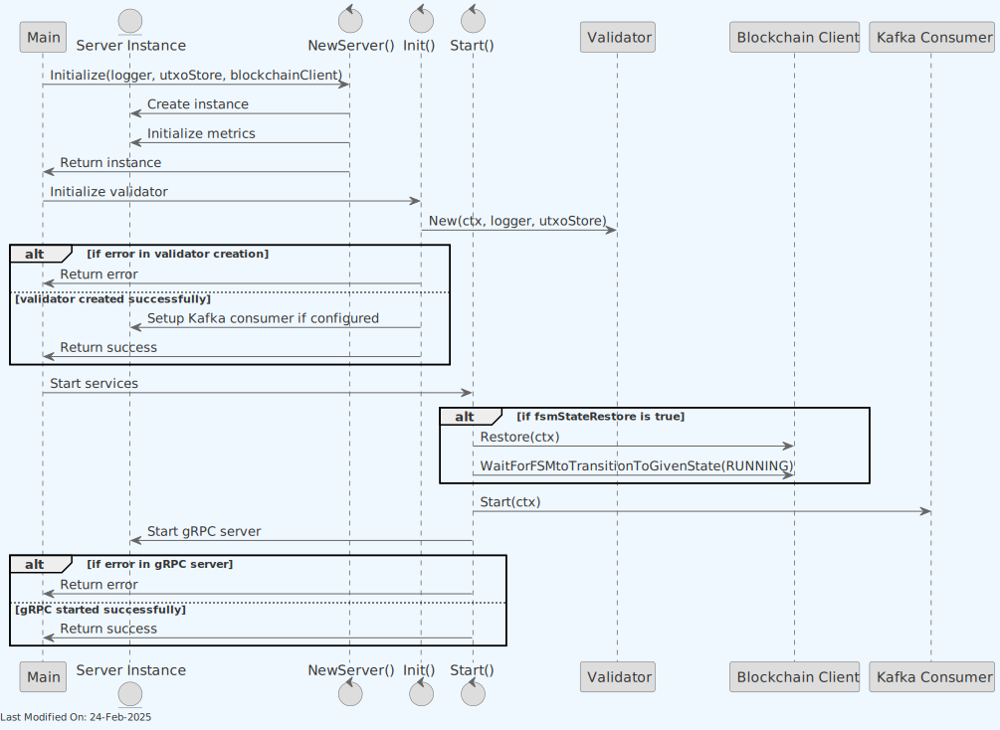
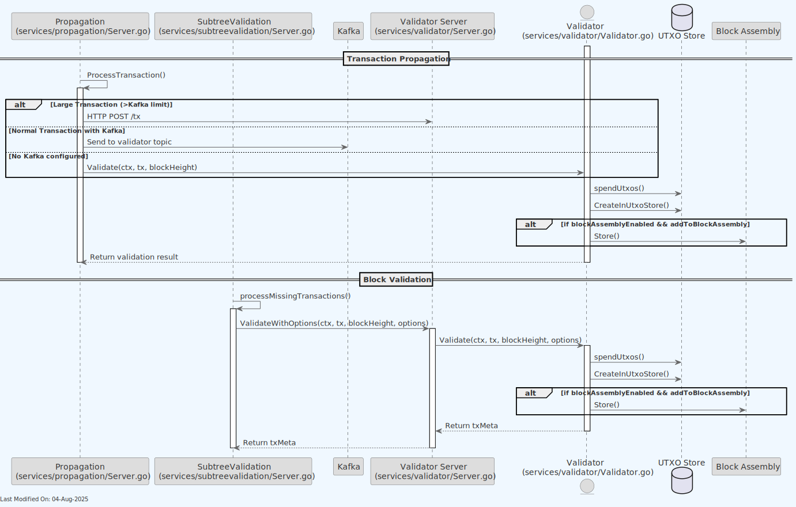
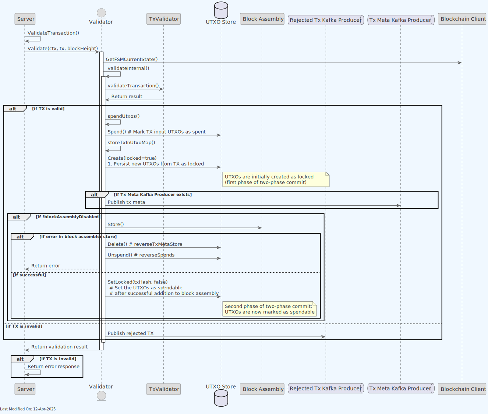
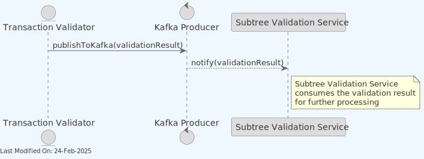
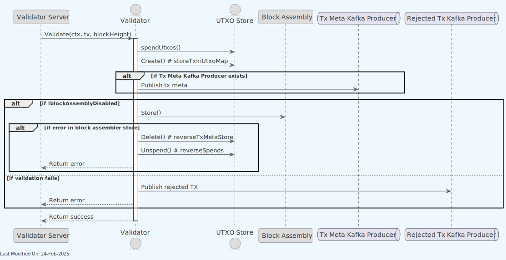

# 🔍 TX Validator

## Index


1. [Description](#1-description)
2. [Functionality](#2-functionality)
    - [2.1. Starting the Validator as a service](#21-starting-the-validator-as-a-service)
    - [2.2. Receiving Transaction Validation Requests](#22-receiving-transaction-validation-requests)
    - [2.3. Validating the Transaction](#23-validating-the-transaction)
        - [2.3.1. Consensus Rules vs Policy Checks](#231-consensus-rules-vs-policy-checks)
    - [2.4. Script Verification](#24-script-verification)
    - [2.5. Error Handling and Transaction Rejection](#25-error-handling-and-transaction-rejection)
    - [2.6. Concurrent Processing](#26-concurrent-processing)
    - [2.7. Post-validation: Updating stores and propagating the transaction](#27-post-validation-updating-stores-and-propagating-the-transaction)
        - [2.7.1. Two-Phase Transaction Commit Process](#271-two-phase-transaction-commit-process)
3. [gRPC Protobuf Definitions](#3-grpc-protobuf-definitions)
4. [Data Model](#4-data-model)
5. [Technology](#5-technology)
6. [Directory Structure and Main Files](#6-directory-structure-and-main-files)
7. [How to run](#7-how-to-run)
8. [Configuration options (settings flags)](#8-configuration-options-settings-flags)
9. [Other Resources](#9-other-resources)


## 1. Description

The `Validator` (also called `Transaction Validator` or `Tx Validator`) is a go component responsible for:

1. Receiving new transactions from the `Propagation`service,
2. Validating them,
3. Persisting the data into the utxo store,
4. Propagating the transactions to the `Subtree Validation` and `Block Assembly` service (if the Tx is passed), or notify the `P2P` service (if the tx is rejected).

### 1.1 Deployment Models

The Validator can be deployed in two distinct ways:

1. **Local Validator (Recommended)**:
   - The Validator is instantiated directly within other services (like the Propagation, Subtree Validation, and Legacy Services)
   - This is the recommended approach for production deployments due to better performance
   - No additional network calls are needed between services and validator
   - Configuration: Set `validator.useLocalValidator=true` in your settings

2. **Remote Validator Service**:
   - The Validator runs as an independent service with a gRPC interface
   - Other services connect to it remotely via gRPC
   - This approach has higher latency due to additional network calls
   - Useful for development, testing, or specialized deployment scenarios
   - Configuration: Set `validator.useLocalValidator=false` and configure validator gRPC endpoint

The performance difference between these approaches can be significant, as the local validator approach eliminates network overhead between services.

> **Note**: For detailed information about how the daemon initializes services and manages dependencies, see the [Teranode Daemon Reference](../../references/teranodeDaemonReference.md#service-initialization-flow).


The Validator, as a component, is instantiated as part of any service requiring to validate transactions.
However, the Validator can also be started as a service, allowing to interact with it via gRPC or Kafka. This setup is not recommended, given its performance overhead.

The Validator receives notifications about new Txs.

Also, the `Validator` will accept subscriptions from the P2P Service, where rejected tx notifications are pushed to.


The Validator notifies the Block Assembly service of new transactions through direct gRPC calls.

A node can start multiple parallel instances of the TX Validator. This translates into multiple pods within a Kubernetes cluster. Each instance / pod will have its own gRPC server, and will be able to receive and process transactions independently. GRPC load balancing allows to distribute the load across the multiple instances.

### Kafka Integration

The Validator uses Kafka for several critical messaging paths:

1. **Transaction Metadata Publishing**:
   - Successfully validated transactions have their metadata published to a Kafka topic
   - Metadata includes transaction ID, size, fee, input and output information
   - The `txmetaKafkaProducerClient` handles this publishing process
   - Target topic is configured via `Kafka.TxMetaConfig` settings

2. **Rejected Transaction Notifications**:
   - When transactions fail validation, details are published to a rejection topic
   - The `rejectedTxKafkaProducerClient` is responsible for these messages
   - Includes rejection reason, transaction ID, and error classification
   - Helps with network-wide tracking of invalid transactions

3. **Transaction Validation Requests**:
   - The Validator can also consume validation requests via Kafka
   - This enables asynchronous transaction processing patterns
   - Useful for high-throughput scenarios where immediate responses aren't needed

The Kafka integration provides resilience, allowing the system to handle temporary outages or service unavailability by buffering messages.

## 2. Functionality

### 2.1. Starting the Validator as a service

Should the node require to start the validator as an independent service, the `services/validator/Server.go` will be instantiated as follows:



* **`NewServer` Function**:

    1. Initialize a new `Server` instance.
    2. Create channels for new and dead subscriptions.
    3. Initialize a map for subscribers.
    4. Create a context for subscriptions and a corresponding cancellation function.
    5. Return the newly created `Server` instance.

* **`Init` Function**:
    1. Create a new validator instance within the server.
    2. Handle any errors during the creation of the validator.
    3. Return the outcome (success or error).

* **`Start` Function**:
    1. Start a goroutine to manage new and dead subscriptions.
    2. Start the gRPC server and handle any errors.

### 2.2. Receiving Transaction Validation Requests

The Propagation and Subtree Validation modules invoke the validator process in order to have new or previously missed Txs validated. The Propagation service is responsible for processing new Txs, while the Block Validation service is responsible for identifying missed Txs while processing blocks.



BlockValidation and Propagation invoke the validator process with and without batching. Batching is settings controlled, and improves the processing performance.

1. **Transaction Propagation**:
    - The Propagation module `ProcessTransaction()` function invokes `Validate()` on the Validator client.
    - The Validator validates the transaction.

2. **Subtree Validation**:
    - The SubtreeValidation module `blessMissingTransaction()` function invokes `Validate()` on the Validator client.
    - The Validator validates the transaction.

### 2.3. Validating the Transaction

For every transaction received, Teranode must validate:
 - All inputs against the existing UTXO-set, verifying if the input(s) can be spent,
    - Notice that if Teranode detects a double-spend, the transaction that was received first must be considered the valid transaction.
 - Bitcoin consensus rules,
 - Local policies (if any),
 - Whether the script execution returns `true`.

Teranode will consider a transaction that passes consensus rules, local policies and script validation as fully validated and fit to be included in the next possible block.

The validation process includes several stages:

1. **Basic Transaction Structure Validation**:
   - Verify inputs and outputs are present
   - Check transaction size against policy limits
   - Validate input and output value ranges

2. **Policy Validation**:
   - Apply configurable policy rules that can be enabled/disabled
   - Check transaction fees against minimum requirements
   - Enforce limits on script operations (sigops)

3. **Input Validation**:
   - Verify inputs exist in the UTXO set
   - Ensure inputs are unspent (prevent double-spending)
   - Validate input script format

New Txs are validated by the `ValidateTransaction()` function. To ensure the validity of the extended Tx, this is delegated to a BSV library: `github.com/TAAL-GmbH/arc/validator/default` (the default validator).


We can see the exact steps being executed as part of the validation process below:

```go
func (tv *TxValidator) ValidateTransaction(tx *bt.Tx, blockHeight uint32, validationOptions *Options) error {
	//
	// Each node will verify every transaction against a long checklist of criteria:
	//
	txSize := tx.Size()

	// 1) Neither lists of inputs nor outputs are empty
	if len(tx.Inputs) == 0 || len(tx.Outputs) == 0 {
		return errors.NewTxInvalidError("transaction has no inputs or outputs")
	}

	// 2) The transaction size in bytes is less than maxtxsizepolicy.
	if !validationOptions.SkipPolicyChecks {
		if err := tv.checkTxSize(txSize); err != nil {
			return err
		}
	}

	// 3) check that each input value, as well as the sum, are in the allowed range of values (less than 21m coins)
	// 5) None of the inputs have hash=0, N=–1 (coinbase transactions should not be relayed)
	if err := tv.checkInputs(tx, blockHeight); err != nil {
		return err
	}

	// 4) Each output value, as well as the total, must be within the allowed range of values (less than 21m coins,
	//    more than the dust threshold if 1 unless it's OP_RETURN, which is allowed to be 0)
	if err := tv.checkOutputs(tx, blockHeight); err != nil {
		return err
	}

	// The transaction size in bytes is greater than or equal to 100 (BCH only check, not applicable to BSV)

	// The number of signature operations (SIGOPS) contained in the transaction is less than the signature operation limit
	// Note: This may be disabled for unlimited operation counts

	// The unlocking script (scriptSig) can only push numbers on the stack
	if tv.interpreter.Interpreter() != TxInterpreterGoBDK && blockHeight > tv.settings.ChainCfgParams.UahfForkHeight {
		if err := tv.pushDataCheck(tx); err != nil {
			return err
		}
	}

	// 10) Reject if the sum of input values is less than sum of output values
	// 11) Reject if transaction fee would be too low (minRelayTxFee) to get into an empty block.
	if !validationOptions.SkipPolicyChecks {
		if err := tv.checkFees(tx, feesToBtFeeQuote(tv.settings.Policy.GetMinMiningTxFee())); err != nil {
			return err
		}
	}

	// 12) The unlocking scripts for each input must validate against the corresponding output locking scripts
	// (Script verification is handled separately with multiple interpreter options)

	return nil
}
```

The above represents an implementation of the core Teranode validation rules:

- All transactions must exist and be unspent (does not apply to Coinbase transactions).

- All transaction inputs must have been present in either a transaction in an ancestor block, or in a transaction in the same block that is located before the transaction being validated.

- All transaction inputs must not have been spent by any transaction in ancestor blocks, or by any transaction in the same block that is not located after the transaction being validated

- The length of the script (scriptSig) in the Coinbase transaction must be between 2 and (including) 100 bytes.

- The transaction must be syntactically valid:

- A transaction must have at least one input

- A transaction must have at least one output

- The amount of satoshis in all outputs must be less than or equal to the amount of satoshis in the inputs, to avoid new BSV being introduced to the network

- The amount in all outputs must be between 0 and 21,000,000 BSV (2.1 * 10^15 satoshi)

- The amount of all inputs must be between 0 and 21,000,000 BSV. The sum of the amount over all inputs must not be larger than 21,000,000 BSV.

- A transaction must be final, meaning that either of the following conditions is met:

    - The sequence number in all inputs is equal to 0xffffffff, or

    - The lock time is:

    - Equal to zero, or

    - <500000000 and smaller than block height, or >=500000000 and SMALLER THAN TIMESTAMP

    - Note: This means that Teranode will deem non-final transactions invalid and REJECT these transactions. It is up to the user to create proper non-final transactions to ensure that Teranode is aware of them. For clarity, if a transaction has a locktime in the future, the Tx Validator will reject it.

    - No output must be Pay-to-Script-Hash (P2SH)

    - A new transaction must not have any output which includes P2SH, as creation of new P2SH transactions is not allowed.

    - Historical P2SH transactions (if any) must still be supported by Teranode, allowing these transactions to be spent.

    - A transaction must not spend frozen UTXOs (see 3.13 – Integration with Alert System)

    - A node must not be able to spend a confiscated (re-assigned) transaction until 1,000 blocks after the transaction was re-assigned (confiscation maturity). The difference between block height and height at which the transaction was re-assigned must not be less than one thousand.


#### 2.3.1. Consensus Rules vs Policy Checks

In Bitcoin transaction validation, there are two distinct types of rules:

1. **Consensus Rules**: Mandatory rules that all nodes must enforce to maintain network consensus. Transactions violating consensus rules are always rejected. These include:
   - Transaction structure and formatting
   - Double-spend prevention
   - Input and output value constraints
   - Script execution validity

2. **Policy Rules**: Node-specific preferences that determine which valid transactions to accept, relay, or mine. Policy rules can differ between nodes without breaking consensus. These include:
   - Minimum transaction fees
   - Maximum transaction size
   - Script complexity limits
   - Dust output thresholds

The TX Validator implements both types of rules, but provides the ability to skip policy checks when appropriate through the `SkipPolicyChecks` option.

##### Skip Policy Checks Feature

The `SkipPolicyChecks` feature allows Teranode to validate transactions while bypassing certain policy-based validations. When enabled, the validator will:

- Skip transaction size policy checks
- Skip minimum fee requirements
- Apply consensus-only script verification rules
- Continue enforcing all consensus rules

This feature is particularly important when validating transactions that:
- Are part of blocks mined by other miners (which have already been validated through proof-of-work)
- Need to be accepted regardless of local policy preferences
- Have already been confirmed on the blockchain

```go
// Example of policy checks being conditionally applied:
if !validationOptions.SkipPolicyChecks {
    if err := tv.checkFees(tx, feesToBtFeeQuote(tv.settings.Policy.GetMinMiningTxFee())); err != nil {
        return err
    }
}
```

When validating transactions from blocks mined by other nodes, policy checks should be skipped because these blocks are already valid due to proof-of-work, and the transactions must be accepted to maintain consensus, even if they don't meet local policy preferences.

##### Skip Policy Checks - Usage

To use this feature:
- When directly calling the validator: Use the `WithSkipPolicyChecks(true)` option
- When using the gRPC API endpoint: Set the `skip_policy_checks` field to `true` in the `ValidateTransactionRequest` message
- In services like Subtree Validation: The option is applied automatically when validating block transactions

### 2.4. Script Verification

The Validator supports multiple script verification implementations through a flexible interpreter architecture. Three different script interpreters are supported:

1. **GoBT Interpreter** (`TxInterpreterGoBT`):
   - Based on the Go-BT library
   - Default interpreter for basic script validation

2. **GoSDK Interpreter** (`TxInterpreterGoSDK`):
   - Based on the Go-SDK library
   - Provides advanced script validation capabilities

3. **GoBDK Interpreter** (`TxInterpreterGoBDK`):
   - Based on the Go-BDK library
   - Optimized for performance in high-throughput scenarios
   - Includes specialized Bitcoin script validation features

The script verification process:
1. Each transaction input's unlocking script is validated against its corresponding output's locking script
2. The interpreter evaluates if the combined script executes successfully and leaves 'true' on the stack
3. The script verification is context-aware, considering current block height and network parameters

Script verification can be configured using the `validator_scriptVerificationLibrary` setting, which defaults to "VerificatorGoBT".

### 2.5. Error Handling and Transaction Rejection

The Validator implements a structured error handling system to categorize and report different types of validation failures:

1. **Error Types**:
   - `TxInvalidError`: Generated when a transaction fails basic validation rules
   - `ProcessingError`: Occurs during transaction processing issues
   - `ConfigurationError`: Indicates validator configuration problems
   - `ServiceError`: Represents broader service-level issues

2. **Rejection Flow**:
   - When a transaction is rejected, detailed error information is captured
   - Rejection reasons are categorized (e.g., invalid inputs, script failure, insufficient fees)
   - Rejected transactions are published to a dedicated Kafka topic if configured
   - The P2P service receives notifications about rejected transactions

3. **Error Propagation**:
   - Errors are wrapped and propagated through the system with context information
   - GRPC error codes translate internal errors for API responses
   - Detailed error messages assist in diagnosing validation issues

### 2.6. Concurrent Processing

The Validator leverages concurrency to optimize transaction processing performance:

1. **Parallel UTXO Saving**:
   - The `saveInParallel` flag enables concurrent UTXO updates
   - Improves throughput by processing multiple transactions simultaneously

2. **Batching**:
   - Transactions can be validated in batches for higher throughput
   - Batch processing is configurable and used by both Propagation and Subtree Validation services
   - The `TriggerBatcher()` method initiates batch processing when sufficient transactions accumulate

3. **Error Group Pattern**:
   - Uses Go's `errgroup` package for coordinated concurrent execution
   - Maintains proper error propagation in concurrent processing flows

4. **Two-Phase Commit Process**:
   - The `twoPhaseCommitTransaction` method ensures atomic transaction processing
   - Prevents partial updates in case of failures during concurrent processing

### 2.7. Post-validation: Updating stores and propagating the transaction

Once a Tx is validated, the Validator will update the UTXO store with the new Tx data. Then, it will notify the Block Assembly service and any P2P subscribers about the new Tx.




- The Server receives a validation request and calls the `Validate` method on the Validator struct.
- If the transaction is valid:
    - The Validator marks the transaction's input UTXOs as spent in the UTXO Store.
    - The Validator registers the new transaction in the UTXO Store.
    - The Validator sends transaction metadata to the Subtree Validation Service via Kafka topic (`txmeta`).
    - The Validator sends the transaction to the Block Assembly Service via direct gRPC calls.
    - The Validator stores the new UTXOs generated by the transaction in the UTXO Store.

- If the transaction is invalid:
    - The Server sends invalid transaction notifications to all P2P Service subscribers.
    - The rejected Tx is not stored or tracked in any store, and it is simply discarded.


We can see the submission to the Subtree Validation Service here:



We can dive deeper into the submission to the Block Assembly:



The Validator notifies the Block Assembly service of new transactions through direct gRPC calls by calling the `Store()` method on the Block Assembly client.

### Configuration Settings Affecting Validator Behavior

The Validator service behavior is controlled by several key configuration parameters:

- **`KafkaMaxMessageBytes`** (default: 1MB): Controls size-based routing - large transactions that exceed this threshold are routed via HTTP instead of Kafka to avoid message size limitations.
- **`UseLocalValidator`** (default: false): Determines whether to use a local validator instance or connect to a remote validator service via gRPC.
- **`KafkaWorkers`** (default: 0): Controls the number of concurrent Kafka message processing workers. When set to 0, Kafka consumer processing is disabled.
- **`HTTPRateLimit`** (default: 1024): Sets the rate limit for HTTP API requests to prevent service overload.
- **`VerboseDebug`** (default: false): Enables detailed validation logging for troubleshooting.

### Rejected Transaction Handling

When the Transaction Validator Service identifies an invalid transaction, it employs a Kafka-based notification system to inform other components of the system. Here's an overview of this process:


1. **Transaction Validation**:
    - The Validator receives a transaction for validation via a gRPC call to the `ValidateTransaction` method.
    - The Validator performs its checks, including script verification, UTXO spending, and other validation rules.

2. **Identification of Invalid Transactions**:
    - If the transaction fails any of the validation checks, it is deemed invalid (rejected).

3. **Notification of Rejected Transactions**:
    - When a transaction is rejected, the Validator publishes information about the rejected transaction to a dedicated Kafka topic (`rejectedTx`).
    - This is done using the Rejected Tx Kafka Producer, which is configured via the `kafka_rejectedTxConfig` setting.

4. **Kafka Message Content**:
    - The Kafka message for a rejected transaction typically includes:
        - The transaction ID (hash)
        - The reason for rejection (error message)

5. **Consumption of Rejected Transaction Notifications**:
    - Other services in the system, such as the P2P Service, can subscribe to this Kafka topic.
    - By consuming messages from this topic, these services receive notifications about rejected transactions and can take appropriate action (e.g., banning peers that send invalid transactions).

#### 2.7.1. Two-Phase Transaction Commit Process

The Validator implements a two-phase commit process for transaction creation and addition to block assembly:

1. **Phase 1 - Transaction Creation with Unspendable Flag**:
   - When a transaction is created, it is initially stored in the UTXO store with an "unspendable" flag set to `true`.
   - This flag prevents the transaction outputs from being spent while it's in the process of being validated and added to block assembly, protecting against potential double-spend attempts.

2. **Phase 2 - Unsetting the Unspendable Flag**:
   - The unspendable flag is unset in two key scenarios:

   a. **After Successful Addition to Block Assembly**:
      - When a transaction is successfully validated and added to the block assembly, the Validator service immediately unsets the "unspendable" flag (sets it to `false`).
      - This makes the transaction outputs available for spending in subsequent transactions, even before the transaction is mined in a block.

   b. **When Mined in a Block (Fallback Mechanism)**:
      - As a fallback mechanism, if the flag hasn't been unset already, it will be unset when the transaction is mined in a block.
      - When the transaction is mined in a block and that block is processed by the Block Validation service, the "unspendable" flag is unset (set to `false`) during the `SetMinedMulti` operation.

3. **Ignoring Unspendable Flag for Block Transactions**:
   - When processing transactions that are part of a block (as opposed to new transactions to include in an upcoming block), the validator can be configured to ignore the unspendable flag.
   - This is necessary because transactions in a block have already been validated by miners and must be accepted regardless of their unspendable status.
   - The validator uses the `WithIgnoreUnspendable` option to control this behavior during transaction validation.

This two-phase commit approach ensures that transactions are only made spendable after they've been successfully added to block assembly, reducing the risk of race conditions and double-spend attempts during the transaction processing lifecycle.

> **For a comprehensive explanation of the two-phase commit process across the entire system, see the [Two-Phase Transaction Commit Process](../features/two_phase_commit.md) documentation.**


## 3. gRPC Protobuf Definitions

The Validator, when run as a service, uses gRPC for communication between nodes. The protobuf definitions used for defining the service methods and message formats can be seen [here](../../references/protobuf_docs/validatorProto.md).

## 4. Data Model

The Validation Service deals with the extended transaction format, as seen below:

- [Extended Transaction Data Model](../datamodel/transaction_data_model.md): Include additional metadata to facilitate processing.

## 5. Technology

The code snippet you've provided utilizes a variety of technologies and libraries, each serving a specific purpose within the context of a Bitcoin SV (BSV) blockchain-related application. Here's a breakdown of these technologies:

1. **Go (Golang)**: The programming language used for the entire codebase.

2. **gRPC**: Google's Remote Procedure Call system, used here for server-client communication. It enables the server to expose specific methods that clients can call remotely. This is only used if the component is started as a service.

3. **Kafka (by Apache)**: A distributed streaming platform (optionally) used here for message handling. Kafka is used for distributing transaction validation data to the block assembly.
   - [Kafka in Teranode](../../topics/kafka/kafka.md#validator-component): Overview of Kafka integration with the Validator component
   - [Kafka Message Format](../../references/kafkaMessageFormat.md): Details on message formats used in Kafka communication

4. **Sarama**: A Go library for Apache Kafka.

5. **Go-Bitcoin**: A Go library that provides utilities and tools for working with Bitcoin, including transaction parsing and manipulation.

6. **LibSV**: Another Go library for Bitcoin SV, used for transaction-related operations.

7. **Other Utilities and Libraries**:
    - `sync/atomic`, `strings`, `strconv`, `time`, `io`, `net/url`, `os`, `bytes`, and other standard Go packages for various utility functions.
    - `github.com/ordishs/gocore` and `github.com/ordishs/go-utils/batcher`: Utility libraries, used for handling core functionalities and batch processing.
    - `github.com/opentracing/opentracing-go`: Used for distributed tracing.


## 6. Directory Structure and Main Files

```
./services/validator
├── Client.go                    # Contains client-side logic for interacting with the Validator
├── Interface.go                 # Defines interfaces for the Validator
├── ScriptVerificatorGoBDK.go    # Implements script verification using a Go Bitcoin Development Kit
├── ScriptVerificatorGoBT.go     # Implements script verification using Go Bitcoin Tools
├── ScriptVerificatorGoSDK.go    # Implements script verification using a Go Software Development Kit
├── Server.go                    # Implements the server-side logic of the Validator
├── TxValidator.go               # Contains specific logic for validating transactions
├── Validator.go                 # Contains the main logic for validator functionalities
├── data.go                      # Contains data structures or constants used in the validator service
├── metrics.go                   # Contains code for metrics collection within the Validator
├── options.go                   # Defines configuration options or settings for the validator service
├── policy.go                    # Defines validation policies or rules
└── validator_api
    ├── validator_api.pb.go          # Auto-generated Go code from validator_api.proto
    ├── validator_api.proto          # Protocol Buffers definition file for the validator API
    └── validator_api_grpc.pb.go     # Auto-generated gRPC specific code from validator_api.proto
```


## 7. How to run


To run the Validator locally, you can execute the following command:

```shell
SETTINGS_CONTEXT=dev.[YOUR_USERNAME] go run -Validator=1
```

Please refer to the [Locally Running Services Documentation](../../howto/locallyRunningServices.md) document for more information on running the Validator locally.


## 8. Configuration options (settings flags)

The TX Validator service relies on a set of configuration settings that control its behavior, performance, and integration with other services. This section provides a comprehensive overview of these settings, organized by functional category, along with their impacts, dependencies, and recommended configurations for different deployment scenarios.

### 8.1 Configuration Categories

TX Validator service settings can be organized into the following functional categories:

1. **Deployment Architecture**: Settings that determine how the validator is deployed and integrated
2. **Network & Communication**: Settings that control network binding and API endpoints
3. **Performance & Throughput**: Settings that affect transaction processing performance
4. **Kafka Integration**: Settings for message-based communication
5. **Validation Rules**: Settings that control transaction validation policies
6. **Monitoring & Debugging**: Settings for observability and troubleshooting

### 8.2 Deployment Architecture Settings

These settings fundamentally change how the validator operates within the system architecture.

| Setting | Type | Default | Description | Impact |
|---------|------|---------|-------------|--------|
| `useLocalValidator` | bool | `false` | Controls whether validation is performed locally or via remote service | Significantly affects system architecture, latency, and deployment model |

#### Deployment Architecture Interactions and Dependencies

The `useLocalValidator` setting has profound implications for system architecture:

- When `true`, the validator is instantiated directly within other services (Propagation, Subtree Validation, Legacy), eliminating network overhead but requiring these services to be compiled with the validator
- When `false`, the validator runs as an independent service with a gRPC interface that other services connect to remotely

This choice creates two distinct deployment architectures:

**Local Validator Architecture:**
- Services contain embedded validator instances
- No network calls between services and validator
- Lower latency and higher throughput
- All services must be redeployed when validator code changes
- Limited deployment flexibility

**Remote Validator Architecture:**
- Validator runs as a standalone service
- Network calls between services and validator
- Higher latency but more flexible deployment
- Validator can be scaled independently
- Supports independent deployment and updates

### 8.3 Network & Communication Settings

These settings control how the validator communicates over the network.

| Setting | Type | Default | Description | Impact |
|---------|------|---------|-------------|--------|
| `validator_grpcAddress` | string | `"localhost:8081"` | Address for connecting to the validator gRPC service | Determines how other services connect to the validator |
| `validator_grpcListenAddress` | string | `":8081"` | Address on which the validator gRPC server listens | Controls network binding for incoming validation requests |
| `validator_httpListenAddress` | string | `""` | Address on which the HTTP API server listens | Enables HTTP-based validation requests when set |
| `validator_httpAddress` | *url.URL | `nil` | URL for connecting to the validator HTTP API | Determines how other services connect to the HTTP interface |
| `validator_httpRateLimit` | int | `1024` | Maximum number of HTTP requests per second | Prevents resource exhaustion from excessive requests |
| `grpc_resolver` | string | `""` | Determines the gRPC resolver to use | Enables service discovery in Kubernetes environments |

#### Network & Communication Interactions and Dependencies

The validator offers two API interfaces for transaction validation:

**gRPC Interface**:
- Primary interface for high-performance validation requests
- Used by Propagation and Subtree Validation services
- Always enabled when running in remote validator mode
- Configured through `validator_grpcAddress` and `validator_grpcListenAddress`

**HTTP Interface**:
- Optional secondary interface for REST-based validation requests
- Only enabled when `validator_httpListenAddress` is set
- Provides a simpler interface for testing and third-party integrations
- Protected by rate limiting through `validator_httpRateLimit`

In Kubernetes environments, the `grpc_resolver` setting enables service discovery to locate validator instances dynamically.

### 8.4 Performance & Throughput Settings

These settings control how efficiently transactions are processed.

| Setting | Type | Default | Description | Impact |
|---------|------|---------|-------------|--------|
| `validator_sendBatchSize` | int | `100` | Number of transactions to accumulate before batch processing | Balances throughput against latency for transaction processing |
| `validator_sendBatchTimeout` | int | `2` | Maximum time (seconds) to wait before processing a partial batch | Ensures timely processing of transactions even when volume is low |
| `validator_sendBatchWorkers` | int | `10` | Number of worker goroutines for batch send operations | Controls parallelism for outbound transaction processing |
| `validator_blockvalidation_delay` | int | `0` | Artificial delay (milliseconds) introduced before block validation | Can be used for testing or throttling validation operations |
| `validator_blockvalidation_maxRetries` | int | `5` | Maximum number of retries for failed block validations | Affects resilience against transient failures |
| `validator_blockvalidation_retrySleep` | string | `"2s"` | Time to wait between block validation retry attempts | Controls backoff strategy for failed validations |

#### Performance & Throughput Interactions and Dependencies

The batch processing settings work together to optimize transaction throughput:

- Batching improves performance by amortizing overhead across multiple transactions
- The validator accumulates up to `validator_sendBatchSize` transactions before processing them as a batch
- If fewer transactions arrive, a partial batch is processed after `validator_sendBatchTimeout` seconds
- Multiple worker goroutines (`validator_sendBatchWorkers`) process batches in parallel

This creates a balance between throughput (larger batches) and latency (timely processing).

The block validation retry settings (`validator_blockvalidation_maxRetries` and `validator_blockvalidation_retrySleep`) control resilience by determining how aggressively the system retries failed operations.

### 8.5 Kafka Integration Settings

These settings control message-based communication via Kafka.

| Setting | Type | Default | Description | Impact |
|---------|------|---------|-------------|--------|
| `validator_kafkaWorkers` | int | `0` | Number of worker goroutines for Kafka message processing | Affects concurrency and throughput for Kafka-based transaction handling |
| `kafka_validatortxsConfig` | URL | `""` | URL for the Kafka configuration for validator transactions | Configures how transactions are published to Kafka |
| `kafka_txmetaConfig` | URL | `""` | URL for the Kafka configuration for transaction metadata | Configures how transaction metadata is published to Kafka |
| `kafka_rejectedTxConfig` | URL | `""` | URL for the Kafka configuration for rejected transactions | Configures how rejected transaction information is published to Kafka |
| `validator_kafka_maxMessageBytes` | int | `1048576` | Maximum size of Kafka messages in bytes | Limits the size of transactions that can be processed via Kafka |

#### Kafka Integration Interactions and Dependencies

Kafka integration provides asynchronous communication between the validator and other services:

- Successful validations produce messages to `kafka_txmetaConfig` for Block Assembly
- Rejected transactions produce messages to `kafka_rejectedTxConfig` for P2P notification
- `validator_kafka_maxMessageBytes` must be coordinated with Kafka broker's `message.max.bytes`
- When `validator_kafkaWorkers` is 0, the system auto-calculates based on available CPUs

These Kafka channels complement the synchronous gRPC and HTTP APIs, providing an event-driven architecture for transaction propagation.

### 8.6 Validation Rules Settings

These settings control the rules and policies applied during transaction validation.

| Setting | Type | Default | Description | Impact |
|---------|------|---------|-------------|--------|
| `maxtxsizepolicy` | int | Varies | Maximum allowed transaction size in bytes | Restricts oversized transactions from entering the mempool |
| `minminingtxfee` | int64 | Varies | Minimum fee required for transaction acceptance | Sets economic barrier for transaction inclusion |
| `validator_scriptVerificationLibrary` | string | `"VerificatorGoBT"` | Library used for Bitcoin script verification | Determines script validation implementation |

#### Validation Rules Interactions and Dependencies

Validation rules determine which transactions are accepted:

- The `maxtxsizepolicy` setting rejects transactions exceeding the size limit
- The `minminingtxfee` setting enforces minimum fee requirements
- The script verification library (`validator_scriptVerificationLibrary`) determines how transaction scripts are validated

These settings directly impact consensus and policy enforcement, ensuring that only valid transactions are propagated and included in blocks.

### 8.7 Monitoring & Debugging Settings

These settings control observability and diagnostics.

| Setting | Type | Default | Description | Impact |
|---------|------|---------|-------------|--------|
| `validator_verbose_debug` | bool | `false` | Enables detailed debug logging for validator operations | Provides additional diagnostic information at the cost of log verbosity |
| `fsm_state_restore` | bool | `false` | Controls whether the service restores from a previously saved state | Affects recovery behavior after restarts or failures |

#### Monitoring & Debugging Interactions and Dependencies

These settings help with troubleshooting and observability:

- `validator_verbose_debug` increases log verbosity, useful for diagnosing issues but increases log volume
- `fsm_state_restore` enables recovering from previous state after restart, important for maintaining continuity

## 9. Other Resources

[Validator Reference](../../references/services/validator_reference.md)
