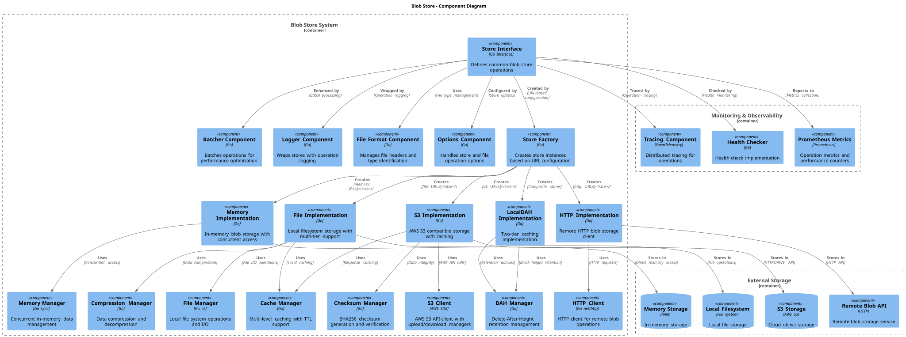

# 🗂️ Blob Server

## Index

- [1. Description](#1-description)
- [2. Architecture](#2-architecture)
- [3. Technology](#3-technology)
    - [3.1 Overview](#31-overview)
    - [3.2 Store Options](#32-store-options)
    - [3.3 Concurrent Access Patterns](#33-concurrent-access-patterns)
    - [3.4 HTTP REST API Server](#34-http-rest-api-server)
- [4. Data Model](#4-data-model)
- [5. Use Cases](#5-use-cases)
    - [5.1. Asset Server (HTTP): Get Transactions](#51-asset-server-http-get-transactions)
    - [5.2. Asset Server (HTTP): Get Subtrees](#52-asset-server-http-get-subtrees)
    - [5.3. Block Assembly](#53-block-assembly)
    - [5.4. Block Validation](#54-block-validation)
    - [5.5 Propagation: TXStore Set()](#55-propagation-txstore-set)
- [6. Directory Structure and Main Files](#6-directory-structure-and-main-files)
- [7. Locally Running the store](#7-locally-running-the-store)
- [8. Configuration Options](#8-configuration-options)
- [9. Other Resources](#9-other-resources)

## 1. Description

The Blob Store is a generic datastore that can be used for any specific data model. In the current Teranode implementation, it is used to store transactions (extended tx) and subtrees.

The Blob Store provides a set of methods to interact with the TX and Subtree storage implementations:

### Store Interface Methods

- **Health**: `Health(ctx, checkLiveness bool) (int, string, error)` - Checks the health status of the blob store, returning HTTP status code, description, and any error.

- **Exists**: `Exists(ctx, key, fileType, opts...) (bool, error)` - Determines if a given key exists in the store.

- **Get**: `Get(ctx, key, fileType, opts...) ([]byte, error)` - Retrieves the blob data associated with a given key.

- **GetIoReader**: `GetIoReader(ctx, key, fileType, opts...) (io.ReadCloser, error)` - Retrieves an `io.ReadCloser` for the blob associated with a given key, useful for streaming large data.

- **Set**: `Set(ctx, key, fileType, value, opts...) error` - Stores a key-value pair in the store.

- **SetFromReader**: `SetFromReader(ctx, key, fileType, reader, opts...) error` - Stores a key-value pair in the store from an `io.ReadCloser`, useful for streaming large data.

- **SetDAH**: `SetDAH(ctx, key, fileType, dah, opts...) error` - Sets a Delete-At-Height value for a given key for automatic blockchain-based expiration.

- **GetDAH**: `GetDAH(ctx, key, fileType, opts...) (uint32, error)` - Retrieves the Delete-At-Height value for a given key.

- **Del**: `Del(ctx, key, fileType, opts...) error` - Deletes a key and its associated value from the store.

- **Close**: `Close(ctx) error` - Closes the Blob Store connection and releases any associated resources.

- **SetCurrentBlockHeight**: `SetCurrentBlockHeight(height uint32)` - Sets the current block height for the store, used for DAH functionality.

11. **SetCurrentBlockHeight**: `SetCurrentBlockHeight(height)`
    - **Purpose**: Sets the current block height for the store, used by the DAH (Delete-At-Height) mechanism.

## 2. Architecture

The Blob Store is a store interface, with implementations for Tx Store and Subtree Store.


The Blob Store implementations for Tx Store and Subtree Store are injected into the various services that require them. They are initialized in `daemon/daemon_stores.go` and passed into the services as dependencies. See example below:

```go
// GetTxStore returns the main transaction store instance. If the store hasn't been initialized yet,
// it creates a new one using the configured URL from settings.
func (d *Stores) GetTxStore(logger ulogger.Logger, appSettings *settings.Settings) (blob.Store, error) {
    if d.mainTxStore != nil {
        return d.mainTxStore, nil
    }

    txStoreURL := appSettings.Block.TxStore
    if txStoreURL == nil {
        return nil, errors.NewConfigurationError("txstore config not found")
    }

    var err error
    hashPrefix := 2
    if txStoreURL.Query().Get("hashPrefix") != "" {
        hashPrefix, err = strconv.Atoi(txStoreURL.Query().Get("hashPrefix"))
        if err != nil {
            return nil, errors.NewConfigurationError("txstore hashPrefix config error", err)
        }
    }

    d.mainTxStore, err = blob.NewStore(logger, txStoreURL, options.WithHashPrefix(hashPrefix))
    if err != nil {
        return nil, errors.NewServiceError("could not create tx store", err)
    }

    return d.mainTxStore, nil
}

// GetSubtreeStore returns the main subtree store instance. If the store hasn't been initialized yet,
// it creates a new one using the URL from settings.
func (d *Stores) GetSubtreeStore(ctx context.Context, logger ulogger.Logger, appSettings *settings.Settings) (blob.Store, error) {
    if d.mainSubtreeStore != nil {
        return d.mainSubtreeStore, nil
    }

    var err error
    subtreeStoreURL := appSettings.SubtreeValidation.SubtreeStore

    if subtreeStoreURL == nil {
        return nil, errors.NewConfigurationError("subtreestore config not found")
    }

    hashPrefix := 2
    if subtreeStoreURL.Query().Get("hashPrefix") != "" {
        hashPrefix, err = strconv.Atoi(subtreeStoreURL.Query().Get("hashPrefix"))
        if err != nil {
            return nil, errors.NewConfigurationError("subtreestore hashPrefix config error", err)
        }
    }

    blockchainClient, err := d.GetBlockchainClient(ctx, logger, appSettings, "subtree")
    if err != nil {
        return nil, errors.NewServiceError("could not create blockchain client for subtree store", err)
    }

    ch, err := getBlockHeightTrackerCh(ctx, logger, blockchainClient)
    if err != nil {
        return nil, errors.NewServiceError("could not create block height tracker channel", err)
    }

    d.mainSubtreeStore, err = blob.NewStore(logger, subtreeStoreURL,
        options.WithHashPrefix(hashPrefix),
        options.WithBlockHeightCh(ch))
    if err != nil {
        return nil, errors.NewServiceError("could not create subtree store", err)
    }

    return d.mainSubtreeStore, nil
}
```

The following diagram provides a deeper level of detail into the Blob Store's internal components and their interactions:



## 3. Technology

### 3.1 Overview

Key technologies involved:

1. **Go Programming Language (Golang)**:

    - A statically typed, compiled language known for its simplicity and efficiency, especially in concurrent operations and networked services.
    - The primary language used for implementing the service's logic.

### 3.2 Store Options

The Blob Server supports various backends, each suited to different storage requirements and environments.

- **Batcher**: Provides batch processing capabilities for storage operations.

- **File**: Utilizes the local file system for storage.

- **HTTP**: Implements an HTTP client for interacting with a remote blob storage server.

- **Local DAH**: Provides local Delete-At-Height (DAH) functionality for managing blockchain-based data expiration.

- **Memory**: In-memory storage for temporary and fast data access.

- **Null**: A no-operation store for testing or disabling storage features.

- **Amazon S3**: Integration with Amazon Simple Storage Service (S3) for cloud storage. [Amazon S3](https://aws.amazon.com/s3/)

Each store option is implemented in its respective subdirectory within the `stores/blob/` directory.

The system also includes a main server implementation (`server.go`) that provides an HTTP interface for blob storage operations.

Options for configuring these stores are managed through the `options` package.

### 3.3 Concurrent Access Patterns

The Blob Server includes a `ConcurrentBlob` implementation that provides thread-safe access to blob storage operations with optimized concurrent access patterns. This feature is particularly important in high-concurrency environments where the same blob might be requested multiple times simultaneously.

#### Key Features

- **Double-Checked Locking Pattern**: Ensures that only one fetch operation occurs at a time for each unique key, while allowing concurrent operations on different keys
- **Generic Type Support**: Parametrized by a key type K that must satisfy `chainhash.Hash` constraints for type-safe handling
- **Duplicate Operation Prevention**: Avoids duplicate network or disk operations when multiple goroutines request the same blob simultaneously
- **Efficient Resource Usage**: Other goroutines wait for completion rather than duplicating work

#### Usage Pattern

```go
// Create a concurrent blob instance
concurrentBlob := blob.NewConcurrentBlob[chainhash.Hash](blobStore, options...)

// Get a blob with automatic fetching if not present
reader, err := concurrentBlob.Get(ctx, key, fileType, func() (io.ReadCloser, error) {
    // This function is called only if the blob doesn't exist
    return fetchBlobFromSource(key)
})
```

The `ConcurrentBlob` wrapper is particularly useful for services that need to fetch the same data concurrently, such as block validation or transaction processing services.

### 3.4 HTTP REST API Server

The Blob Store includes a comprehensive HTTP REST API server implementation (`HTTPBlobServer`) that provides full HTTP access to blob storage operations. This server implements the standard `http.Handler` interface and can be easily integrated into existing HTTP server infrastructure.

#### Supported HTTP Endpoints

- **GET /health**: Health check endpoint returning server status
- **HEAD /blob/{key}.{fileType}**: Check if a blob exists without retrieving content
- **GET /blob/{key}.{fileType}**: Retrieve blob by key with optional Range header support for partial content
- **POST /blob/{key}.{fileType}**: Store new blob data with streaming support
- **PATCH /blob/{key}.{fileType}**: Update blob's Delete-At-Height value via `dah` query parameter
- **DELETE /blob/{key}.{fileType}**: Delete blob by key

POST, PATCH and DELETE require an `Authorization: Bearer <token>` header matching the shared
secret the server was constructed with. An empty secret leaves the server read-only and refuses
all three with 401. Reads and the health endpoint need no credential.

#### Usage Example

```go
// Create HTTP blob server. The third argument is the shared secret required for writes;
// pass "" to serve reads only.
httpServer, err := blob.NewHTTPBlobServer(logger, storeURL, authToken)

// Start HTTP server
http.Handle("/blob/", http.StripPrefix("/blob", httpServer))
log.Fatal(http.ListenAndServe(":8080", nil))
```

The HTTP server is particularly useful for external integrations, debugging, and providing web-based access to blob storage functionality.

## 4. Data Model

- [Subtree Data Model](../datamodel/subtree_data_model.md): Contain lists of transaction IDs and their Merkle root.

- [Extended Transaction Data Model](../datamodel/transaction_data_model.md): Include additional metadata to facilitate processing.

## 5. Use Cases

### 5.1. Asset Server (HTTP): Get Transactions


### 5.2. Asset Server (HTTP): Get Subtrees


### 5.3. Block Assembly

New Subtree and block mining scenarios:


Reorganizing subtrees:


### 5.4. Block Validation

Service:


gRPC endpoints:


### 5.5 Propagation: TXStore Set()


## 6. Directory Structure and Main Files

```text
./stores/blob/
├── Interface.go                # Interface definitions for the blob store.
├── batcher                     # Batching functionality for efficient processing.
│   └── batcher.go              # Main batcher functionality.
├── concurrent_blob.go          # Concurrent blob access implementation.
├── concurrent_blob_test.go     # Test cases for concurrent blob access.
├── factory.go                  # Factory methods for creating store instances.
├── file                        # File system based implementations.
│   ├── file.go                 # File system handling.
│   └── file_test.go            # Test cases for file system functions.
├── http                        # HTTP client implementation for remote blob storage.
│   └── http.go                 # HTTP specific functionality.
├── localdah                    # Local Delete-At-Height functionality.
│   ├── localDAH.go             # Local DAH implementation.
│   └── localDAH_test.go        # Test cases for local DAH.
├── logger                      # Logging wrapper for blob store operations.
├── memory                      # In-memory implementation.
│   └── memory.go               # In-memory data handling.
├── mock.go                     # Mock implementation for testing.
├── null                        # Null implementation (no-op).
│   └── null.go                 # Null pattern implementation.
├── options                     # Options and configurations.
│   ├── Options.go              # General options for the project.
│   └── Options_test.go         # Test cases for options.
├── s3                          # Amazon S3 cloud storage implementation.
│   └── s3.go                   # S3 specific functionality.
├── server.go                   # HTTP server implementation for blob storage.
└── server_test.go              # Test cases for the server implementation.
```

## 7. Locally Running the store

The Blob Store cannot be run independently. It is instantiated as part of the main.go initialization and directly used by the services that require it.

## 8. Configuration Options

For comprehensive configuration documentation including all settings, defaults, and interactions, see the [ublob Store Settings Reference](../../references/settings/stores/blob_settings.md).

## 9. Other Resources

[Blob Server Reference](../../references/stores/blob_reference.md)
