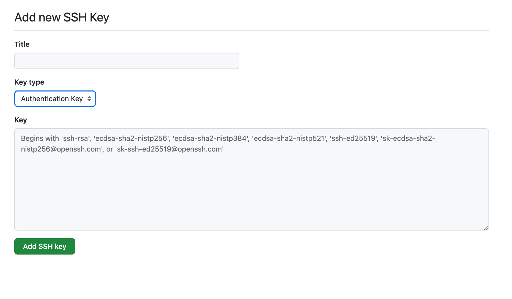

# Git Commit Signing Setup Guide

When setting up commit signing for your project, you have two options: GPG signing or SSH key signing. Both methods provide cryptographic verification of your commits, showing that they genuinely came from you. Choose the method that best fits your workflow:

- GPG signing is the traditional approach and offers more advanced cryptographic features
- SSH signing is simpler if you already use SSH keys for GitHub authentication

## Option 1: GPG Signing with Homebrew

### Prerequisites
- macOS
- Homebrew installed
- GitHub account

### Setup Instructions

1. Install GPG
```bash
brew install gnupg
```

2. Install pinentry-mac for Keychain integration
```bash
brew install pinentry-mac
echo "pinentry-program $(which pinentry-mac)" >> ~/.gnupg/gpg-agent.conf
```

3. Create GPG key (or load existing key into `$HOME/.gnupg`)
```bash
gpg --full-generate-key
```
- Follow prompts to set name and email address
- Choose DSA + ElGamal or ECC with ED 25519 for cipher
- Set a strong passphrase and store it safely

4. Configure repository for signed commits
```bash
git config commit.gpgsign true
```

5. Export GPG public key
```bash
gpg --output $HOME/public-key.pgp --armor --export email@address.tld
```

6. Import GPG key to GitHub
- Navigate to GitHub Profile → Settings → SSH and GPG Keys
- Click "New GPG Key"
- Enter a title (e.g., your email address)
- Paste the contents of `$HOME/public-key.pgp`
- Click "Add GPG key"

7. Sign a commit
```bash
git commit -S -m "Commit message"
```
Note: If `commit.gpgsign = true`, commits will always be signed even without `-S`

8. Sign a tag
```bash
git tag -s 'mytag'
```

9. Push your changes
```bash
git push
```

10. Verify in GitHub UI that your commit shows the green "Verified" badge

## Option 2: SSH Key Signing

### Prerequisites
- macOS
- SSH client installed
- GitHub account

### Setup Instructions

1. Create or use existing SSH key
```bash
ssh-keygen
```

2. Start ssh-agent
```bash
ssh-agent
```

3. Add key to ssh-agent
```bash
ssh-add ~/.ssh/id_ed25519 # or your key name
```

4. Configure Git for SSH signing
```bash
git config commit.gpgsign true
git config gpg.format ssh
git config user.signingkey ~/.ssh/id_ed25519
```

5. Add SSH signing key to GitHub
- Navigate to GitHub Profile → Settings → SSH and GPG Keys
- Click "New SSH Key"
- Enter a title
- Select "Signing Key" for Key Type
-


- Paste contents of `~/.ssh/id_ed25519.pub`
- Click "Add SSH key"

Notice this step is required even if you already had that same SSH key as an Authentication Key.

6. Make a commit (it will be signed automatically)
```bash
git commit -m "Commit message"
```

7. Create a tag (it will be signed)
```bash
git tag -s 'mytag'
```

8. Push your changes
```bash
git push
```

9. Verify in GitHub UI that your commit shows the green "Verified" badge

## Global Configuration

To apply signing settings across all repositories, use the `--global` flag:

```bash
git config --global commit.gpgsign true
```

This will enable commit signing by default for all repositories on your system.

## Add secondary email address ID to GPG key

To enable use of commit signing with GitHub email addresses (which shield your real address from the public),

use the following procedure to add an additional user ID.


First, go to https://github.com/settings/emails and enable “Keep my email addresses private”. This will then show you the email address you can use for your git config. Then, perform the following steps:

```bash
$ gpg --list-secret-keys --keyid-format=long
[keyboxd]
---------
sec   dsa2048/1E2524E88A171281 2024-12-28 [SC]
      G383AC2FB137E315434A19BD9D5E20D68C167499
uid                 [ unknown] User Name <user@email.tld>
ssb   elg2048/CD516A2C10D0251E 2024-12-28 [E]

$ gpg --edit-key G383AC2FB137E315434A19BD9D5E20D68C167499
gpg (GnuPG) 2.4.7; Copyright (C) 2024 g10 Code GmbH
This is free software: you are free to change and redistribute it.
There is NO WARRANTY, to the extent permitted by law.

Secret key is available.

sec  dsa2048/1E2524E88A171281
     created: 2024-12-28  expires: never       usage: SC
     trust: unknown       validity: unknown
ssb  elg2048/CD516A2C10D0251E
     created: 2024-12-28  expires: never       usage: E
[ unknown] (1).  User Name <user@email.tld>

gpg> adduid
Real name: New Name
Email address: 71282472+ghacctid@users.noreply.github.com
Comment:
You selected this USER-ID:
    "New Name <71282472+ghacctid@users.noreply.github.com>"

Change (N)ame, (C)omment, (E)mail or (O)kay/(Q)uit? O

sec  dsa2048/1E2524E88A171281
     created: 2024-12-28  expires: never       usage: SC
     trust: unknown       validity: unknown
ssb  elg2048/CD516A2C10D0251E
     created: 2024-12-28  expires: never       usage: E
[ unknown] (1).  User Name <user@email.tld>
[ unknown] (2). New Name <71282472+ghacctid@users.noreply.github.com>

gpg> quit
Save changes? (y/N) y
```

You can then configure Git in a particular repo to use the alternative email address for signing commits. Add the --global flag to do this for all repos:

```bash
git config user.email "71282472+ghacctid@users.noreply.github.com"
git config user.name "New Name"
```

You will need to delete a previously installed GPG key within GitHub, re-export an ASCII public key using the gpg program (see Setup instructions, Step 5), and then import the new public key into your GitHub user settings. It should then display both the original and alternate email address.
